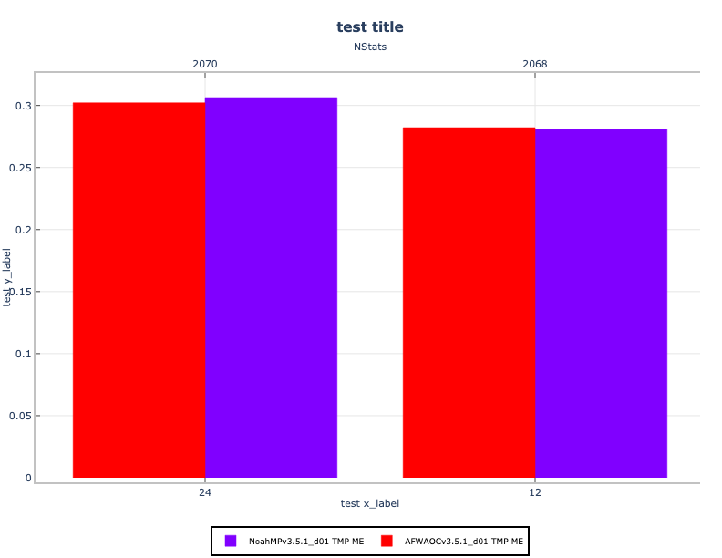

********
Bar plot
********

Description
===========
A bar plot shows comparisons among discrete categories. One axis of the
chart shows the specific categories being compared, while the other
represents some measured value. The heights or lengths are proportional to
the values that they represent. Bar plots are simple and flexible, unlike
some other METview plot types. Rather than using prescribed statistics in
a specific way, the user can select both axes.

Bar plots are distinct from histograms and the two are not interchangeable.
Histograms show the frequency of occurrence of values in discrete
categories (that are sometimes created by binning continuous values).
To create a histogram, the user may only select the variable for a single
axis. In a bar plot, two axis values are selected by the user, one
categorical and one numeric.

Bar plots often represent counts or frequencies, however, bar plots can
represent means, medians, standard deviations, or any other statistic.
Refer to the
`METviewer documentation <https://metviewer.readthedocs.io/en/latest/Users_Guide/barplot.html>`_
for details on how this plot is utilized.

Example
=======

Sample Data
___________

The sample data used to create an example bar plot is available in the METplotpy
repository, where the bar plot tests are located:

*$METPLOTPY_SOURCE/METplotpy/metplotpy/test/bar/bar.data*

*$METPLOTPY_SOURCE* is the directory where the METplotpy code is saved.
The data is text output from MET in columnar format.

Configuration Files
___________________

The bar plot utilizes YAML configuration files to indicate where input data
is located and to set plot attributes. These plot attributes correspond to
values that can be set via the METviewer tool. YAML is a recursive acronym
for "YAML Ain't Markup Language" and according to
`yaml.org <https://yaml.org>`_, it is a "human-friendly data serialization
language". It is commonly used for configuration files and in applications
where data is being stored or transmitted.  Two configuration files
are required, the first is a default configuration file,
**bar_defaults.yaml** that is found in the
*$METPLOTPY_SOURCE/METplotpy/metplotpy/plots/config* directory.
All default configuration files are located in the
*$METPLOTPY_SOURCE/METplotpy/metplotpy/plots/config*
directory.  Note, *$METPLOTPY_SOURCE* is the user-specified directory
where the METplotpy source code has been saved.  The second required YAML
configuration file is a user-supplied "custom" configuration file that
is used to customize/override the default settings in the
**bar_defaults.yaml** file.  The custom configuration file can be an empty
file if all default settings are to be applied.

METplus Configuration
=====================

Default Configuration File
__________________________

The following is the *mandatory*, **bar_defaults.yaml** configuration file,
which serves as a good starting point for creating a line
plot as it represents the default values set in METviewer

.. literalinclude:: ../../metplotpy/plots/config/bar_defaults.yaml

Custom Configuration File
_________________________

A second, *mandatory* configuration file is required, which is
used to customize the settings to the bar plot. The **custom_bar.yaml**
file is included with the source code.  If the user
wishes to use all the default settings defined in the **bar_defaults.yaml**
file, an empty custom configuration file can be specified instead.

.. literalinclude:: ../../test/bar/custom_bar.yaml

Run from the Command Line
=========================

The **custom_bar.yaml** configuration file, in combination with the
**bar_defaults.yaml** configuration file, generate a plot of
five four:

To generate the above plot using the **bar_defaults.yaml** and
**custom_bar.yaml** config files, perform the following:

* Verify the conda environment is running and has has the required
  Python packages outlined in the requirements section.

* Provide the absolute path to the *stat_input* property from the
  **custom_line.yaml**

* Change directories on the command line:

.. code-block:: ini
		
  cd $METPLOTPY_SOURCE/METplotpy/metplotpy/plots/bar

* Enter the following command. Remember to replacy the <path_to>
  with the correct path:

.. code-block:: ini  

  python bar.py <path_to>custom_bar.yaml

* A **bar.png** output file will be created in the
  *$METPLOTPY_SOURCE/METplotpy/metplotpy/plots/bar* directory, as
  specified by the **custom_bar.yaml plot_filename** value.

* In addition, a **bar.point1 (<outputfilename>.point1)** text file is also
  generated, which lists the statistics used to create bars.
  This information can be useful in debugging.

