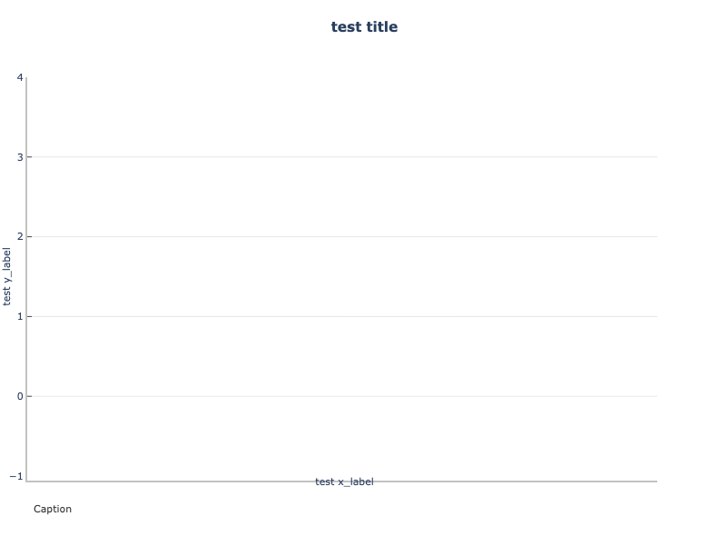

Box plot
===========================================

Description
~~~~~~~~~~~
Box plots, or box and whisker plots, are a way to summarize a distribution
of values using Tukey's 5-number summary
(:ref:`Hoaglin et al., 1983<Hoaglin>`). The dark
line in the middle of the boxes (sometimes called the 'waist') is the
median of data. Half of the data values have a value greater than the
median, and half have a value lower. The actual box (i.e. the central
rectangle) spans the first quartile to the third quartile (or the
interquartile range or IQR). Whiskers extend to 1.5 times the height
of the box or, if closer to the median, the minimum or maximum values
of the data. The points represent outliers: any data point more than
1.5 times the IQR away from the median. These are defined as values
that do not fall inside the whiskers. Outliers are extreme values.
It is used by METviewer for generating box plots.
Refer to the METviewer documentation for details on how this
plot is utilized:

https://metviewer.readthedocs.io/en/latest/Users_Guide/boxplot.html

Example
~~~~~~~

**Sample Data**

The sample data used to create an example box plot is available in the METplotpy
repository, where the box plot tests are located:

$METPLOTPY_SOURCE/METplotpy/metplotpy/test/box/box.data

$METPLOTPY_SOURCE is the directory where the METplotpy code is saved (e.g. /username/myworkspace).  The data is text
output from MET in columnar format.

**Configuration Files**

The box plot utilizes YAML configuration files to indicate where input data is located and
to set plot attributes. These plot attributes correspond to values that can be set via the METviewer
tool. YAML is a recursive acroynym for "YAML Ain't Markup Language" and according to yaml.org,
it is a "human-readable data-serialization language". It is commonly used for configuration files
and in applications where data is being stored or transmitted".  Two configuration files are required,
the first is a default configuration file, box_defaults.yaml that is found in the
$METPLOTPY_SOURCE/METplotpy/metplotpy/plots/config directory.  All default
configuration files are located in the $METPLOTPY_SOURCE/METplotpy/metplotpy/plots/config
directory.  $METPLOTPY_SOURCE is the user-specified directory
where the METplotpy source code has been saved.  **Default configuration files are automatically loaded by the plotting code and do not
need to be explicitly specified when generating a plot**.  The second required YAML configuration file is a
user-supplied "custom" configuration file that is used to customize/override the default
settings in the box_defaults.yaml file.  The custom configuration file can be an empty
file if all default settings are to be applied.

METplus Configuration
~~~~~~~~~~~~~~~~~~~~~

**Default Configuration File**

The following is the `mandatory`, box_defaults.yaml configuration file,
which serves as a good starting point for creating a line
plot as it represents the default values set in METviewer

.. literalinclude:: ../../metplotpy/plots/config/box_defaults.yaml

**Custom Configuration File**

A second, `mandatory` configuration file is required, which is
used to customize the settings to the box plot. The custom_box.yaml
file is included with the source code.  If the user
wishes to use all the default settings defined in the box_defaults.yaml
file, an empty custom configuration file can be specified instead.

.. literalinclude:: ../../test/box/custom_box.yaml

Copy this custom config file from the directory where you saved the source code to your working directory:

``cp $METPLOTPY_SOURCE/METplotpy/test/box/custom_box.yaml $WORKING_DIR/custom_box.yaml``

Modify the `stat_input` setting in the
$METPLOTPY_SOURCE/METplotpy/test/box/custom_box.yaml
file to explicitly point to the $METPLOTPY_SOURCE/METplotpy/test/box directory (where
the custom config files and sample data reside).  Replace the relative path `./box.data`
with the full path `$METPLOTPY_SOURCE/METplotpy/test/box/box.data`.  Modify the `plot_filename`
setting to point to the output path where your plot will be saved, including the name of your plot.

For example:

`stat_input: /username/myworkspace/METplotpy/test/box/box.data`

`plot_filename: /username/working_dir/output_plots/box.png`

where /username/myworkspace/ is $METPLOTPY_SOURCE and /username/working_dir is $WORKING_DIR.  Make sure that the
$WORKING_DIR directory you specify exists and has the appropriate read and write permissions.  You may
change the path listed for `plot_filename` to the output directory of your choice.  If this is not set, then the
`plot_filename` setting specified in the $METPLOTPY_SOURCE/METplotpy/metplotpy/plots/config/box_defaults.yaml
configuration file will be used.

If you wish to save the intermediate `.points1` file (used by METviewer and useful for debugging), set the `dump_points_1`
setting to True. Uncomment or add (if it doesn't exist) the `points_path` setting.

`dump_points_1: 'True'`

`points_path: '/dir_to_save_points1_file'`

Replace the `'/dir_to_save_points1_file'` to the directory where you wish to save the `.points1` file.
If points_path is commented out (indicated by a '#' symbol in front of it), remove the '#' symbol to uncomment
the points_path so that it will be used by the code.  Make sure that this directory exists and has the
appropriate read and write permissions.  **NOTE**: the `points_path` setting
is **optional** and does not need to be defined in your configuration file unless you wish to save the intermediate .points1
file.

**Using defaults**

If you wish to use the **default** settings defined in the box_defaults.yaml
file, specify a minimal custom configuration file (minimal_box.yaml), which consists of only a comment
block, but can be any empty file (if you have write permissions for the output filename path corresponding to the
`plot_filename` setting in the default configuration file. Otherwise you will need to specify a `plot_filename` in your minimal_box.yaml file):

. literalinclude:: ../../test/box/minimal_box.yaml

Copy this file to your working directory:

``cp $METPLOTPY_SOURCE/METplotpy/test/box/minimal_box.yaml $WORKING_DIR/minimal_box.yaml``

Add the `stat_input` (input data) and `plot_filename` (output file/plot path) settings to the $WORKING_DIR/minimal_box.yaml
file (anywhere below the comment block). The `stat_input` setting explicitly indicates where the
sample data and custom configuration files are located.  Set the `stat_input` to
`$METPLOTPY_SOURCE/METplotpy/test/box/box.data` and set the
`plot_filename` to $WORKING_DIR/output_plots/box_default.png:

`stat_input: $METPLOTPY_SOURCE/METplotpy/test/box/box.data`

`plot_filename: $WORKING_DIR/output_plots/box_default.png`

Where `$WORKING_DIR` is the working directory where you are saving all your custom
configuration files. **NOTE**: You may specify the `plot_filename` (output directory) to a directory other than the
$WORKING_DIR/output_plots, as long as it is an existing directory where you have read and write permissions.

**NOTE** This file does not plot any data, its purpose is to provide a template for setting the
margins, plot size, labels, etc.

Run from the Command Line
~~~~~~~~~~~~~~~~~~~~~~~~~

Perform the following to generate the plots:

* set the METPLOTPY_BASE environment variable to point to $METPLOTPY_SOURCE/METplotpy/metplotpy

for ksh:

``export METPLOTPY_BASE=$METPLOTPY_SOURCE/METplotpy/metplotpy``

for csh:

``setenv METPLOTPY_BASE $METPLOTPY_SOURCE/METplotpy/metplotpy``

Replacing the $METPLOTPY_SOURCE with the directory where the METplotpy source code was saved.

The custom_box.yaml configuration file, in combination with the
box_defaults.yaml configuration file, generates a customized box plot:

.. image:: box.png

To generate the above plot using the box_defaults.yaml and
custom_box.yaml config files, perform the following:

* if using a conda environment, verify that you are running in the conda environment that
  has the required Python packages outlined in the Python Requirements
  section:

https://metplotpy.readthedocs.io/en/latest/Users_Guide/installation.html

The minimal_box.yaml configuration file, in combination with the
box_defaults.yaml configuration file, generates a "default" box plot. **The purpose of this is to provide a
template/starting point for setting up the margins, plot size, labels, etc. and does not plot any
data**:

To generate the above **"defaults"** plot (i.e using default configuration settings), use the "minimal" custom configuration file, minimal_box.yaml.

* enter the following command:

  ``python $METPLOTPY_SOURCE/METplotpy/metplotpy/plots/box/box.py $WORKING_DIR/minimal_box.yaml``

* a `box_default.png` output file will be created in the
  directory you specified in the `plot_filename` configuration setting in the `box_minimal.yaml` config file.

