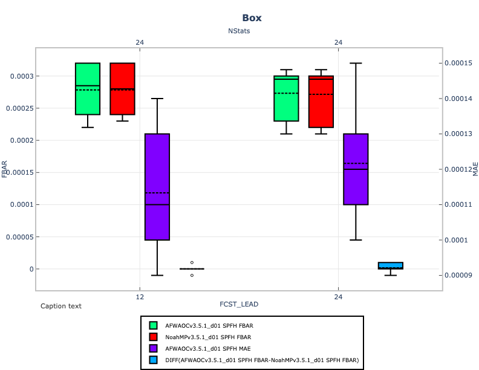

Box plot
===========================================

Description
~~~~~~~~~~~
Box plots, or box and whisker plots, are a way to summarize a distribution
of values using Tukey's 5-number summary
(:ref:`Hoaglin et al., 1983<Hoaglin>`). The dark
line in the middle of the boxes (sometimes called the 'waist') is the
median of data. Half of the data values have a value greater than the
median, and half have a value lower. The actual box (i.e. the central
rectangle) spans the first quartile to the third quartile (or the
interquartile range or IQR). Whiskers extend to 1.5 times the height
of the box or, if closer to the median, the minimum or maximum values
of the data. The points represent outliers: any data point more than
1.5 times the IQR away from the median. These are defined as values
that do not fall inside the whiskers. Outliers are extreme values.
It is used by METviewer for generating box plots.
Refer to the METviewer documentation for details on how this
plot is utilized:

https://metviewer.readthedocs.io/en/latest/Users_Guide/boxplot.html

Example
~~~~~~~

**Sample Data**

The sample data used to create an example box plot is available in the METplotpy
repository, where the box plot tests are located:

$METPLOTPY_SOURCE/METplotpy/metplotpy/test/box/box.data

$METPLOTPY_SOURCE is the directory where the METplotpy code is saved.  The data is text
output from MET in columnar format.

**Configuration Files**

The box plot utilizes YAML configuration files to indicate where input data is located and
to set plot attributes. These plot attributes correspond to values that can be set via the METviewer
tool. YAML is a recursive acroynym for "YAML Ain't Markup Language" and according to yaml.org,
it is a "human-readable data-serialization language". It is commonly used for configuration files
and in applications where data is being stored or transmitted".  Two configuration files are required,
the first is a default configuration file, box_defaults.yaml that is found in the
$METPLOTPY_SOURCE/METplotpy/metplotpy/plots/config directory.  All default
configuration files are located in the $METPLOTPY_SOURCE/METplotpy/metplotpy/plots/config
directory.  Note, $METPLOTPY_SOURCE is the user-specified directory
where the METplotpy source code has been saved.  The second required YAML configuration file is a
user-supplied "custom" configuration file that is used to customize/override the default
settings in the box_defaults.yaml file.  The custom configuration file can be an empty
file if all default settings are to be applied.

METplus Configuration
~~~~~~~~~~~~~~~~~~~~~

**Default Configuration File**

The following is the `mandatory`, box_defaults.yaml configuration file,
which serves as a good starting point for creating a line
plot as it represents the default values set in METviewer

.. literalinclude:: ../../metplotpy/plots/config/box_defaults.yaml

**Custom Configuration File**

A second, `mandatory` configuration file is required, which is
used to customize the settings to the box plot. The custom_box.yaml
file is included with the source code.  If the user
wishes to use all the default settings defined in the box_defaults.yaml
file, an empty custom configuration file can be specified instead.

.. literalinclude:: ../../metplotpy/test/box/custom_box.yaml

Run from the Command Line
~~~~~~~~~~~~~~~~~~~~~~~~~

The custom_box.yaml configuration file, in combination with the
box_defaults.yaml configuration file, generate a plot of
five four:

To generate the above plot using the box_defaults.yaml and
custom_box.yaml config files, perform the following:

* verify that you are running in the conda environment that
  has the required Python packages outlined in the requirements
  section

* provide the absolute path to the stat_input property from the custom_line.yaml

* cd to the $METPLOTPY_SOURCE/METplotpy/metplotpy/plots/box
  directory

* enter the following command:

  ``python box.py <path_to>custom_box.yaml``

* a `box.png` output file will be created in the
  $METPLOTPY_SOURCE/METplotpy/metplotpy/plots/box directory, as
  specified by the custom_box.yaml `plot_filename` value.

* in addition, a box.point1 (<outputfilename>.point1) text file is also
  generated, which lists the statistics used to create boxes.  This information can be useful in debugging.

