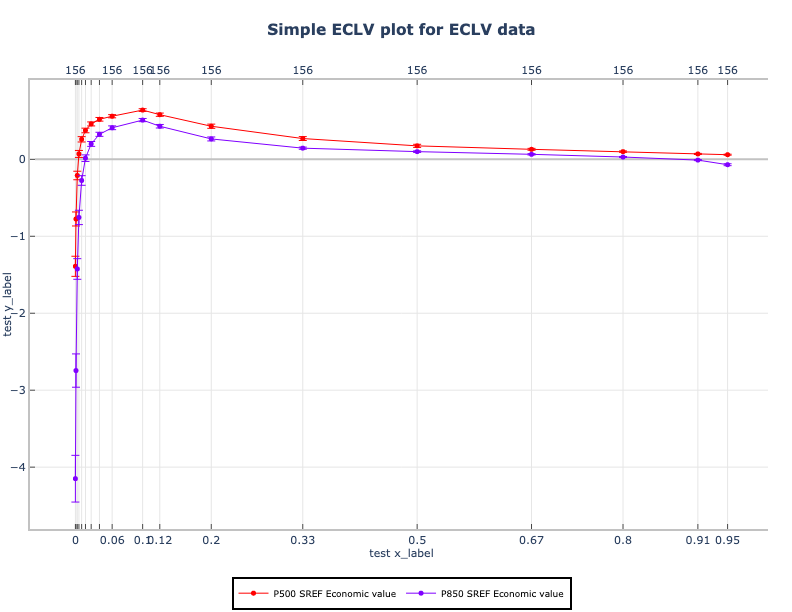

*************************************
Economic Cost/Lost Value (ECLV) Plots
*************************************

Description
===========

Economic Cost/Loss Value (ECLV) Plot, also called the Relative value score (:ref:`Richardson, 2000<Richardson>`;
:ref:`Wilks, 2001<Wilks_2001>`) is useful in decision making.
This plot produces the relative value curve for deterministic forecasts based on counts in a 2x2 contingency
table along with the expected cost-to-loss ratio.

For more information on Economic Cost/Loss Value Plots, please refer to the
`METviewer documentation
<https://metviewer.readthedocs.io/en/develop/Users_Guide/eclvplots.html>`_.

The ECLV score can range from -:math:`\infty` to 1.

Example
=======

Sample Data
___________

The sample data used to create these plots is available in the METplotpy
repository, where the ECLV plot scripts are located:

*$METPLOTPY_SOURCE/METplotpy/test/eclv/eclv.data*

*$METPLOTPY_SOURCE* is the directory where the METplotpy code is saved.
The data is text output from MET in columnar format.

Configuration Files
___________________

The ECLV plot utilizes YAML configuration files to indicate where
input data is located and to set plot attributes. These plot attributes
correspond to values that can be set via the METviewer tool. YAML is a
recursive acronym for "YAML Ain't Markup Language" and according to
`yaml.org <https://yaml.org>`_,
it is a "human-friendly data serialization language. It is commonly used for
configuration files and in applications where data is being stored or
transmitted. Two configuration files are required. The first is a
default configuration file, **eclv_defaults.yaml**,
which is found in the
*$METPLOTPY_SOURCE/METplotpy/metplotpy/plots/config* directory.
*$METPLOTPY_SOURCE* indicates the directory where the METplotpy
source code has been saved.  All default
configuration files are located in the
*$METPLOTPY_SOURCE/METplotpy/metplotpy/plots/config* directory.
**Default configuration files are automatically loaded by the
plotting code and do not need to be explicitly specified when
generating a plot**.

The second required configuration file is a user-supplied “custom”
configuration file. This  file is used to customize/override the default
settings in the **eclv_defaults.yaml** file.

METplus Configuration
=====================

Default Configuration File
__________________________

The following is the *mandatory*, **eclv_defaults.yaml**
configuration file along with another *mandatory* configuration file, **custom_eclv.yaml** . These configuration files
serve as a starting point for creating an eclv plot.

**NOTE**: The eclv_defaults.yaml default configuration file is **automatically** loaded by
**eclv.py.**

.. literalinclude:: ../../metplotpy/plots/config/eclv_defaults.yaml

Custom Configuration File
_________________________

As mentioned above a second, *mandatory* configuration file is required.  This is
used to customize the settings to the ECLV plot.
The **custom_eclv.yaml**  file is included with the
source code and looks like the following:

.. literalinclude:: ../../test/eclv/custom_eclv.yaml

Copy this custom config file from the directory where the source
code was saved to the working directory:

.. code-block:: ini

  cp $METPLOTPY_SOURCE/METplotpy/test/eclv/custom_eclv.yaml $WORKING_DIR/custom_eclv.yaml

Modify the *stat_input* setting in the
*$METPLOTPY_SOURCE/METplotpy/test/eclv/custom_eclv.yaml*
file to explicitly point to the
*$METPLOTPY_SOURCE/METplotpy/test/eclv/*
directory (where the custom config files and sample data reside).
Replace the relative path *.eclv.data*
with the full path
*$METPLOTPY_SOURCE/METplotpy/test/eclv/eclv.data*.
Modify the *plot_filename* setting to point to the output path where the
plot will be saved, including the name of the plot.

For example:

*stat_input: /username/myworkspace/METplotpy/test/eclv/eclv.data*

*plot_filename: /username/working_dir/output_plots/custom_eclv.png*

This is where */username/myworkspace/* is $METPLOTPY_SOURCE and
*/username/working_dir* is $WORKING_DIR.  Make sure that the
$WORKING_DIR directory that is specified exists and has the
appropriate read and write permissions. The path listed for
*plot_filename* may be changed to the output directory of one’s choosing.
If this is not set, then the
*plot_filename* setting specified in the
*$METPLOTPY_SOURCE/METplotpy/metplotpy/plots/config/eclv_defaults.yaml*
configuration file will be used.

To save the intermediate **.points1** file (used by METviewer and useful
for debugging), set the *dump_points_1* setting to True.
Uncomment or add (if it doesn't exist) the *points_path* setting:

*dump_points_1: 'True'*

*points_path: '/dir_to_save_points1_file'*

Replace the */dir_to_save_points1_file* to the same directory where the
**.points1** file is saved.
If *points_path* is commented out (indicated by a '#' symbol in front of it),
remove the '#' symbol to uncomment
the *points_path* so that it will be used by the code.  Make sure that
this directory exists and has the
appropriate read and write permissions.  **NOTE**: the *points_path* setting
is **optional** and does not need to be defined in the configuration
files unless saving the intermediate **.points1** file is desired.

Using defaults
______________

There isn't a set of "default" values to create a meaningful ECLV plot. Use the combination of the
default_eclv.yaml and custom_eclv.yaml file to create a sample ECLV plot.

Run from the Command Line
=========================

To generate a *meaningful* ECLV plot (i.e. using settings in the
**eclv_defaults.yaml** and **custom_eclv.yaml** configuration files),
perform the following:

*  If using the conda environment, verify the conda environment
   is running and has has the required Python packages outlined in the
   `requirements section.
   <https://metplotpy.readthedocs.io/en/latest/Users_Guide/installation-requirements.html>`_

* Set the METPLOTPY_BASE environment variable to point to
  *$METPLOTPY_SOURCE/METplotpy*.

  For the ksh environment:

  .. code-block:: ini
		
    export METPLOTPY_BASE=$METPLOTPY_SOURCE/METplotpy

  For the csh environment:

  .. code-block:: ini
		
    setenv METPLOTPY_BASE $METPLOTPY_SOURCE/METplotpy

  Replacing the $METPLOTPY_SOURCE with the directory where the
  METplotpy source code was saved.

* Run the following on the command line:

  .. code-block:: ini  

    python $METPLOTPY_SOURCE/METplotpy/metplotpy/plots/eclv/eclv.py $WORKING_DIR/custom_eclv.yaml

  This will create a PNG file, **custom_eclv.png**,
  in the directory that was specified in the *plot_filename*
  setting of the **custom_eclv.yaml** config file:

  .. image:: custom_eclv.png

