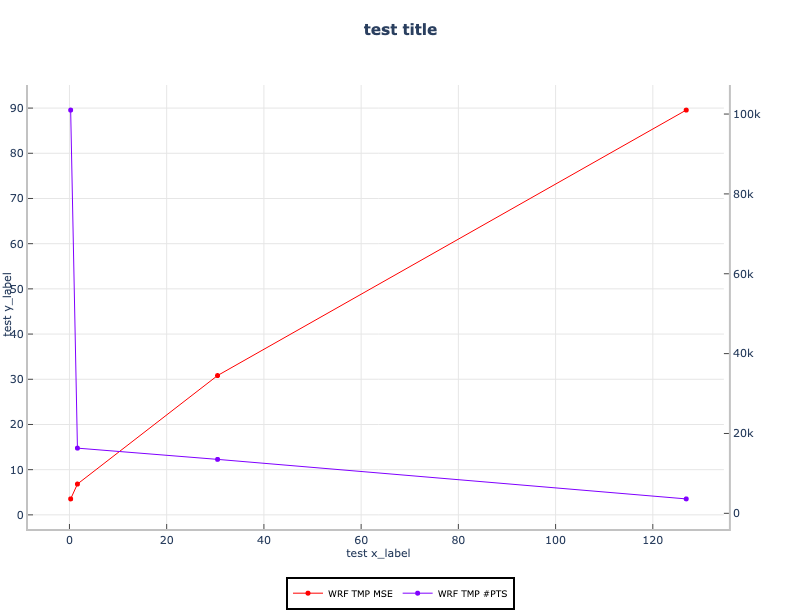

Ensemble spread-skill plot
===========================================

Description
~~~~~~~~~~~
The theory is that RMSE of the ensemble mean should have roughly a 1-1 relationship
with the ensemble spread (I.e. standard deviation of the ensemble member values).
Ensemble spread-skill plot measures that relationship.

Example
~~~~~~~

**Sample Data**

The sample data used to create an example Ensemble spread-skill plot is available in the METplotpy
repository, where the Ensemble spread-skill plot tests are located:

$METPLOTPY_SOURCE/METplotpy/metplotpy/test/ens_ss/ens_ss.data

$METPLOTPY_SOURCE is the directory where the METplotpy code is saved.  The data is text
output from MET in columnar format.

**Configuration Files**

The Ensemble spread-skill plot utilizes YAML configuration files to indicate where input data is located and
to set plot attributes. These plot attributes correspond to values that can be set via the METviewer
tool. YAML is a recursive acroynym for "YAML Ain't Markup Language" and according to yaml.org,
it is a "human-readable data-serialization language". It is commonly used for configuration files
and in applications where data is being stored or transmitted".  Two configuration files are required,
the first is a default configuration file, ens_ss_defaults.yaml that is found in the
$METPLOTPY_SOURCE/METplotpy/metplotpy/plots/config directory.  All default
configuration files are located in the $METPLOTPY_SOURCE/METplotpy/metplotpy/plots/config
directory.  $METPLOTPY_SOURCE is the user-specified directory
where the METplotpy source code has been saved.  **Default configuration files are automatically loaded by the plotting code and do not
need to be explicitly specified when generating a plot**. The second required YAML configuration file is a
user-supplied "custom" configuration file that is used to customize/override the default
settings in the ens_ss_defaults.yaml file.  The custom configuration file can be an empty
file if all default settings are to be applied.

METplus Configuration
~~~~~~~~~~~~~~~~~~~~~

**Default Configuration File**

The following is the `mandatory`, ens_ss_defaults.yaml configuration file,
which serves as a good starting point for creating a line
plot as it represents the default values set in METviewer

.. literalinclude:: ../../metplotpy/plots/config/ens_ss_defaults.yaml

**Custom Configuration File**

A second, `mandatory` configuration file is required, which is
used to customize the settings to the plot. The custom_ens_ss.yaml
file is included with the source code.  If the user
wishes to use all the default settings defined in the ens_ss_defaults.yaml
file, an empty custom configuration file can be specified instead.

.. literalinclude:: ../../test/ens_ss/custom_ens_ss.yaml

Copy this custom config file from the directory where you saved the source code to your working directory:

``cp $METPLOTPY_SOURCE/METplotpy/test/ens_ss/custom_ens_ss.yaml $WORKING_DIR/custom_ens_ss.yaml``

Modify the `stat_input` setting in the
$METPLOTPY_SOURCE/METplotpy/test/ens_ss/custom_ens_ss.yaml
file to explicitly point to the $METPLOTPY_SOURCE/METplotpy/test/ens_ss directory (where
the custom config files and sample data reside).  Replace the relative path `./ens_ss.data`
with the full path `$METPLOTPY_SOURCE/METplotpy/test/ens_ss/ens_ss.data`.  Modify the `plot_filename`
setting to point to the output path where your plot will be saved, including the name of your plot.

For example:

`stat_input: /username/myworkspace/METplotpy/test/ens_ss/ens_ss.data`

`plot_filename: /username/working_dir/output_plots/ens_ss.png`

where /username/myworkspace/ is $METPLOTPY_SOURCE and /username/working_dir is $WORKING_DIR.  Make sure that the
$WORKING_DIR directory you specify exists and has the appropriate read and write permissions.  You may
change the path listed for `plot_filename` to the output directory of your choice.  If this is not set, then the
`plot_filename` setting specified in the $METPLOTPY_SOURCE/METplotpy/metplotpy/plots/config/ens_ss_defaults.yaml
configuration file will be used.

f you wish to save the intermediate `.points1` file (used by METviewer and useful for debugging), set the `dump_points_1`
setting to True. Uncomment or add (if it doesn't exist) the `points_path` setting.

`dump_points_1: 'True'`

`points_path: '/dir_to_save_points1_file'`

Replace the `'/dir_to_save_points1_file'` to the directory where you wish to save the `.points1` file.
If points_path is commented out (indicated by a '#' symbol in front of it), remove the '#' symbol to uncomment
the points_path so that it will be used by the code.  Make sure that this directory exists and has the
appropriate read and write permissions.  **NOTE**: the `points_path` setting
is **optional** and does not need to be defined in your configuration file unless you wish to save the intermediate .points1
file.

Run from the Command Line
~~~~~~~~~~~~~~~~~~~~~~~~~

The custom_ens_ss.yaml configuration file, in combination with the
ens_ss_defaults.yaml configuration file, generates the following plot:

Perform the following:

* if using a conda environment, verify that you are running in the conda environment that
  has the required Python packages outlined in the Python Requirements
  section:

https://metplotpy.readthedocs.io/en/latest/Users_Guide/installation.html

* set the METPLOTPY_BASE environment variable to point to $METPLOTPY_SOURCE/METplotpy/metplotpy

for ksh:

``export METPLOTPY_BASE=$METPLOTPY_SOURCE/METplotpy/metplotpy``

for csh:

``setenv METPLOTPY_BASE $METPLOTPY_SOURCE/METplotpy/metplotpy``

Replacing the $METPLOTPY_SOURCE with the directory where the METplotpy source code was saved.

* enter the following command:

  ``python $METPLOTPY_SOURCE/METplotpy/metplotpy/plotsens_ss.py $WORKING_DIR/custom_ens_ss.yaml``

* an `ens_ss.png` output file will be created in the directory you specified in the `plot_filename` configuration setting in the custom_ens_ss.yaml configuration file.
