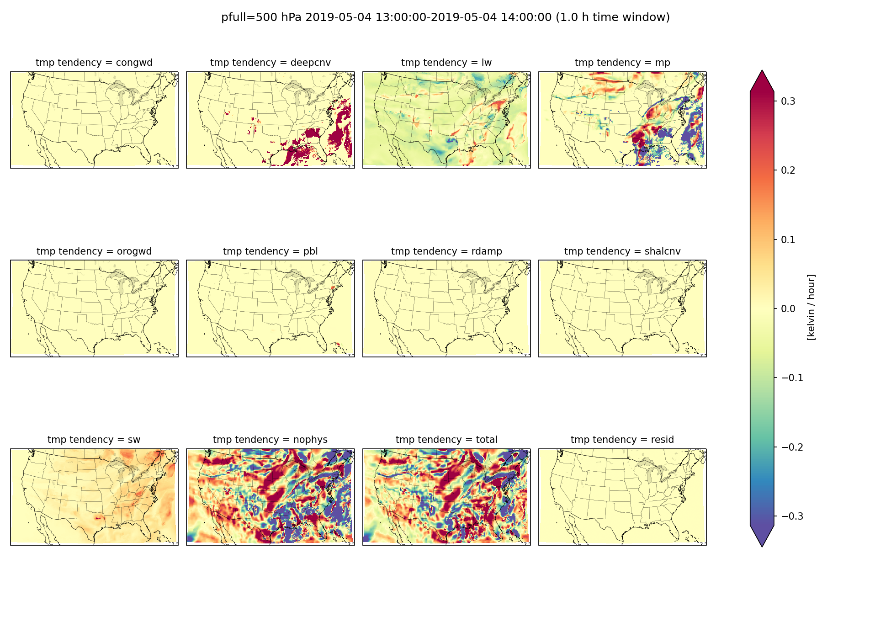

**********************
FV3 physics tendencies
**********************

Description
===========
Plot tendencies of temperature, moisture, and wind components averaged over a time window 
and spatial domain. Tendencies are partitioned into physics parameterizations and 
dynamics. Physics parameterizations include schemes like deep convection, convective 
gravity wave drag, short wave radiation, planetary boundary layer, microphysics, 
and others listed below. Non-physics tendencies (or dynamics) are due to horizontal
and vertical motion. The residual (which should be zero) is the difference between
the actual change in the state variable over the requested time window and the
expected change due to physics parameterizations and dynamics tendencies. One can plot
a single tendency component at multiple pressure levels or plot all tendency components
at a single pressure level. Plan views (horizontal cross sections), vertical profiles,
and difference plots are also available. 

Required Packages:
==================

* cartopy

* matplotlib

* metpy

* numpy

* pandas

* shapely

* xarray

Required input:
===============

#. FV3 3-D history file with physics and dynamics tendencies (fv3_history.nc)

#. FV3 2-D grid specification file with latititude and longitude of each grid point (grid_spec.nc)

**Download** the `fv3_history.nc and grid_spec.nc files
<https://dtcenter.ucar.edu/dfiles/code/METplus/METplotpy/fv3_physics_tendency/>`_

Save this file in a directory where you have read and write permissions, such as
$WORKING_DIR/data/fv3_physics_tend, where $WORKING_DIR is the path to the directory where you will save
input data.

For additional details see `grid description in UFS Short Range Weather App user manual <https://ufs-srweather-app.readthedocs.io/en/latest/LAMGrids.html?highlight=grid#limited-area-model-lam-grids-predefined-and-user-generated-options>`_

Available tendency variables
____________________________

A small description of each tendency variable and their nicknames are shown below. Some  
tendencies do not apply to all four state variables, so these cells are blank. 

+----------------------------+-------------+-------------------+-------------+-------------+
|           tendency         | temperature | specific humidity |   u-wind    |   v-wind    |
+============================+=============+===================+=============+=============+
|convective gravity wave drag|       congwd|                   |      congwd |      congwd |
+----------------------------+-------------+-------------------+-------------+-------------+
|       deep convection      |      deepcnv|         deepcnv   |      deepcnv|      deepcnv|
+----------------------------+-------------+-------------------+-------------+-------------+
|     long wave radiation    |        lw   |                   |             |             |
+----------------------------+-------------+-------------------+-------------+-------------+
|        microphysics        |        mp   |           mp      |        mp   |         mp  |
+----------------------------+-------------+-------------------+-------------+-------------+
|orographic gravity wave drag|       orogwd|                   |      orogwd |      orogwd |
+----------------------------+-------------+-------------------+-------------+-------------+
|  planetary boundary layer  |        pbl  |           pbl     |        pbl  |        pbl  |
+----------------------------+-------------+-------------------+-------------+-------------+
|      Rayleigh damping      |       rdamp |                   |       rdamp |       rdamp |
+----------------------------+-------------+-------------------+-------------+-------------+
|     shallow convection     |      shalcnv|         shalcnv   |      shalcnv|      shalcnv|
+----------------------------+-------------+-------------------+-------------+-------------+
|    short wave radiation    |        sw   |                   |             |             |
+----------------------------+-------------+-------------------+-------------+-------------+
|  total physics (all above) |       phys  |           phys    |      phys   |        phys |
+----------------------------+-------------+-------------------+-------------+-------------+
|           dynamics         |       nophys|          nophys   |       nophys|       nophys|
+----------------------------+-------------+-------------------+-------------+-------------+
| state variable at validtime|     tmp     |        spfh       |    ugrd     |    vgrd     |
+----------------------------+-------------+-------------------+-------------+-------------+
| actual change in state var |    dtmp     |       dspfh       |   dugrd     |   dvgrd     |
+----------------------------+-------------+-------------------+-------------+-------------+

The expected names of the netCDF variables in the history file are shown below. If your history 
file is different, one can change them in YAML config file 
*$METPLOTPY_BASE/test/fv3_physics_tend/fv3_physics_tend_defaults.yaml* 

**NOTE**: *$METPLOTPY_BASE* is the directory where the METplotpy code is saved (e.g. */path/to/user/dir/METplotpy*).

+----------------------------+-------------+-------------------+-------------+-------------+
|           tendency         | temperature | specific humidity |   u-wind    |   v-wind    |
+============================+=============+===================+=============+=============+
|convective gravity wave drag| dt3dt_congwd|                   |du3dt_congwd |dv3dt_congwd |
+----------------------------+-------------+-------------------+-------------+-------------+
|       deep convection      |dt3dt_deepcnv|   dq3dt_deepcnv   |du3dt_deepcnv|dv3dt_deepcnv|
+----------------------------+-------------+-------------------+-------------+-------------+
|     long wave radiation    |  dt3dt_lw   |                   |             |             |
+----------------------------+-------------+-------------------+-------------+-------------+
|        microphysics        |  dt3dt_mp   |     dq3dt_mp      |  du3dt_mp   |   dv3dt_mp  |
+----------------------------+-------------+-------------------+-------------+-------------+
|orographic gravity wave drag| dt3dt_orogwd|                   |du3dt_orogwd |dv3dt_orogwd |
+----------------------------+-------------+-------------------+-------------+-------------+
|  planetary boundary layer  |  dt3dt_pbl  |     dq3dt_pbl     |  du3dt_pbl  |  dv3dt_pbl  |
+----------------------------+-------------+-------------------+-------------+-------------+
|      Rayleigh damping      | dt3dt_rdamp |                   | du3dt_rdamp | dv3dt_rdamp |
+----------------------------+-------------+-------------------+-------------+-------------+
|     shallow convection     |dt3dt_shalcnv|   dq3dt_shalcnv   |du3dt_shalcnv|dv3dt_shalcnv|
+----------------------------+-------------+-------------------+-------------+-------------+
|    short wave radiation    |  dt3dt_sw   |                   |             |             |
+----------------------------+-------------+-------------------+-------------+-------------+
|  total physics (all above) | dt3dt_phys  |     dq3dt_phys    |du3dt_phys   |  dv3dt_phys |
+----------------------------+-------------+-------------------+-------------+-------------+
|           dynamics         | dt3dt_nophys|    dq3dt_nophys   | du3dt_nophys| dv3dt_nophys|
+----------------------------+-------------+-------------------+-------------+-------------+

Example
=======

Sample Data
___________

Sample data to plot physics tendencies are available in the `METplus data tar file
<https://dtcenter.ucar.edu/dfiles/code/METplus/METplus_Data/vX.y/sample_data-xxx-x.y.tgz>`_  in the directory
*xxx/fv3_physics_tend*.

Save this file in a directory where you have read and write permissions, such as
$WORKING_DIR/data/fv3_physics_tend, where $WORKING_DIR is the path to the directory where you will save
input data.

Configuration File
___________________

There is a YAML config file located in
*$METPLOTPY_BASE/test/fv3_physics_tend/fv3_physics_tend_defaults.yaml* 

.. literalinclude:: ../../test/fv3_physics_tend/fv3_physics_tend_defaults.yaml

*$METPLOTPY_BASE* is the directory where the METplotpy code is saved.

Run from the Command Line
=========================

To generate example tendency plots using settings in the **fv3_physics_defaults.yaml** configuration file, perform the following:

.. code-block:: bash

   setenv CONFIG $METPLOTPY_BASE/test/fv3_physics_tend/fv3_physics_tend_defaults.yaml
   setenv WORKING_DIR $METPLOTPY_BASE/metplotpy/contributed/fv3_physics_tend
   cd $WORKING_DIR
   python planview_fv3.py -h
   
Plan view
_________

::

    usage: planview_fv3.py [-h] [-d] [--method {nearest,linear,loglinear}] [--ncols NCOLS]
                           [--nofineprint] [-o OFILE] [-p PFULL [PFULL ...]] [-s SHP]
                           [--subtract SUBTRACT] [-t TWINDOW] [-v VALIDTIME]
                           config historyfile gridfile statevariable fill

    Plan view of FV3 diagnostic tendency

    positional arguments:
      config                yaml configuration file
      historyfile           FV3 history file
      gridfile              FV3 grid spec file
      statevariable         moisture, temperature, or wind component variable name
      fill                  type of tendency. ignored if pfull is a single level

    optional arguments:
      -h, --help            show this help message and exit
      -d, --debug
      --method {nearest,linear,loglinear}
                            vertical interpolation method (default: nearest)
      --ncols NCOLS         number of columns (default: None)
      --nofineprint         Don't add metadata and created by date (for comparing images)
                            (default: False)
      -o OFILE, --ofile OFILE
                            name of output image file (default: None)
      -p PFULL [PFULL ...], --pfull PFULL [PFULL ...]
                            pressure level(s) in hPa to plot. If only one pressure level is
                            provided, the type-of-tendency argument will be ignored and all
                            tendencies will be plotted. (default: [1000, 925, 850, 700, 500,
                            300, 200, 100, 0])
      -s SHP, --shp SHP     shape file directory for mask (default: None)
      --subtract SUBTRACT   FV3 history file to subtract (default: None)
      -t TWINDOW, --twindow TWINDOW
                            time window in hours (default: 3)
      -v VALIDTIME, --validtime VALIDTIME
                            valid time (default: None)

                        
Generate a plan view of all tendencies at 500 hPa:

.. code-block:: bash

   python planview_fv3.py $CONFIG $WORKING_DIR/fv3_history.nc $WORKING_DIR/grid_spec.nc tmp pbl -p 500 -t 1 -v 20190504T14 --nofineprint

Generate a plan view of PBL tendency at default pressure levels:

.. code-block:: bash

   python planview_fv3.py $CONFIG $WORKING_DIR/fv3_history.nc $WORKING_DIR/grid_spec.nc tmp pbl -t 1 -v 20190504T13 --nofineprint

.. image:: tmp_pbl.png

.. code-block:: bash

   python vert_profile_fv3.py -h 
   
Vertical profile
________________

::

    usage: vert_profile_fv3.py [-h] [-d] [--nofineprint] [-o OFILE] [--resid] [-s SHP]
                               [--subtract SUBTRACT] [-t TWINDOW] [-v VALIDTIME]
                               config historyfile gridfile statevariable

    Vertical profile of FV3 diagnostic tendencies

    positional arguments:
      config                yaml configuration file
      historyfile           FV3 history file
      gridfile              FV3 grid spec file
      statevariable         moisture, temperature, or wind component variable name

    optional arguments:
      -h, --help            show this help message and exit
      -d, --debug
      --nofineprint         Don't add metadata and created by date (for comparing images)
                            (default: False)
      -o OFILE, --ofile OFILE
                            name of output image file (default: None)
      --resid               calculate residual (default: False)
      -s SHP, --shp SHP     shape file directory for mask (default: None)
      --subtract SUBTRACT   FV3 history file to subtract (default: None)
      -t TWINDOW, --twindow TWINDOW
                            time window in hours (default: 3)
      -v VALIDTIME, --validtime VALIDTIME
                            valid time (default: None)
   
Generate vertical profile of temperature tendencies averaged over the mid-CONUS region:

.. code-block:: bash

   python vert_profile_fv3.py $CONFIG $WORKING_DIR/fv3_history.nc $WORKING_DIR/grid_spec.nc tmp -t 2 -v 20190504T14 -s $METPLOTPY_BASE/metplotpy/contributed/fv3_physics_tend/shapefiles/MID_CONUS --nofineprint

.. image:: tmp.vert_profile.MID_CONUS.png

Vertical cross section
______________________

.. code-block:: bash

   python cross_section_vert.py -h 
   
Usage::

    usage: cross_section_vert.py [-h] [-d] [--dindex DINDEX] [--ncols NCOLS] [--nofineprint]
                                 [-o OFILE] [-s START START] [-e END END]
                                 [--subtract SUBTRACT] [-t TWINDOW] [-v VALIDTIME]
                                 config historyfile gridfile statevariable

    Vertical cross section of FV3 diagnostic tendency

    positional arguments:
      config                yaml configuration file
      historyfile           FV3 history file
      gridfile              FV3 grid spec file
      statevariable         moisture, temperature, or wind component variable name

    optional arguments:
      -h, --help            show this help message and exit
      -d, --debug
      --dindex DINDEX       tick and gridline interval along cross section (default: 20)
      --ncols NCOLS         number of columns (default: None)
      --nofineprint         Don't add metadata and created by date (for comparing images)
                            (default: False)
      -o OFILE, --ofile OFILE
                            name of output image file (default: None)
      -s START START, --start START START
                            start point (default: (28, -115))
      -e END END, --end END END
                            end point (default: (30, -82))
      --subtract SUBTRACT   FV3 history file to subtract (default: None)
      -t TWINDOW, --twindow TWINDOW
                            time window in hours (default: 3)
      -v VALIDTIME, --validtime VALIDTIME
                            valid time (default: None)
                         
Generate vertical cross section from 32°N 115°W to 34°N 82°W:

.. code-block:: bash

   python cross_section_vert.py $CONFIG $WORKING_DIR/fv3_history.nc $WORKING_DIR/grid_spec.nc tmp -t 2 -v 20190504T14 -s 32 -115 -e 34 -82 --nofineprint

.. image:: tmp_32.0N-115.0E-34.0N-82.0E.png

Difference plot
_______________

Put file you want to subtract after the --subtract argument:

.. code-block:: bash

   python vert_profile_fv3.py $CONFIG $WORKING_DIR/fv3_history.nc $WORKING_DIR/grid_spec.nc tmp -t 1 --subtract $WORKING_DIR/fv3_history.nc --nofineprint

.. image:: tmp.vert_profile.png

