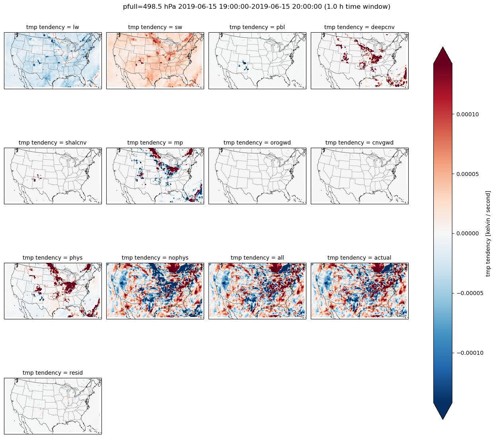
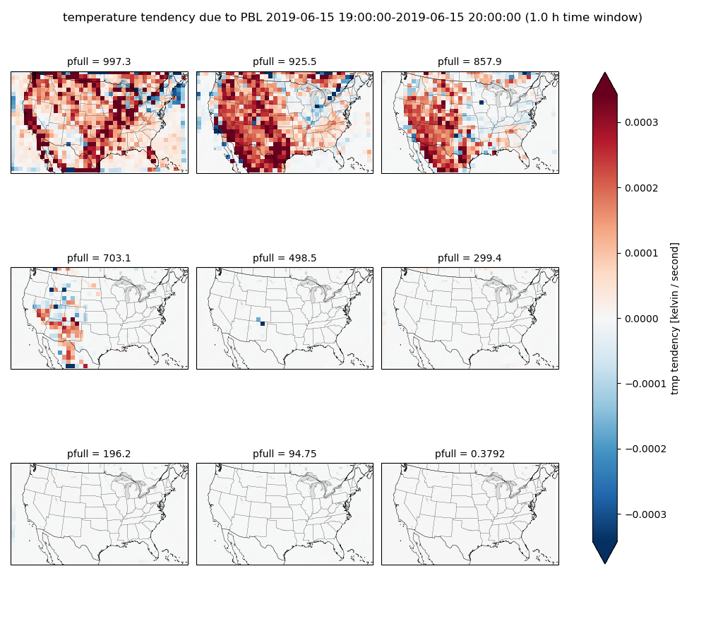
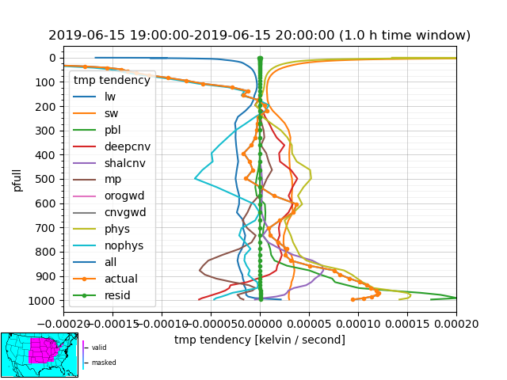
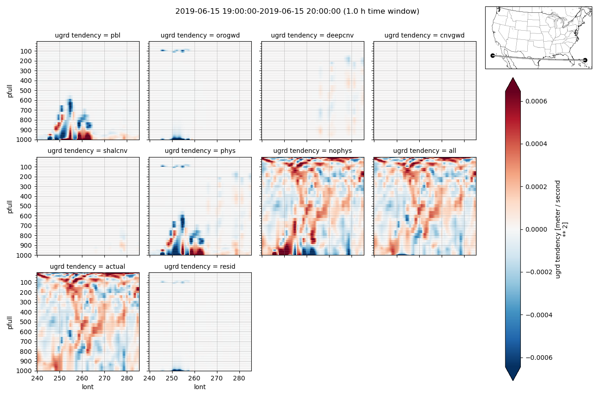

**********************
FV3 physics tendencies
**********************

Description
===========
Plot tendencies of temperature, moisture, and wind components averaged over a time window 
and spatial domain. Tendencies are partitioned into physics parameterizations and 
dynamics. Physics parameterizations include schemes like deep convection, convective 
gravity wave drag, short wave radiation, planetary boundary layer, microphysics, 
and others listed below. Non-physics tendencies (or dynamics) are due to horizontal
and vertical motion (advection). 

residual = *all tendencies - actual change*

The residual (which should be close to zero) is the 
difference between
the actual change in the state variable over the requested time window and the
combined change due to all physics parameterizations and dynamics tendencies. One can plot
a single tendency component at multiple pressure levels or plot all tendency components
at a single pressure level. Plan views (horizontal cross sections), vertical profiles,
and vertical cross sections are also available. 

Required Packages:
==================

* cartopy

* matplotlib

* metpy

* numpy

* pandas

* shapely

* xarray

Required input:
===============

#. FV3 3-D history file with physics and dynamics tendencies (fv3_history.nc)

#. FV3 2-D grid specification file with latititude and longitude of each grid point (grid_spec.nc)

**Download** the `fv3_history.nc and grid_spec.nc files
<https://dtcenter.ucar.edu/dfiles/code/METplus/METplotpy/fv3_physics_tendency/>`_

Save to $DATA_DIR directory where you have read and write permissions.

For additional details see 
`grid description in UFS Short Range Weather App user manual <https://ufs-srweather-app.readthedocs.io/en/latest/LAMGrids.html?highlight=grid#limited-area-model-lam-grids-predefined-and-user-generated-options>`_

Default tendency variable names
-------------------------------

Default tendency variable names are below. The tendencies that are available depend on the 
physics suite that the user selects when running FV3; more specifically, its contents are 
determined by the diag_table file that the user sets up. The history file that we
use our example is for a specific diag_table and so may change with different FV3 configurations. 
The user must make sure the names in the configuration file 
*$METPLOTPY_BASE/test/fv3_physics_tend/fv3_physics_tend_defaults.yaml*
match the names used in fv3_history.nc for their case.
Some tendencies do not apply to all four state variables, so these cells are left blank.

**NOTE**: *$METPLOTPY_BASE* is the directory where the METplotpy code is saved (e.g. */path/to/user/dir/METplotpy*).

+-----------------------------+-------------+-------------------+-------------+-------------+
|      State Variable         | temperature | specific humidity |   u-wind    |   v-wind    |
+=============================+=============+===================+=============+=============+
|       typical name          |     tmp     |        spfh       |    ugrd     |    vgrd     |
+-----------------------------+-------------+-------------------+-------------+-------------+

Typical Tendency variable names (change in config file if your case is different)

+-----------------------------+-------------------+-------------------+----------------+----------------+
|     Tendency  Variable      |    temperature    | specific humidity |     u-wind     |     v-wind     |
+=============================+===================+===================+================+================+
| convective gravity wave drag| dtend_temp_cnvgwd |                   | dtend_u_cnvgwd | dtend_v_cnvgwd |
+-----------------------------+-------------------+-------------------+----------------+----------------+
|        deep convection      | dtend_temp_deepcnv| dtend_qv_deepcnv  | dtend_u_deepcnv| dtend_v_deepcnv|
+-----------------------------+-------------------+-------------------+----------------+----------------+
|      long wave radiation    |   dtend_temp_lw   |                   |                |                |
+-----------------------------+-------------------+-------------------+----------------+----------------+
|         microphysics        |   dtend_temp_mp   |   dtend_qv_mp     |                |                |
+-----------------------------+-------------------+-------------------+----------------+----------------+
| orographic gravity wave drag| dtend_temp_orogwd |                   | dtend_u_orogwd | dtend_v_orogwd |
+-----------------------------+-------------------+-------------------+----------------+----------------+
|   planetary boundary layer  |   dtend_temp_pbl  |   dtend_qv_pbl    |  dtend_u_pbl   |  dtend_v_pbl   |
+-----------------------------+-------------------+-------------------+----------------+----------------+
|       Rayleigh damping      |  dtend_temp_rdamp |                   | dtend_u_rdamp  | dtend_v_rdamp  |
+-----------------------------+-------------------+-------------------+----------------+----------------+
|      shallow convection     | dtend_temp_shalcnv| dtend_qv_shalcnv  | dtend_u_shalcnv| dtend_v_shalcnv|
+-----------------------------+-------------------+-------------------+----------------+----------------+
|     short wave radiation    |   dtend_temp_sw   |                   |                |                |
+-----------------------------+-------------------+-------------------+----------------+----------------+
|   all physics tendencies    |  dtend_temp_phys  |   dtend_qv_phys   |  dtend_u_phys  |  dtend_v_phys  |
+-----------------------------+-------------------+-------------------+----------------+----------------+
|     dynamics (advection)    | dtend_temp_nophys |  dtend_qv_nophys  | dtend_u_nophys | dtend_v_nophys |
+-----------------------------+-------------------+-------------------+----------------+----------------+

Derived tendency variables that show up in plots:

+-----------------------------+-------------------+-------------------+----------------+----------------+
|      Derived Variable       |    temperature    | specific humidity |     u-wind     |     v-wind     |
+=============================+===================+===================+================+================+
|     all phys and nophys     |        all        |        all        |       all      |      all       |
+-----------------------------+-------------------+-------------------+----------------+----------------+
|       actual change         |      actual       |       actual      |     actual     |     actual     |
+-----------------------------+-------------------+-------------------+----------------+----------------+
|  residual (*all - actual*)  |      resid        |       resid       |     resid      |     resid      |
+-----------------------------+-------------------+-------------------+----------------+----------------+

If time window overlaps initialization time
-------------------------------------------

The history file does not necessarily have the temperature, moisture, or wind at the exact
time of model initialization. It is usally the next timestep (e.g. 180 seconds later). 
This means you cannot derive the actual change in temperature starting at the model initialization
time. You must choose a later valid time and/or a shorter time window that does not overlap
the initialization time. In other words, it is a problem if your model initialization time is 0z, your
valid time is 1z and your time window is one hour.

Example
=======

Configuration File
------------------

There is a YAML config file located in
*$METPLOTPY_BASE/test/fv3_physics_tend/fv3_physics_tend_defaults.yaml* 

.. literalinclude:: ../../test/fv3_physics_tend/fv3_physics_tend_defaults.yaml

*$METPLOTPY_BASE* is the directory where the METplotpy code is saved.

Run from the Command Line
=========================

To generate example tendency plots using settings in the **fv3_physics_defaults.yaml** 
configuration file, perform the following:

.. code-block:: bash

   setenv CONFIG_DIR $METPLOTPY_BASE/test/fv3_physics_tend
   setenv DATA_DIR $METPLOTPY_BASE/metplotpy/contributed/fv3_physics_tend
   
::

    usage: <program> [-h] config historyfile gridfile

    Plot FV3 diagnostic tendency

    positional arguments:
      config                yaml configuration file
      historyfile           FV3 history file
      gridfile              FV3 grid spec file

    optional arguments:
      -h, --help            show this help message and exit
      --debug               more log messages (default: False)

                        
Plan View
---------

Generate a plan view of all temperature tendencies at 500 hPa. Settings in config file:

.. code-block:: yaml

   pfull : 
       - 500
   shp : null
   statevarname : "tmp"
   
.. code-block:: bash

   python planview_fv3.py $CONFIG_DIR/tmp_500hPa.yaml $DATA_DIR/fv3_history.nc $DATA_DIR/grid_spec.nc

Generate a plan view of PBL tendency at specified pressure levels. Set `pfull` to an array of levels in config file:

.. code-block:: yaml

   pfull :
       - 1000
       - 925
       - 850
       - 700
       - 500
       - 300
       - 200
       - 100
       - 0

.. code-block:: bash

   python planview_fv3.py $CONFIG_DIR/tmp_pbl.yaml $DATA_DIR/fv3_history.nc $DATA_DIR/grid_spec.nc

Vertical Profile
----------------

Generate vertical profile of temperature tendencies averaged over the central US. Plot residual
tendency and its components. Limit the x-axis range with xmin and xmax. Settings in config file:

.. code-block:: yaml

    shp : "shapefiles/MID_CONUS"
    xmin : -0.0002
    xmax : 0.0002

.. code-block:: bash

    python vert_profile_fv3.py $CONFIG_DIR/tmp.vert_profile.MID_CONUS.yaml $DATA_DIR/fv3_history.nc $DATA_DIR/grid_spec.nc

Vertical Cross Section
----------------------

Generate vertical cross section of u-wind tendencies from 28°N 120°W to 26°N 75°W over one-hour
time window ending 20z June 15, 2019. Settings in config file:

.. code-block:: yaml

   statevarname : "ugrd"
   startpt :
      - 28
      - -120
   endpt :
      - 26
      - -75

.. code-block:: bash

   python cross_section_vert.py $CONFIG_DIR/ugrd_cross_section.yaml $DATA_DIR/fv3_history.nc $DATA_DIR/grid_spec.nc

