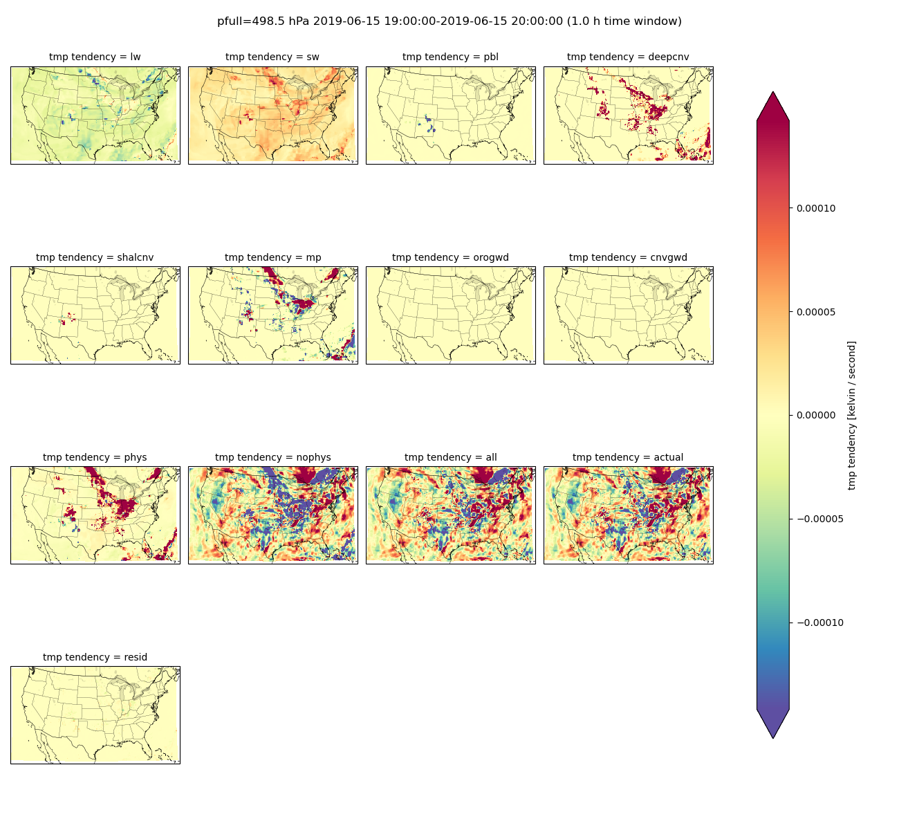
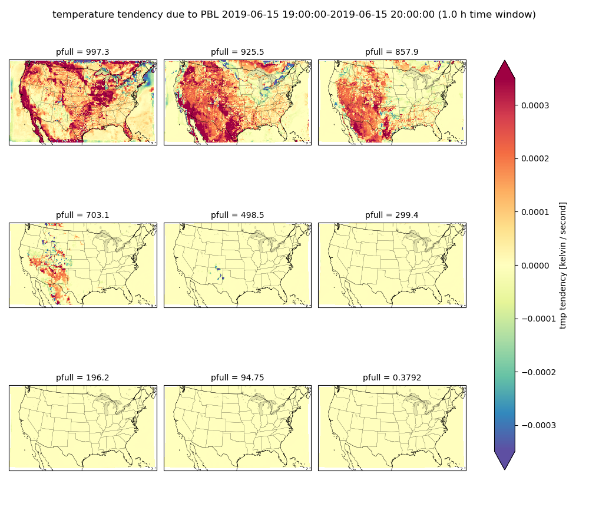

**********************
FV3 physics tendencies
**********************

Description
===========
Plot tendencies of temperature, moisture, and wind components averaged over a time window 
and spatial domain. Tendencies are partitioned into physics parameterizations and 
dynamics. Physics parameterizations include schemes like deep convection, convective 
gravity wave drag, short wave radiation, planetary boundary layer, microphysics, 
and others listed below. Non-physics tendencies (or dynamics) are due to horizontal
and vertical motion (advection). 

residual = all tendencies - actual tendency

The residual (which should be close to zero) is the 
difference between
the actual change in the state variable over the requested time window and the
combined change due to all physics parameterizations and dynamics tendencies. One can plot
a single tendency component at multiple pressure levels or plot all tendency components
at a single pressure level. Plan views (horizontal cross sections), vertical profiles,
and difference plots are also available. 

Required Packages:
==================

* cartopy

* matplotlib

* metpy

* numpy

* pandas

* shapely

* xarray

Required input:
===============

#. FV3 3-D history file with physics and dynamics tendencies (fv3_history.nc)

#. FV3 2-D grid specification file with latititude and longitude of each grid point (grid_spec.nc)

**Download** the `fv3_history.nc and grid_spec.nc files
<https://dtcenter.ucar.edu/dfiles/code/METplus/METplotpy/fv3_physics_tendency/>`_

Save this file in a directory where you have read and write permissions, such as
$WORKING_DIR/data/fv3_physics_tend, where $WORKING_DIR is the path to the directory where you will save
input data.

For additional details see 
`grid description in UFS Short Range Weather App user manual <https://ufs-srweather-app.readthedocs.io/en/latest/LAMGrids.html?highlight=grid#limited-area-model-lam-grids-predefined-and-user-generated-options>`_

Default tendency variable names
-------------------------------

Default tendency variable names are below. The tendencies that are available depend on the 
physics suite that the user selects when running FV3; more specifically, its contents are 
determined by the diag_table file that the user sets up. The history file that we
use our example is for a specific diag_table and so may change with different FV3 configurations. 
The user must make sure the names in the configuration file 
*$METPLOTPY_BASE/test/fv3_physics_tend/fv3_physics_tend_defaults.yaml*
match the names used in fv3_history.nc for their case.
Some tendencies do not apply to all four state variables, so these cells are left blank.

**NOTE**: *$METPLOTPY_BASE* is the directory where the METplotpy code is saved (e.g. */path/to/user/dir/METplotpy*).

+-----------------------------+-------------+-------------------+-------------+-------------+
|      State Variable         | temperature | specific humidity |   u-wind    |   v-wind    |
+=============================+=============+===================+=============+=============+
|       expected name         |     tmp     |        spfh       |    ugrd     |    vgrd     |
+-----------------------------+-------------+-------------------+-------------+-------------+

Tendency variables:

+-----------------------------+-------------------+-------------------+----------------+----------------+
|     Tendency  Variable      |    temperature    | specific humidity |     u-wind     |     v-wind     |
+=============================+===================+===================+================+================+
| convective gravity wave drag| dtend_temp_cnvgwd |                   | dtend_u_cnvgwd | dtend_v_cnvgwd |
+-----------------------------+-------------------+-------------------+----------------+----------------+
|        deep convection      | dtend_temp_deepcnv| dtend_qv_deepcnv  | dtend_u_deepcnv| dtend_v_deepcnv|
+-----------------------------+-------------------+-------------------+----------------+----------------+
|      long wave radiation    |   dtend_temp_lw   |                   |                |                |
+-----------------------------+-------------------+-------------------+----------------+----------------+
|         microphysics        |   dtend_temp_mp   |   dtend_qv_mp     |                |                |
+-----------------------------+-------------------+-------------------+----------------+----------------+
| orographic gravity wave drag| dtend_temp_orogwd |                   | dtend_u_orogwd | dtend_v_orogwd |
+-----------------------------+-------------------+-------------------+----------------+----------------+
|   planetary boundary layer  |   dtend_temp_pbl  |   dtend_qv_pbl    |  dtend_u_pbl   |  dtend_v_pbl   |
+-----------------------------+-------------------+-------------------+----------------+----------------+
|       Rayleigh damping      |  dtend_temp_rdamp |                   | dtend_u_rdamp  | dtend_v_rdamp  |
+-----------------------------+-------------------+-------------------+----------------+----------------+
|      shallow convection     | dtend_temp_shalcnv| dtend_qv_shalcnv  | dtend_u_shalcnv| dtend_v_shalcnv|
+-----------------------------+-------------------+-------------------+----------------+----------------+
|     short wave radiation    |   dtend_temp_sw   |                   |                |                |
+-----------------------------+-------------------+-------------------+----------------+----------------+
|   all physics tendencies    |  dtend_temp_phys  |   dtend_qv_phys   |  dtend_u_phys  |  dtend_v_phys  |
+-----------------------------+-------------------+-------------------+----------------+----------------+
|     dynamics (advection)    | dtend_temp_nophys |  dtend_qv_nophys  | dtend_u_nophys | dtend_v_nophys |
+-----------------------------+-------------------+-------------------+----------------+----------------+

Derived tendency variables that show up in plots:

+-----------------------------+-------------------+-------------------+----------------+----------------+
|      Derived Variable       |    temperature    | specific humidity |     u-wind     |     v-wind     |
+=============================+===================+===================+================+================+
|     all phys and nophys     |        all        |        all        |       all      |      all       |
+-----------------------------+-------------------+-------------------+----------------+----------------+
|       actual tendency       |      actual       |       actual      |     actual     |     actual     |
+-----------------------------+-------------------+-------------------+----------------+----------------+
| residual tend. (all-actual) |      resid        |       resid       |     resid      |     resid      |
+-----------------------------+-------------------+-------------------+----------------+----------------+

If time window overlaps initialization time
----------------------------

The history file does not necessarily have the temperature, moisture, or wind at the exact
time of model initialization. It is usally the next timestep (e.g. 180 seconds later). 
This means you cannot derive the actual change in temperature starting at the model initialization
time. You must choose a later valid time and/or a shorter time window that does not overlap
the initialization time. In other words, it is a problem if your model initialization time is 0z, your
valid time is 1z and your time window is one hour.

Example
=======

Sample Data
-----------

Sample data to plot physics tendencies are available in the `METplus data tar file
<https://dtcenter.ucar.edu/dfiles/code/METplus/METplus_Data/vX.y/sample_data-xxx-x.y.tgz>`_  in the directory
*xxx/fv3_physics_tend*.

Save this file in a directory where you have read and write permissions, such as
$WORKING_DIR/data/fv3_physics_tend, where $WORKING_DIR is the path to the directory where you will save
input data.

Configuration File
------------------

There is a YAML config file located in
*$METPLOTPY_BASE/test/fv3_physics_tend/fv3_physics_tend_defaults.yaml* 

.. literalinclude:: ../../test/fv3_physics_tend/fv3_physics_tend_defaults.yaml

*$METPLOTPY_BASE* is the directory where the METplotpy code is saved.

Run from the Command Line
=========================

To generate example tendency plots using settings in the **fv3_physics_defaults.yaml** 
configuration file, perform the following:

.. code-block:: bash

   setenv CONFIG $METPLOTPY_BASE/test/fv3_physics_tend/fv3_physics_tend_defaults.yaml
   setenv WORKING_DIR $METPLOTPY_BASE/metplotpy/contributed/fv3_physics_tend
   cd $WORKING_DIR
   python planview_fv3.py -h
   
Plan View
---------

::

    usage: planview_fv3.py [-h] [-d] [--method {nearest,linear,loglinear}] [--ncols NCOLS]
                           [--nofineprint] [--norobust] [-o OFILE] [-p PFULL [PFULL ...]]
                           [-s SHP] [--subtract SUBTRACT] [-t TWINDOW] [-v VALIDTIME]
                           [--vmin VMIN] [--vmax VMAX]
                           config historyfile gridfile statevariable fill

    Plan view of FV3 diagnostic tendency

    positional arguments:
      config                yaml configuration file
      historyfile           FV3 history file
      gridfile              FV3 grid spec file
      statevariable         moisture, temperature, or wind component variable name
      fill                  type of tendency. ignored if pfull is a single level

    optional arguments:
      -h, --help            show this help message and exit
      -d, --debug
      --method {nearest,linear,loglinear}
                            vertical interpolation method (default: nearest)
      --ncols NCOLS         number of columns (default: None)
      --nofineprint         Don't add metadata and created by date (for comparing images)
                            (default: False)
      --norobust            compute colormap range with extremes, not 2nd and 98th
                            percentiles (default: False)
      -o OFILE, --ofile OFILE
                            name of output image file (default: None)
      -p PFULL [PFULL ...], --pfull PFULL [PFULL ...]
                            pressure level(s) in hPa to plot. If only one pressure level is
                            provided, the type-of-tendency argument will be ignored and all
                            tendencies will be plotted. (default: [1000, 925, 850, 700, 500,
                            300, 200, 100, 0])
      -s SHP, --shp SHP     shape file directory for mask (default: None)
      --subtract SUBTRACT   FV3 history file to subtract (default: None)
      -t TWINDOW, --twindow TWINDOW
                            time window in hours (default: 3)
      -v VALIDTIME, --validtime VALIDTIME
                            valid time (default: None)
      --vmin VMIN           color bar minimum (overrides robust=True) (default: None)
      --vmax VMAX           color bar maximum (overrides robust=True) (default: None)

                        
Generate a plan view of all tendencies at 500 hPa for the 1-hour time window ending 20190615 20z:

.. code-block:: bash

   python planview_fv3.py $CONFIG $WORKING_DIR/fv3_history.nc $WORKING_DIR/grid_spec.nc tmp pbl \
   -p 500 -t 1 -v 20190615T20 --nofineprint

Generate a plan view of PBL tendency at default pressure levels:

.. code-block:: bash

   python planview_fv3.py $CONFIG $WORKING_DIR/fv3_history.nc $WORKING_DIR/grid_spec.nc tmp pbl \
   -t 1 -v 20190615T20 --nofineprint

.. code-block:: bash

   python vert_profile_fv3.py -h 
   
Vertical Profile
----------------

::

    usage: vert_profile_fv3.py [-h] [-d] [--nofineprint] [-o OFILE] [--resid] [-s SHP]
                               [--subtract SUBTRACT] [-t TWINDOW] [-v VALIDTIME]
                               [--xmin XMIN] [--xmax XMAX]
                               config historyfile gridfile statevariable

    Vertical profile of FV3 diagnostic tendencies

    positional arguments:
      config                yaml configuration file
      historyfile           FV3 history file
      gridfile              FV3 grid spec file
      statevariable         moisture, temperature, or wind component variable name

    optional arguments:
      -h, --help            show this help message and exit
      -d, --debug
      --nofineprint         Don't add metadata and created by date (for comparing images)
                            (default: False)
      -o OFILE, --ofile OFILE
                            name of output image file (default: None)
      --resid               calculate residual (default: False)
      -s SHP, --shp SHP     shape file directory for mask (default: None)
      --subtract SUBTRACT   FV3 history file to subtract (default: None)
      -t TWINDOW, --twindow TWINDOW
                            time window in hours (default: 3)
      -v VALIDTIME, --validtime VALIDTIME
                            valid time (default: None)
      --xmin XMIN           x-axis minimum (default: None)
      --xmax XMAX           x-axis maximum (default: None)
       
Generate vertical profile of temperature tendencies averaged over the central US. Plot residual
tendency and its components. Limit the x-axis range with --xmin and --xmax.

.. code-block:: bash

    python vert_profile_fv3.py $CONFIG $WORKING_DIR/fv3_history.nc $WORKING_DIR/grid_spec.nc tmp \
    -t 1 -v 20190615T20 -s shapefiles/MID_CONUS --resid --xmin -0.0005 --xmax 0.0004 --nofineprint

Vertical Cross Section
----------------------

.. code-block:: bash

   python cross_section_vert.py -h 
   
::

usage: cross_section_vert.py [-h] [-d] [--ncols NCOLS] [--nofineprint] [--norobust] [-o OFILE]
                             [-s START START] [-e END END] [--subtract SUBTRACT] [-t TWINDOW]
                             [-v VALIDTIME] [--vmin VMIN] [--vmax VMAX]
                             config historyfile gridfile statevariable

Vertical cross section of FV3 diagnostic tendencies

positional arguments:
  config                yaml configuration file
  historyfile           FV3 history file
  gridfile              FV3 grid spec file
  statevariable         moisture, temperature, or wind component variable name

optional arguments:
  -h, --help            show this help message and exit
  -d, --debug
  --ncols NCOLS         number of columns (default: None)
  --nofineprint         Don't add metadata and created by date (for comparing images) (default: False)
  --norobust            compute colormap range with extremes, not 2nd and 98th percentiles (default:
                        False)
  -o OFILE, --ofile OFILE
                        name of output image file (default: None)
  -s START START, --start START START
                        start point lat lon (default: (28, -115))
  -e END END, --end END END
                        end point lat lon (default: (30, -82))
  --subtract SUBTRACT   FV3 history file to subtract (default: None)
  -t TWINDOW, --twindow TWINDOW
                        time window in hours (default: 3)
  -v VALIDTIME, --validtime VALIDTIME
                        valid time (default: None)
  --vmin VMIN           color bar minimum (overrides robust=True) (default: None)
  --vmax VMAX           color bar maximum (overrides robust=True) (default: None)

Generate vertical cross section of u-wind tendencies from 28°N 120°W to 26°N 75°W over one-hour
time window ending 23z June 15, 2019.

.. code-block:: bash

    python cross_section_vert.py $CONFIG $WORKING_DIR/fv3_history.nc $WORKING_DIR/grid_spec.nc tmp \
    -t 1 -v "2019-06-15 23" -s 28 -120 -e 26 -75 --nofineprint

Difference Plot
---------------

Put file you want to subtract after the --subtract argument:

.. code-block:: bash

   python vert_profile_fv3.py $CONFIG $WORKING_DIR/fv3_history.nc $WORKING_DIR/grid_spec.nc tmp \
   -t 1 --subtract $WORKING_DIR/fv3_history.nc --nofineprint

