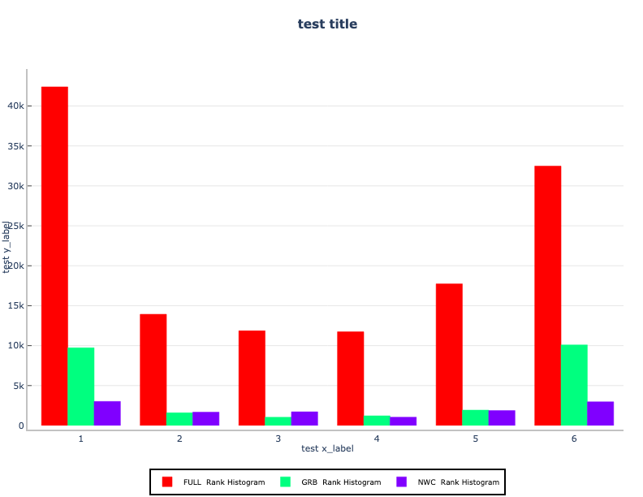
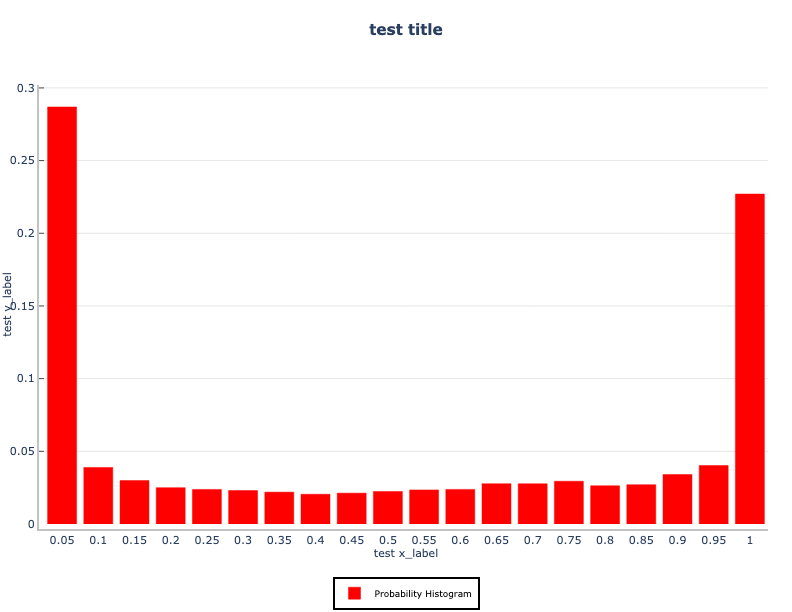
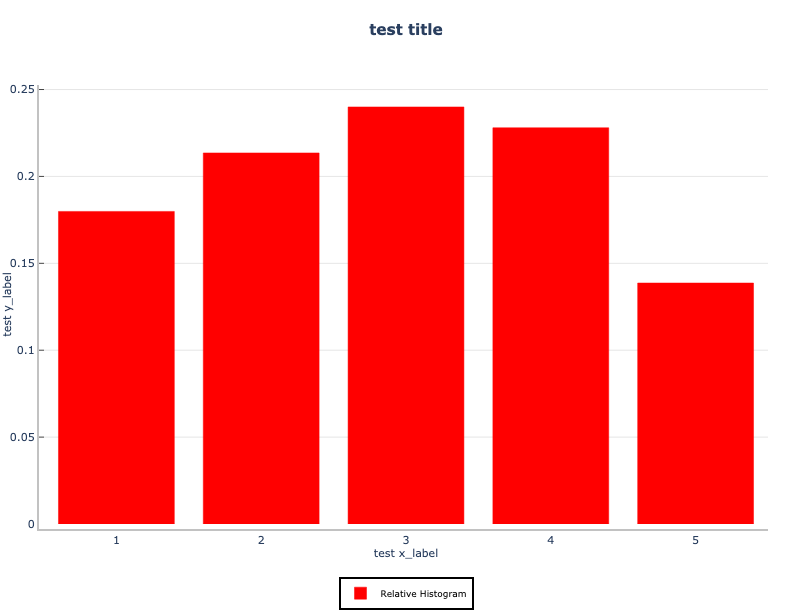

***************
Histogram Plots
***************

Description
===========

Three specialized types of histogram plots are supported: rank histogram, probability histogram, and relative
frequency histogram.  These plots are customized versions of the histogram plot.

**Rank histogram:**

**Probability histogram:**

**Relative Frequency histogram:**

Example
=======

Sample Data
___________

The data is text output from MET in columnar format.
The sample data used to create each of these "customized" plots is available in the METplotpy
repository, where the histogram test scripts are located:

**Rank Histogram**:

*$METPLOTPY_BASE/test/histogram/rank_hist.data*

**Probability Histogram**:

*$METPLOTPY_BASE/test/histogram/prob_hist.data*

**Relative Frequency Histogram**:

*$METPLOTPY_BASE/test/histogram/rel_hist.data*

*$METPLOTPY_BASE* is the directory where the METplotpy code is saved:

e.g.

*/usr/path/to/METplotpy*  if the source code was cloned or forked from the Github repository

or

*/usr/path/to/METplotpy-x.y.z*  if the source code was downloaded as a zip or gzip'd tar file from the Release link of
the Github repository.  The *x.y.z* is the release number.

Configuration Files
___________________

Each histogram plot utilizes YAML configuration files to indicate where
input data is located and to set plot attributes. These plot attributes
correspond to values that can be set via the METviewer tool. YAML is a
recursive acronym for "YAML Ain't Markup Language" and according to
`yaml.org <https://yaml.org>`_,
it is a "human-friendly data serialization language. It is commonly used for
configuration files and in applications where data is being stored or
transmitted. Two configuration files are required. The first is a
default configuration file, **hist_defaults.yaml**,
which is found in the
*$METPLOTPY_BASE/metplotpy/plots/config* directory.
*$METPLOTPY_BASE* indicates the directory where the METplotpy
source code has been saved.  All default
configuration files are located in the
*$METPLOTPY_BASE/metplotpy/plots/config* directory.
**Default configuration files are automatically loaded by the
plotting code and do not need to be explicitly specified when
generating a plot**.

The second required configuration file is a user-supplied “custom”
configuration file to specify settings for the rank, probability, and relative frequency histograms.
This file is used to customize/override the default
settings in the **hist_defaults.yaml** file.

METplus Configuration
=====================

Default Configuration File
__________________________

The following is the *mandatory*, **hist_defaults.yaml**
configuration file, which serves as a starting point for creating a
*generic* histogram plot, upon which the rank, probability, and relative frequency histograms
will be built.

**NOTE**: This default configuration file is automatically loaded by
**histogram.py, rank_hist.py, prob_hist.py, and rel_hist.py.**

.. literalinclude:: ../../metplotpy/plots/config/hist_defaults.yaml

In the default config file, logging is set to stdout and the log level is INFO (i.e. any log messages
of type INFO, WARNING, and ERROR will be logged).  If the log_filename and log_level are
not specified in the custom configuration file, these settings will be used.

Custom Configuration File
_________________________

A second, *mandatory* configuration file is required, which is
used to customize the settings to generate each of the specialized histograms.
The **rank_hist.yaml** , **rank_hist.yaml**, and **rank_hist.yaml** files are included with the
source code and look like the following:

**Rank histogram config file:**

.. literalinclude:: ../../test/histogram/rank_hist.yaml

**Probability histogram config file:**

.. literalinclude:: ../../test/histogram/prob_hist.yaml

**Relative frequency histogram config file:**

.. literalinclude:: ../../test/histogram/rel_hist.yaml

Copy each of these "custom" config files from the directory where the source
code was saved to the working directory:

For the **rank histogram** configuration file

.. code-block:: ini

  cp $METPLOTPY_BASE/test/histogram/rank_hist.yaml $WORKING_DIR/rank_hist.yaml

For the **probability histogram** configuration file

.. code-block:: ini

  cp $METPLOTPY_BASE/test/histogram/prob_hist.yaml $WORKING_DIR/prob_hist.yaml

For the **relative frequency histogram** configuration file

.. code-block:: ini

  cp $METPLOTPY_BASE/test/histogram/rel_hist.yaml $WORKING_DIR/rel_hist.yaml

Modify the *stat_input* setting in the

*$METPLOTPY_BASE/test/histogram/rank_hist.yaml* file
to explicitly point to the
*$METPLOTPY_BASE/test/histogram/histogram*
directory (where the custom config files and sample data reside).

Modify the *stat_input* setting in the

*$METPLOTPY_BASE/test/histogram/prob_hist.yaml* file
to explicitly point to the
*$METPLOTPY_BASE/test/histogram/histogram*
directory (where the custom config files and sample data reside).

Modify the *stat_input* setting in the

*$METPLOTPY_BASE/test/histogram/rel_hist.yaml* file
to explicitly point to the
*$METPLOTPY_BASE/test/histogram/histogram*
directory (where the custom config files and sample data reside).

In the *$METPLOTPY_BASE/test/histogram/rank_hist.yaml* file, replace the
relative path *./rank_hist.data* with the full path
*$METPLOTPY_BASE/test/histogram/rank_hist.data* for the rank histogram config file
(including replacing *$METPLOTPY_BASE* with the full path to the METplotpy
installation on the system)..

In the *$METPLOTPY_BASE/test/histogram/prob_hist.yaml* file, replace the
relative path *./prob_hist.data* with the full path
*$METPLOTPY_BASE/test/histogram/prob_hist.data*
(including replacing *$METPLOTPY_BASE* with the full path to the METplotpy
installation on the system) for the probability histogram config file.

In the *$METPLOTPY_BASE/test/histogram/rel_hist.yaml* file, replace the
relative path *./rel_hist.data* with the full path
*$METPLOTPY_BASE/test/histogram/rel_hist.data* (including replacing *$METPLOTPY_BASE* with the full path to the METplotpy
installation on the system)
for the relative frequency histogram config file.

Modify the *plot_filename* setting to point to the output path where the
plot will be saved, including the name of the plot.

For example

For the **rank histogram**:

*stat_input: /username/myworkspace/METplotpy/test/histogram/rank_hist.data*

*plot_filename: /username/working_dir/output_plots/rank_hist.png*

For the **probability histogram**:

*stat_input: /username/myworkspace/METplotpy/test/histogram/prob_hist.data*

*plot_filename: /username/working_dir/output_plots/prob_hist.png*

For the **relative frequency histogram**:

*stat_input: /username/myworkspace/METplotpy/test/histogram/rel_hist.data*

*plot_filename: /username/working_dir/output_plots/rel_hist.png*

This is where */username/myworkspace/METplotpy* is $METPLOTPY_BASE and
*/username/working_dir* is $WORKING_DIR.  Make sure that the
$WORKING_DIR directory that is specified exists and has the
appropriate read and write permissions. The path listed for
*plot_filename* may be changed to the output directory of one’s choosing.
If this is not set, then the
*plot_filename* setting specified in the
*$METPLOTPY_BASE/metplotpy/plots/config/hist_defaults.yaml*
configuration file will be used.

To save the intermediate **.points1** file (used by METviewer and useful
for debugging), set the *dump_points_1* setting to *True* (in the config file
corresponding to the specialized histogram plot where you wish to save intermediate points).
Uncomment or add (if it doesn't exist) the *points_path* setting:

*dump_points_1: 'True'*

*points_path: '/dir_to_save_points1_file'*

Replace the */dir_to_save_points1_file* to the same directory where the
**.points1** file is saved.
If *points_path* is commented out (indicated by a '#' symbol in front of it),
remove the '#' symbol to uncomment
the *points_path* so that it will be used by the code.  Make sure that
this directory exists and has the
appropriate read and write permissions.  **NOTE**: the *points_path* setting
is **optional** and does not need to be defined in the configuration
file unless saving the intermediate **.points1** file is desired.

For each of the histogram custom config files (rank, probability, and relative frequency),
to save the log output to a file, uncomment the *log_filename* entry and specify the path and
name of the log file.  Select a directory with the appropriate read and write
privileges.  To modify the verbosity of logging than what is set in the default config
file, uncomment the *log_level* entry and specify the log level  (debug and info are higher verbosity, warning and error
are lower verbosity).

Run from the Command Line
=========================

To generate the three specialized histogram plots (i.e. using settings in the
**hist_defaults.yaml** configuration file),
perform the following:

*  If using the conda environment, verify the conda environment
   is running and has has the required Python packages outlined in the
   `requirements section.
   <https://metplotpy.readthedocs.io/en/latest/Users_Guide/installation-requirements.html>`_

* Set the METPLOTPY_BASE environment variable to point to
  *$METPLOTPY_BASE*.

  For the ksh environment:

  .. code-block:: ini
		
    export METPLOTPY_BASE=$METPLOTPY_BASE

  For the csh environment:

  .. code-block:: ini
		
    setenv METPLOTPY_BASE $METPLOTPY_BASE

  Recall that *$METPLOTPY_BASE* is the directory path indicating where the METplotpy source code was saved.

* Run the following on the command line:

  **To generate the rank histogram:**

  .. code-block:: ini  

    python $METPLOTPY_BASE/metplotpy/plots/histogram/rank_hist.py $WORKING_DIR/rank_hist.yaml

  This will create a PNG file, **rank_hist.png**,
  in the directory that was specified in the *plot_filename*
  setting of the **minimal_histogram.yaml** config file:

  .. image:: figure/rank_hist.png

  **To generate the probability histogram**, re-run the above
  command using the **prob_hist.yaml** file:

  .. code-block:: ini
		
    python $METPLOTPY_BASE/metplotpy/plots/histogram/prob_hist.py $WORKING_DIR/prob_hist.yaml

  .. image:: figure/prob_hist.png

**To generate the relative frequency histogram**, re-run the above
  command using the **rel_hist.yaml** file:

  .. code-block:: ini

    python $METPLOTPY_BASE/metplotpy/plots/histogram/rel_hist.py $WORKING_DIR/rel_hist.yaml

  .. image:: figure/rel_hist.png

* A **rank_hist.png** output file will be created in
  the directory that was specified in the *plot_filename* config setting
  in the **rank_hist.yaml** config file.

* A **prob_hist.png** output file will be
  created in the the directory that was specified in the *plot_filename* config setting
  in the **prob_hist.yaml** config file.

* A **rel_hist.png** output file will be
  created in the the directory that was specified in the *plot_filename* config setting
  in the **rel_hist.yaml** config file.
