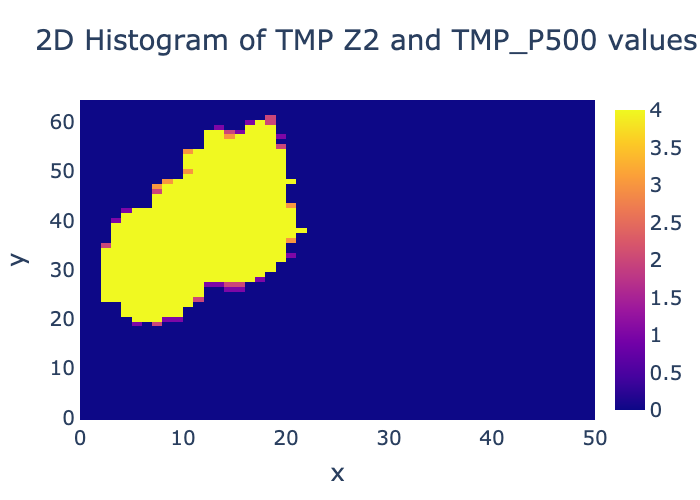

*****************
Histogram_2d plot
*****************

Description
===========

The output from the MET grid_diag tool can be visualized as a 2D-histogram
by invoking the **histogram_2d.py** plotting script from the command line.

For more information about the MET grid_diag tool, please refer to the
`documentation
<https://met.readthedocs.io/en/latest/Users_Guide/grid-diag.html>`_.

Example
=======

Sample Data
___________

The data is in netCDF format.  The sample data used to create an example 2d histogram is available in the
METplotpy repository, where the **histogram_2d.py** code is located:

*$METPLOTPY_BASE/test/histogram_2d/grid_diag_temperature.nc*

*$METPLOTPY_BASE* is the directory where the METplotpy code is saved:

e.g.

*/usr/path/to/METplotpy*  if the source code was cloned or forked from the Github repository

or

*/usr/path/to/METplotpy-x.y.z*  if the source code was downloaded as a zip or gzip'd tar file from the Release link of
the Github repository.  The *x.y.z* is the release number.

Configuration File
__________________

The histogram_2d utilizes YAML configuration files to indicate where
input data is located and to set plot attributes. **NOTE**: The
histogram_2d plot is currently **not** integrated into the METviewer tool,
and as a result the configuration file has fewer settings than the
other plot types that are available through the METviewer tool.  YAML is
a recursive acroynym for "YAML Ain't Markup Language" and according to
`yaml.org <https://yaml.org>`_, it is a "human-friendly data serialization
language". It is commonly used for configuration files and in applications
where data is being stored or transmitted.  Two configuration files are
required. The first is a default configuration file,
**histogram_2d_defaults.yaml** that is found in the
*$METPLOTPY_BASE/metplotpy/plots/config* directory.  All default
configuration files are located in the
*$METPLOTPY_BASE/metplotpy/plots/config*
directory.  **Default configuration files are automatically loaded by
the plotting code and do not need to be explicitly specified when
generating a plot**.

The second, required YAML configuration file is a user-supplied "custom"
configuration file that is used to customize/override the default
settings in the **histogram_2d_defaults.yaml** file.  The custom
configuration file can be an empty file if all the default settings
are to be applied.

METplus Configuration
=====================

Default Configuration File
__________________________

The following is the *mandatory*, **histogram_2d_defaults.yaml**
configuration file, which serves as a starting point for creating a
histogram_2d diagram plot,  as it represents the default values
set in METviewer.

**NOTE**: This default configuration file is automatically loaded by
**histogram_2d.py**.

.. literalinclude:: ../../metplotpy/plots/config/histogram_2d_defaults.yaml

In the default config file, logging is set to stdout and the log level is INFO (i.e. any log messages
of type INFO, WARNING, and DEBUG will be logged).  If the log_filename and log_level are
not specified in the custom configuration file, these settings will be used.

Custom Configuration File
_________________________

A second, *mandatory* configuration file is required, which is
used to customize the settings to the histogram_2d plot. The
**custom_histogram_2d.yaml** file is included with the source code and
looks like the following:

.. literalinclude:: ../../test/histogram_2d/custom_histogram_2d.yaml

Copy this custom config file from the directory where the source code
is saved to the working directory:

.. code-block:: ini

  cp $METPLOTPY_BASE/test/histogram_2d/custom_histogram_2d.yaml $WORKING_DIR/custom_histogram_2d.yaml

Modify the *stat_input* setting in the
*$METPLOTPY_BASE/test/histogram_2d/custom_histogram_2d.yaml*
file to explicitly point to the
*$METPLOTPY_BASE/test/histogram_2d* directory (where
the custom config files and sample data reside).  Replace the relative path
*./grid_diag_temperature.nc* with the full path
*$METPLOTPY_BASE/test/histogram_2d/grid_diag_temperature.nc*
(including replacing *$METPLOTPY_BASE* with the full path to the METplotpy
installation on the system).
Modify the *plot_filename* setting to point to the output path where the
plot will be saved, including the name of the plot.

For example:

*stat_input: /username/myworkspace/METplotpy/test/histogram_2d/grid_diag_temperature.nc*

*plot_filename: /username/working_dir/output_plots/custom_tmp_z2_p500.png*

This is where */username/myworkspace/METplotpy* is $METPLOTPY_BASE and
*/username/working_dir* is $WORKING_DIR.  Make sure that the
$WORKING_DIR directory that is specified exists and has the appropriate
read and write permissions.  The path listed for *plot_filename* may
be changed to the output directory of one's choosing.  If this is not
set, then the *plot_filename* setting specified in the
*$METPLOTPY_BASE/metplotpy/plots/config/histogram_2d_defaults.yaml*
configuration file will be used.   **NOTE**: This may cause issues
if the user does not have write permissions for the *plot_filename*
directory in the **histogram_2d_defaults.yaml** configuration file.

The *points_path*, *dump_points_1*, and *dump_points_2* settings are
**unused** and do not need to be defined in the configuration file, as the
intermediate files that are used by METviewer are currently not being
generated (this plot type is currently not integrated into the METviewer
tool which is why these intermediate files are not being
generated).  The *points_path*, *dump_points_1*, and *dump_points2*
settings can be commented out (i.e. line begins with a '#'):

*# points_path: /path/to/your/directory*

*# dump_points_1: False*

*# dump_points_2: False*

To save the log output to a file, uncomment the *log_filename* entry and specify the path and
name of the log file.  Select a directory with the appropriate read and write
privileges.  To modify the verbosity of logging than what is set in the default config
file, uncomment the *log_level* entry and specify the log level  (debug and info are higher verbosity, warning and error
are lower verbosity).

Using Defaults
______________

To use the **default** settings defined in the **histogram_2d_defaults.yaml**
file, specify a minimal custom configuration file
(**minimal_histogram_2d.yaml**), which consists of only a comment
block, but can be any empty file. **NOTE**: If the user has write
permissions for the output filename path corresponding to the
*plot_filename* setting in the default configuration file, the user
can use the **minimal_histogram_2d.yaml** configuration
file unaltered. Otherwise the user will need to specify
a *plot_filename* in the **minimal_histogram_2d.yaml** file:

.. literalinclude:: ../../test/histogram_2d/minimal_histogram_2d.yaml

Copy this file to the working directory:

.. code-block:: ini

  cp $METPLOTPY_BASE/test/histogram_2d/minimal_histogram_2d.yaml $WORKING_DIR/minimal_histogram_2d.yaml

Add the *stat_input* (input data) and *plot_filename* (output file/plot path)
setting to the *$WORKING_DIR/minimal_histogram_2d.yaml* file (anywhere
below the comment block). The *stat_input* setting explicitly indicates
where the sample data and custom configuration files are located.  Set the
*stat_input* to
*$METPLOTPY_BASE/test/histogram_2d/grid_diag_temperature.nc*
and set the
*plot_filename* to *$WORKING_DIR/output_plots/tmp_z2_p500.png*:

*stat_input: $METPLOTPY_BASE/test/histogram_2d/grid_diag_temperature.nc*

*plot_filename: $WORKING_DIR/output_plots/tmp_z2_p500.png*

Where *$WORKING_DIR* is the working directory where all the custom
configuration files are being saved. **NOTE**: It is possible to
specify the *plot_filename* (output directory) to a directory other than the
*$WORKING_DIR/output_plots*, as long as it is an existing directory
where the user has read and write permissions.

Run from the Command Line
=========================

The **histogram_2d_defaults.yaml** configuration file, in combination with the
**grid_diag_temperature.nc** netCDF data file (generated from the MET
tool grid_diag), generates a 2D-histogram plot of the hist_TMP_Z2_TMP_P500
variable:

Perform the following:

* If using a conda environment, verify that the conda environment is
  running and has the required Python packages outlined in the
  `Python Requirements section
  <https://metplotpy.readthedocs.io/en/latest/Users_Guide/installation.html#python-requirements>`_:

* Clone the METplotpy repository from GitHub.  First, make the directory:

  .. code-block:: ini
		
     mkdir $METPLOTPY_BASE

* *$METPLOTPY_BASE* is the directory where the source code is66TAW saved.
  Enter the following:

  .. code-block:: ini
		
      cd $METPLOTPY_BASE
      git clone https://github.com/dtcenter/METplotpy

* Set the PYTHONPATH to point to the location of the METplotpy code:

  For the csh environment:
  
  .. code-block:: ini

    setenv PYTHONPATH $METPLOTPY_BASE/metplotpy:$METPLOTPY_BASE/metplotpy/plots
  
  For the ksh environment:

  .. code-block:: ini

    export PYTHONPATH=$METPLOTPY_BASE/metplotpy:$METPLOTPY_BASE/metplotpy/plots

  Replace *$METPLOTPY_BASE* with the directory where the source code is saved.

  To generate the above **"defaults"** plot (i.e using default configuration
  settings), use the "minimal" custom configuration file,
  **minimal_histogram_2d.yaml**.

* Enter the following command:

  .. code-block:: ini

    python $METPLOTPY_BASE/metplotpy/plots/histogram_2d/histogram_2d.py $WORKING_DIR/minimal_histogram_2d.yaml

* A **tmp_z2_p500.png** output file will be created in the
  directory specified in the *plot_filename* configuration setting
  in the **minimal_histogram_2d.yaml** config file.

  To generate a **customized** histogram_2d plot (i.e. some or all
  default configuration settings are to be overridden), use the
  **custom_histogram_2d.yaml** config file.

* Enter the following command:

  .. code-block:: ini

    python $METPLOTPY_BASE/metplotpy/plots/histogram_2d/histogram_2d.py $WORKING_DIR/custom_histogram_2d.yaml

  In this example, this custom config file changes the title and font size.

  .. image:: figure/custom_tmp_z2_p500.png

* A **custom_tmp_z2_p500.png** output file will be created in the directory
  specified in the *plot_filename* configuration setting in the
  **custom_histogram_2d.yaml** config file.
