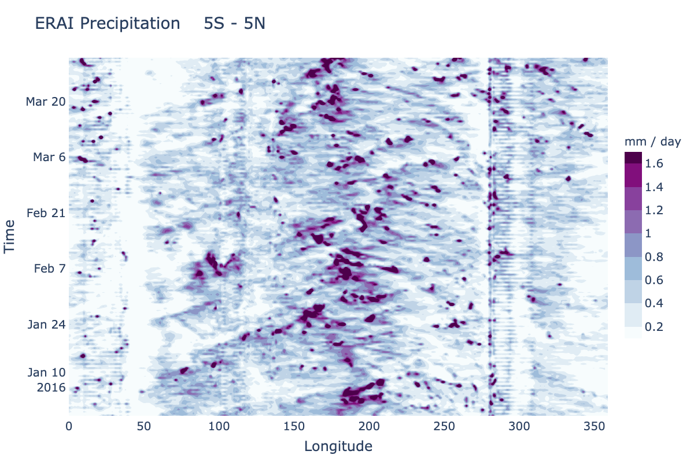

***************
Hovmoeller Plot
***************

Description
===========
A Hovmoeller plot is a 2D contour plot with time along one axis and a
spatial dimension along the other axis. Typically the spatial dimension
not shown has been averaged over some domain. The current METplotpy
Hovmoeller class supports only time along the vertical axis and
longitude along the horizontal axis. This can be generalized in future
releases to allow, for instance, time on the horizontal and latitude on
the vertical. The examples are based on tropical diagnostics applications,
so a meridional average of precipitation from 5 S to 5 N has been set up
in the default configuration.

Please refer to the `METplus use case documentation
<https://metplus.readthedocs.io/en/develop/generated/model_applications/s2s/UserScript_obsPrecip_obsOnly_Hovmoeller.html#sphx-glr-generated-model-applications-s2s-userscript-obsprecip-obsonly-hovmoeller-py>`_
for instructions on how to generate a Hovmoeller diagram.

Required Packages:
==================

* metplotpy

* netcdf4 1.5.6

* numpy 1.20.2

* pandas 1.2.3

* plotly 4.14.3

* scipy 1.5.3

* xarray 0.16.0

Example
=======

Sample Data
___________

The sample data used to create an example Hovmoeller plot is available in
the `s2s METplus data tar file
<https://dtcenter.ucar.edu/dfiles/code/METplus/METplus_Data/v4.0/sample_data-s2s-4.0.tgz>`_  in the directory
*model_applications/s2s/UserScript_obsPrecip_obsOnly_Hovmoeller*.

Save this file in a directory where you have read and write permissions, such as
$WORKING_DIR/data/hovmoeller, where $WORKING_DIR is the path to your data directory.

Configuration Files
___________________

There is a YAML config file located in
*$METPLOTPY_SOURCE/METplotpy/metplotpy/plots/config/hovmoeller_defaults.yaml*

Copy this configuration file from where you saved the METplotpy source code to your working directory:

.. code-block:: ini

  cp $METPLOTPY_SOURCE/METplotpy/metplotpy/plots/config/hovmoeller_defaults.yaml $WORKING_DIR/hovmoeller_defaults.yaml

$METPLOTPY_SOURCE is the directory where you saved the METplotpy code, and $WORKING_DIR is the directory where you
have read and write permissions.

Run from the Command Line
=========================

To generate the example Hovmoeller plot (i.e. using settings in the
**hovmoeller_defaults.yaml** configuration file) perform the following:

*  If using the conda environment, verify the conda environment
   is running and has has the required Python packages specified in the
   **Required Packages** section above.

* Set the METPLOTPY_BASE environment variable to point to
  *$METPLOTPY_SOURCE/METplotpy*. where $METPLOTPY_SOURCE is the directory where you saved the
  METplotpy source code (e.g. /home/someuser).

  For the ksh environment:

  .. code-block:: ini

    export METPLOTPY_BASE=$METPLOTPY_SOURCE/METplotpy

  For the csh environment:

  .. code-block:: ini

* Run the following on the command line:

.. code-block:: ini

   python $METPLOTPY_SOURCE/METplotpy/metplotpy/plots/hovmoeller/hovmoeller.py --config $WORKING_DIR/hovmoeller_defaults.yaml --datadir $WORKING_DIR/data/hovmoeller  --input precip.erai.sfc.1p0.2x.2014-2016.nc

where $METPLOTPY_SOURCE is the directory where you are storing the METplotpy source code and $WORKING_DIR is the
directory where you have read and write permissions and where you are storing all your input data and where you
copied the default config file.

A plot named **erai_precip.png** will be generated in the directory from where you ran the above command:

