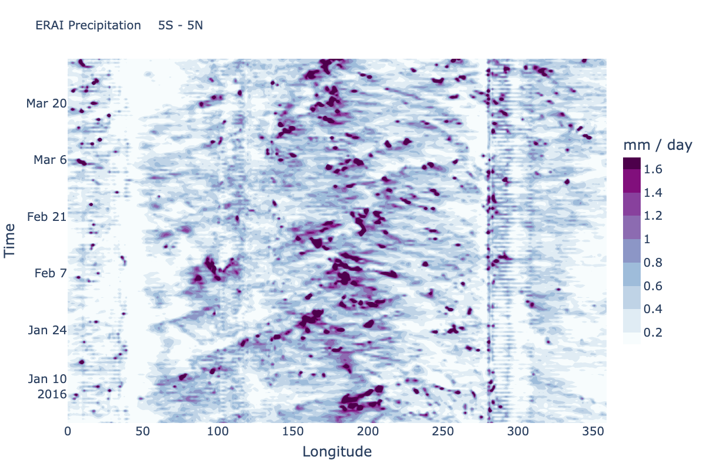

***************
Hovmoeller Plot
***************

Description
===========
A Hovmoeller plot is a 2D contour plot with time along one axis and a
spatial dimension along the other axis. Typically the spatial dimension
not shown has been averaged over some domain. The current METplotpy
Hovmoeller class supports only time along the vertical axis and
longitude along the horizontal axis. This can be generalized in future
releases to allow, for instance, time on the horizontal and latitude on
the vertical. The examples are based on tropical diagnostics applications,
so a meridional average of precipitation from 5 S to 5 N has been set up
in the default configuration.

Please refer to the `METplus use case documentation
<https://metplus.readthedocs.io/en/develop/generated/model_applications/s2s/UserScript_obsPrecip_obsOnly_Hovmoeller.html#sphx-glr-generated-model-applications-s2s-userscript-obsprecip-obsonly-hovmoeller-py>`_
for instructions on how to generate a Hovmoeller diagram.

Required Packages:
==================

Python 3.8.6 is the minimum version that is required

* metplotpy

* netcdf4 1.5.7 or above

* numpy 1.22.3

* pandas 1.4.2

* plotly 5.7.0 or above

* scipy 1.8.0

* xarray 2022.3.0

Example
=======

Sample Data
___________

The sample data used to create an example Hovmoeller plot is available in
the `s2s METplus data tar file
<https://dtcenter.ucar.edu/dfiles/code/METplus/METplus_Data/v4.0/sample_data-s2s-4.0.tgz>`_  in the directory
*model_applications/s2s/UserScript_obsPrecip_obsOnly_Hovmoeller*.

Save this file in a directory where you have read and write permissions, such as
$WORKING_DIR/data/hovmoeller, where $WORKING_DIR is the path to the directory where you will save
input data.

Configuration Files
___________________

There is a YAML config file located in
*$METPLOTPY_BASE/metplotpy/plots/config/hovmoeller_defaults.yaml*

.. literalinclude:: ../../metplotpy/plots/config/hovmoeller_defaults.yaml

*$METPLOTPY_BASE* is the directory where the METplotpy code is saved:

e.g.

*/usr/path/to/METplotpy*  if the source code was cloned or forked from the Github repository

or

*/usr/path/to/METplotpy-x.y.z*  if the source code was downloaded as a zip or gzip'd tar file from the Release link of
the Github repository.  The *x.y.z* is the release number.

The Hovmoeller plot utilizes YAML configuration files to indicate where input data is located and to set plot attributes.
YAML is a recursive acronym for “YAML Ain’t Markup Language” and according to yaml.org, it is a “human-friendly data serialization language”.
It is commonly used for configuration files and in applications where data is being stored or transmitted.
Two configuration files are required. The first is a default configuration file, the first is a default configuration file,
hovmoeller_defaults.yaml that is found in the $METPLOTPY_BASE/metplotpy/plots/config directory. All default configuration
files are located in the $METPLOTPY_BASE/metplotpy/plots/config directory. Default configuration files are automatically
loaded by the plotting code and do not need to be explicitly specified when generating a plot.

The second, required YAML configuration file is a user-supplied “custom” configuration file that is used to
customize/override the default settings in the hovmoeller_defaults.yaml file. The custom configuration file can be an
empty file if **all** default settings are to be applied.

Default Configuration File
__________________________

The following is the *mandatory*, **hovmoeller_defaults.yaml**
configuration file, which serves as a starting point for creating
a Hovmoeller plot.

**NOTE**: This default configuration file is automatically loaded by
**hovmoeller.py**.

.. literalinclude:: ../../metplotpy/plots/config/hovmoeller_defaults.yaml

Custom Configuration File
_________________________

A second, *mandatory* configuration file is required, which is
used to customize the settings to the Hovmoeller plot. The
**custom_hovmoeller.yaml** file is included with the source code
and looks like the following:

.. literalinclude:: ../../test/hovmoeller/custom_hovmoeller.yaml

Copy this custom config file from the directory where the source code
was saved to the working directory:

.. code-block:: ini

  cp $METPLOTPY_BASE/test/hovmoeller/custom_hovmoeller.yaml $WORKING_DIR/custom_hovmoeller.yaml

Modify the *input_data_file* setting in the
*$METPLOTPY_BASE/test/hovmoeller/custom_hovmoeller.yaml*
file to explicitly point to the
*$METPLOTPY_BASE/test/hovmoeller* directory (where the
custom config files and sample data reside).  Replace the relative path
*./precip.erai.sfc.1p0.2x.2014-2016.nc* with the full path
*$METPLOTPY_BASE/test/hovmoeller/precip.erai.sfc.1p0.2x.2014-2016.nc*
(including replacing *$METPLOTPY_BASE* with the full path to the METplotpy
installation on the system).
Modify the *plot_filename* setting to point to the output path where the
plot will be saved, including the name of the plot.

For example:

*input_data_file: /username/myworkspace/METplotpy/test/hovmoeller/precip.erai.sfc.1p0.2x.2014-2016.nc*

*plot_filename: /username/working_dir/output_plots/hovmoeller_custom_plot.png*

This is where */username/myworkspace/METplotpy* is *$METPLOTPY_BASE* and
*/username/working_dir* is *$WORKING_DIR*.  Make sure that the
*$WORKING_DIR* directory that is specified exists and has the appropriate
read and write permissions.The path listed for *plot_filename* may be
changed to the output directory of one’s choosing.  If this is not set,
then the *plot_filename* setting specified in the
*$METPLOTPY_BASE/metplotpy/plots/config/hovmoeller_defaults.yaml*
configuration file will be used.

Using Defaults
______________

If the user wishes to use all the **default** settings defined in the
**hovmoeller_defaults.yaml** file, specify a minimal custom configuration
file (**minimal_hovmoeller.yaml**), which consists of only a comment
block. This can be any empty file (as long as the user has write permissions
for the output filename path corresponding to the
*plot_filename* setting in the default configuration file). Otherwise,
this will need to be specified in *plot_filename* in the
**minimal_hovmoeller.yaml** file:

.. literalinclude:: ../../test/hovmoeller/minimal_hovmoeller.yaml

Copy this file to the working directory:

.. code-block:: ini

  cp $METPLOTPY_BASE/test/hovmoeller/minimal_hovmoeller.yaml $WORKING_DIR/minimal_hovmoeller.yaml

Edit the *input_data_file* (input data) and *plot_filename*
(output file/plot path) settings in the
*$WORKING_DIR/minimal_hovmoeller.yaml* file (anywhere below the
comment block). The *input_data_file* setting explicitly indicates where the
sample data and custom configuration files are located.  Set the
*input_data_file* to
*$METPLOTPY_BASE/test/hovmoeller/precip.erai.sfc.1p0.2x.2014-2016.nc*
and set the *input_data_file* and *plot_filename* settings:

*input_data_file: $METPLOTPY_BASE/test/hovmoeller/precip.erai.sfc.1p0.2x.2014-2016.nc*

*plot_filename: $WORKING_DIR/output_plots/hovmoeller_default.png*

*$WORKING_DIR* is the working directory where all the custom
configuration files are being saved
(including replacing *$METPLOTPY_BASE* with the full path to the METplotpy
installation on the system). **NOTE**: To specify the
*plot_filename* (output directory) to a directory other than the
*$WORKING_DIR/output_plots*, this can be done as long as it is an
existing directory where the user has read and write permissions.

Run from the Command Line
=========================

The Hovmoeller plot that uses only the default values defined in
the **hovmoeller_defaults.yaml** configuration file looks like the following:

Perform the following:

* To use the conda environment, verify the conda environment
  is running and has has the required
  Python packages outlined in the `Python Requirements section
  <https://metplotpy.readthedocs.io/en/latest/Users_Guide/installation.html#python-requirements>`_.>`_:

* Set the METPLOTPY_BASE environment variable to point to
  *$METPLOTPY_BASE*

  For the ksh environment:

  .. code-block:: ini

    export METPLOTPY_BASE=$METPLOTPY_BASE

  For the csh environment:

  .. code-block:: ini

    setenv METPLOTPY_BASE $METPLOTPY_BASE

  Replacing the $METPLOTPY_BASE with the directory where the
  METplotpy source code was saved.

  To generate the above **"defaults"** plot (i.e using default configuration settings), use the "minimal" custom configuration file,
  **minimal_hovmoeller.yaml**.

* Enter the following command:

  .. code-block:: ini

    python $METPLOTPY_BASE/metplotpy/plots/hovmoeller/hovmoeller.py $WORKING_DIR/minimal_hovmoeller.yaml

* A **hovmoeller_default.png** output file will be created in the
  directory specified in the *plot_filename* configuration setting
  in the **minimal_hovmoeller.yaml** config file.

  To generate a **customized** Hovmoeller plot (i.e. some or all default
  configuration settings are to be overridden), use the
  **custom_hovmoeller.yaml** config file.

* Enter the following command:

  .. code-block:: ini

    python $METPLOTPY_BASE/metplotpy/plots/hovmoeller/hovmoeller.py $WORKING_DIR/custom_hovmoeller.yaml

  In this example, this custom config file changes the title and date_start and date_end values. These changes are evident in the drastically different plot
  shown below.  The user can experiment with the values in the custom_hovmoeller.yaml configuration file
  to achieve the desired appearance.

  .. image:: hovmoeller_custom_plot.png

* A **custom_hovmoeller.png** output file will be created in the
  directory that was specified in the *plot_filename* configuration
  setting in the **custom_hovmoeller.yaml** config file.

