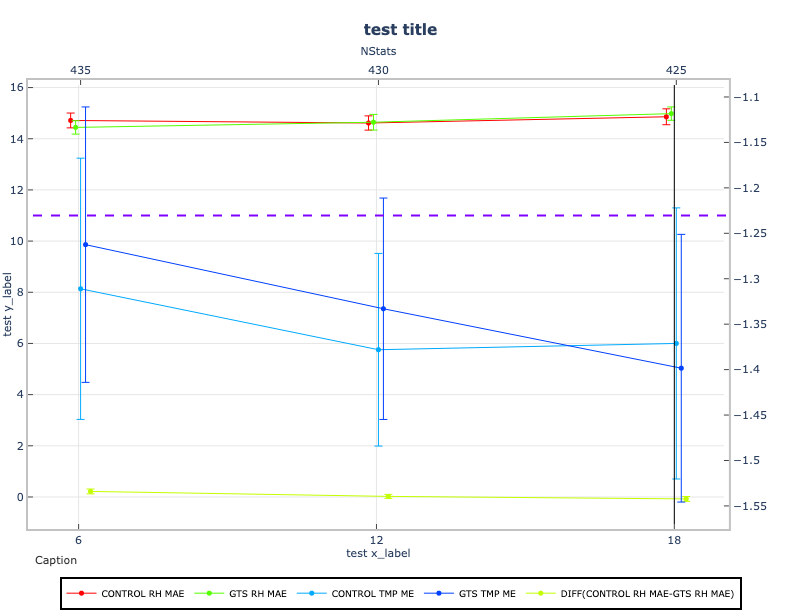

*********
Line Plot
*********

Description
===========
The line plot is a scatter plot where each point is connected by a line.
It is used by METviewer for generating series plots.
Refer to the
`METviewer documentation
<https://metviewer.readthedocs.io/en/latest/Users_Guide/boxplot.html>`_
for details on how this plot is utilized.

Example
=======

Sample Data
___________

The data is text output from MET in columnar format. The sample data used to
create an example line plot is available in the
`METplotpy <https://github.com/dtcenter/METplotpy>`_ repository, where the line plot tests are located:

*$METPLOTPY_BASE/metplotpy/test/line/line.data*

*$METPLOTPY_BASE* is the directory where the METplotpy code is saved:

e.g.

*/usr/path/to/METplotpy*  if the source code was cloned or forked from the Github repository

or

*/usr/path/to/METplotpy-x.y.z*  if the source code was downloaded as a zip or gzip'd tar file from the Release link of
the Github repository.  The *x.y.z* is the release number.

Configuration Files
___________________

The line plot utilizes YAML configuration files to indicate where input
data is located and to set plot attributes. These plot attributes correspond
to values that can be set via the METviewer tool. YAML is a recursive
acronym for "YAML Ain't Markup Language" and according to
`yaml.org <https://yaml.org>`_, it is a
"human-friendly data serialization language".
It is commonly used for configuration files and in applications where
data is being stored or
transmitted. Two configuration files are required. The first is a default
configuration file, **line_defaults.yaml**, which is found in the
*$METPLOTPY_BASE/metplotpy/plots/config* directory. All default
configuration files are located in the
*$METPLOTPY_BASE/metplotpy/plots/config* directory.
*$METPLOTPY_BASE* is base directory where the
METplotpy source code has been saved. **Default configuration files are
automatically loaded by the plotting code and do not need to be explicitly
specified when generating a plot**.

The second required configuration file is a user-supplied “custom”
configuration file. This  file is used to customize/override the default
settings in the **line_defaults.yaml** file. The custom configuration
file can be an empty file if all default settings are to be applied.

.. note::

  The YAML configuration files do not support expanding environment variables. If you see an environment variable
  referenced in this documentation for a YAML configuration item, please be aware the full value of that environment
  variable must be used.

METplus Configuration
=====================

Default Configuration File
__________________________

The following is the *mandatory*, **line_defaults.yaml** configuration file,
which serves as a good starting point for creating a line
plot as it represents the default values set in METviewer.

**NOTE**: This default configuration file is automatically loaded by
**line.py**.

.. literalinclude:: ../../metplotpy/plots/config/line_defaults.yaml

In the default config file, logging is set to stdout and the log level is INFO (i.e. any log messages
of type INFO, WARNING, and DEBUG will be logged).  If the log_filename and log_level are
not specified in the custom configuration file, these settings will be used.

Custom Configuration File
_________________________

A second, *mandatory* configuration file is required, which is
used to customize the settings to the line plot. The **custom_line.yaml**
file is included with the source code.  If the user
wishes to use all the default settings defined in the **line_defaults.yaml**
file, an empty custom configuration file can be specified instead.

.. literalinclude:: ../../test/line/custom_line.yaml

Copy this custom config file from the directory where the source code was
saved to the working directory:

.. code-block:: ini
		
  cp $METPLOTPY_BASE/test/line/custom_line.yaml $WORKING_DIR/custom_line.yaml

Modify the *stat_input* setting in the
*$METPLOTPY_BASE/test/line/custom_line.yaml* file to
explicitly point to the *$METPLOTPY_BASE/test/line*
directory (where the custom config files and sample data reside).
Replace the relative path *./line.data* with the full path
*$METPLOTPY_BASE/test/line/line.data*
(including replacing *$METPLOTPY_BASE* with the full path to the METplotpy
installation on the system).  Modify the *plot_filename*
setting to point to the output path where the plot will be saved,
including the name of the plot.

For example:

*stat_input: /username/myworkspace/METplotpy/test/line/line.data*

*plot_filename: /username/working_dir/output_plots/line.png*

This is where */username/myworkspace/METplotpy* corresponds to *$METPLOTPY_BASE* and
*/username/working_dir* corresponds to *$WORKING_DIR*.  Make sure that the
*$WORKING_DIR* directory that is specified exists and has the appropriate
read and write permissions.  The path listed for *plot_filename* may be
changed to the output directory of one's choosing.  If this is not set,
then the *plot_filename* setting specified in the
*$METPLOTPY_BASE/metplotpy/plots/config/line_defaults.yaml*
configuration file will be used.

To save the intermediate **.points1** file (used by METviewer and is useful
for debugging but not required), set the *dump_points_1*
setting to True. Uncomment or add (if it doesn't exist) the
*points_path* setting.

*dump_points_1: 'True'*

*points_path: '/dir_to_save_points1_file'*

Replace the */dir_to_save_points1_file* to the same directory where
the **.points1** file is saved.
If *points_path* is commented out (indicated by a '#' symbol in front of it),
remove the '#' symbol to uncomment the points_path so that it will be
used by the code.  Make sure that this directory exists and has the
appropriate read and write permissions.  **NOTE**: the *points_path* setting
is **optional** and does not need to be defined in the configuration file
unless saving the intermediate **.points1** file is desired.

To save the log output to a file, uncomment the *log_filename* entry and specify the path and
name of the log file.  Select a directory with the appropriate read and write
privileges.  To modify the verbosity of logging than what is set in the default config
file, uncomment the *log_level* entry and specify the log level  (debug and info are higher verbosity, warning and error
are lower verbosity).

Using Defaults
______________

To use the *default* settings defined in the **line_defaults.yaml**
file, specify a minimal custom configuration file (**minimal_line.yaml**),
which consists of only a comment block, but can be any empty file
(if the user has write permissions for the output filename path corresponding
to the *plot_filename* setting in the default configuration file.
Otherwise the user  will need to specify a *plot_filename* in the
**minimal_line.yaml** file):

.. literalinclude:: ../../test/line/minimal_line.yaml

Copy this file to the working directory:

.. code-block:: ini

  cp $METPLOTPY_BASE/test/line/minimal_line.yaml $WORKING_DIR/minimal_line.yaml

Add the *stat_input* (input data) and *plot_filename* (output file/plot path)
settings to the **$WORKING_DIR/minimal_line.yaml**
file (anywhere below the comment block). The *stat_input* setting
explicitly indicates where the sample data and custom configuration
files are located.  Set the *stat_input* to
*$METPLOTPY_BASE/test/line/line.data* and set the
*plot_filename* to *$WORKING_DIR/output_plots/line_default.png* (making sure to
replace environment variables with their actual values):

*stat_input: $METPLOTPY_BASE/test/line/line.data*

*plot_filename: $WORKING_DIR/output_plots/line_default.png*

*$WORKING_DIR* is the working directory where all the custom
configuration files are being saved. **NOTE**: If the *plot_filename*
(output directory) is specified to a directory other than the
*$WORKING_DIR/output_plots*, the user must have read and write permissions
to that directory.

**NOTE**: This default plot does not display any of the data points.
It is to be used as a template for setting up margins, captions,
label sizes, etc.

Run from the Command Line
=========================

The **custom_line.yaml** configuration file, in combination with the
**line_defaults.yaml** configuration file, generate a plot of
five series:

To generate the above plot using the **line_defaults.yaml** and
**custom_line.yaml** config files, perform the following:

* If using the conda environment, verify the conda environment
  is running and has the required
  `Python packages
  <https://metplotpy.readthedocs.io/en/latest/Users_Guide/installation.html#python-requirements>`_
  outlined in the requirements section.

* Set the METPLOTPY_BASE environment variable to point to
  *$METPLOTPY_BASE*.

  For the ksh environment:

  .. code-block:: ini
		
    export METPLOTPY_BASE=$METPLOTPY_BASE

  For the csh environment:

  .. code-block:: ini

    setenv METPLOTPY_BASE $METPLOTPY_BASE

  Recall that *$METPLOTPY_BASE* is the directory path indicating where the METplotpy source code was saved.

  To generate the above **"custom"** plot (i.e using some custom
  configuration settings), use the custom configuration file,
  **custom_line.yaml**.

* Enter the following command:
  
  .. code-block:: ini

    python $METPLOTPY_BASE/metplotpy/plots/line/line.py $WORKING_DIR/custom_line.yaml

* A **line.png** output file will be created in the directory specified in
  the *plot_filename* configuration setting in the **line.yaml** config file.

  To generate the **"defaults"** plot below (i.e using default configuration
  settings), use the "minimal" custom configuration file,
  **minimal_line.yaml**.

* Enter the following command:

  .. code-block:: ini
    
    python $METPLOTPY_BASE/metplotpy/plots/line/line.py $WORKING_DIR/minimal_line.yaml

* A **line_default.png** output file will be created in the
  directory specified in the *plot_filename* configuration setting
  in the **line_defaults.yaml** config file.

  .. image:: figure/line_default.png

  **NOTE**: This default plot does not display any of the data points.
  It is to be used as a template for
  setting up margins, captions, label sizes, etc.
