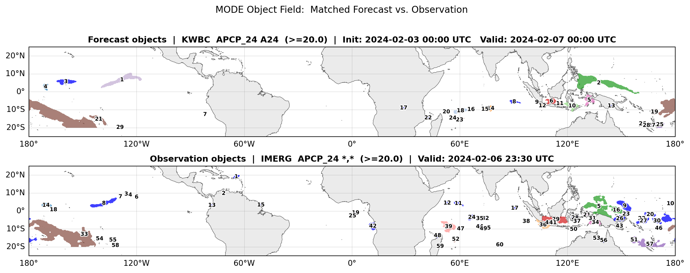
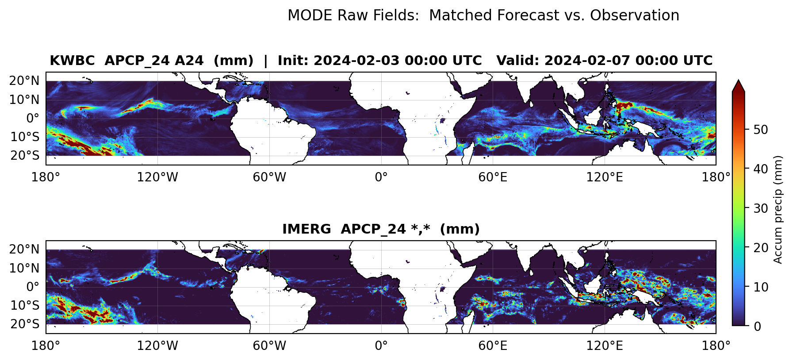

***************
Mode Field Plot
***************

Description
===========
The mode field plot replaces the deprecated MET MODE plotting utility plot_mode_field.

Example
=======

Sample Data
-----------

The data used to generate the plot is the netCDF object file from the MET MODE tool.

The sample data for creating the example mode_field_plot plot is available in the
`METplus Data directory <https://github.com/dtcenter/METplus>`_ repository,
under the Releases link, click on the link corresponding to **METplus_Data/vx.y.z** or **METplus_Data/vx.y** (where x.y.z or x.y is the version of the release):

    *ToDo: Explicit name of tarball goes here and related instructions*

Configuration Files
-------------------

The mode field plot utilizes YAML configuration files to indicate where input
data is located and to set plot attributes. YAML is a recursive
acronym for "YAML Ain't Markup Language" and according to
`yaml.org <https://yaml.org>`_, it is a
"human-friendly data serialization language".
It is commonly used for configuration files and in applications where
data is being stored or
transmitted. Two configuration files are required. The first is a default
configuration file, **mode_field_plot_defaults.yaml**, which is found in the
*$METPLOTPY_BASE/metplotpy/plots/config* directory. All default
configuration files are located in the
*$METPLOTPY_BASE/metplotpy/plots/config* directory.
*$METPLOTPY_BASE* is base directory where the
METplotpy source code has been saved. **Default configuration files are
automatically loaded by the plotting code and do not need to be explicitly
specified when generating a plot**. In addition, the default configuration file
**DOES NOT require any modifications**.

The second required configuration file is a user-supplied “custom”
configuration file. This file is used to customize/override the default
settings in the **mode_field_plot_defaults.yaml** file. The custom configuration
file can contain only those settings that will override the default settings in the
mode_field_plot_defaults.yaml config file.

.. note::

  The YAML configuration files do not support expanding environment variables. If you see an environment variable referenced in this documentation for a YAML configuration item, please be aware the full value of that environment variable must be used.

METplus Configuration
=====================

Default Configuration File
--------------------------

The *mandatory*, **mode_field_plot_defaults.yaml** configuration file serves as a good starting point for creating a mode field
plot.  This default config file **SHOULD NOT** be modified.
The custom configuration file is used to override the settings
of interest (i.e. marker colors, marker styles, trendline styles, etc.).

.. note::

 This default configuration file is automatically loaded by **mode_field_plot.py**.

**Default configuration file:**

.. dropdown:: mode_field_plot_defaults.yaml

    .. literalinclude:: ../../metplotpy/plots/config/mode_field_plot_defaults.yaml

- The default config file is set up to plot the MODE objects field.

- Logging is set to *stdout* and the log level is *ERROR* (i.e. any log messages of type ERROR will be logged).

- If the log_filename and log_level are not specified in the custom configuration file, these settings will be used.

- To save the log to a file and change the log level, set the log_filename and log_level to the desired values in the custom config file.

*DO NOT* modify the default configuration file.

Custom Configuration File
-------------------------

A second, *mandatory* configuration file is required, which is
used to customize the settings to the mode field plot. The **test_mode_field_plot_objects.yaml** and **test_mode_field_plot_raw.yaml** configuration files are included with the source code.

.. dropdown:: **Example config to plot MODE objects fields**

   .. literalinclude:: ../../test/mode_field_plot/test_mode_field_plot_objects.yaml

.. dropdown::  **Example config to plot MODE raw field**

  .. literalinclude:: ../../test/mode_field_plot/test_mode_field_plot_raw.yaml

Copy the custom config file from the directory where the source code was saved to the working directory:

.. code-block:: ini

  cp $METPLOTPY_BASE/test/mode_field_plot/test_mode_field_plot_objects.yaml $WORKING_DIR/custom_mode_field_obj_plot.yaml

To generate a plot of the MODE raw field, copy this custom config file to the working directory:

.. code-block:: ini

 cp $METPLOTPY_BASE/test/mode_field_plot/test_mode_field_plot_raw.yaml $WORKING_DIR/custom_mode_field_raw_plot.yaml

**Make modifications to the custom configuration file**

.. dropdown:: Description of custom config file settings (click to expand)

 .. dropdown::  mode_obj_file

      - **mandatory**

      - MODE netCDF file

      - full path to the file, replace  *path-to-data* with full path

           ex:  /path-to-data/mode_KWBC_APCP_24_vs_IMERG_APCP_24_960000L_20240207_000000V_240000A_R1_T2_obj.nc
 .. dropdown:: output_dir

    - **mandatory**

 .. dropdown:: output_filename

    - **mandatory**

 .. dropdown:: field_to_plot

    - options are *objects*  or *raw*

    - default is *objects*

 .. dropdown:: super_title

     - **mandatory**

     - the super title (at the very top of the plot figure)

     - default is "Your super-title goes here"

 .. dropdown:: super_title_font_size

     - default is 12

 .. dropdown:: download_natural_earth_shapefile

   - default value is False

         - uses the provided Natural Earth shapefile (included in source code)

   - if set to True,  downloads from the naturalearthdata.com/S3 mirror

         - **NOTE** requires internet access

 .. dropdown::  plot_height

     - value in inches

     - default value set to 8

 .. dropdown:: plot_width

    - value in inches

    - default value set to 11.0

 .. dropdown:: bbox_padding_degrees

    - padding around the bounding box

    - default value is 5.0

 .. dropdown:: resolution_dpi

    - resolution in dpi (dots per inch)

    - default value is 200

 .. dropdown:: show_obj_id_labels

   - shows object id labels

   - default value is True

 .. dropdown:: vert_spacing

   - vertical spacing between panels

   - default value is 0.06

 .. dropdown:: colormap_name

   - colormap used for plotting MODE raw field

   - default value is *turbo*

 .. dropdown:: colorbar_max

   - max value for colorbar in legend for MODE field

   - default value is 99.0

 .. dropdown:: colorbar_label

   - label to colorbar

   - default is 'colorbar label goes here'

 .. dropdown:: colorbar_label_fontsize

   - fontsize for the colorbar legend label

   - default value is 9

 .. dropdown:: title_space

   - title spacing between panels

   - default value is 0.45

 .. dropdown:: top_bottom_marging

   - positioning the super title

   - default value is 0.35

 Applicable to plotting the raw field data:  range
 that the colormap covers

 .. dropdown:: vmin

   - default value is 0.0

 .. dropdown:: vmax

   - default is None (i.e. not specified/setting not
     included in the config file)

 .. dropdown:: vmax_pctile

   - used to comput vmax when vmax is unspecified

   - default value is 99.0

Run from the Command Line
=========================

**MODE field objects plot**

The **custom_mode_field_obj_plot.yaml** configuration file, in combination with the
**mode_field_plot_defaults.yaml** configuration file, generates a figure of the MODE objects field.

The MODE objects figure has two stacked plots, the upper plot is the forecast objects
and the lower plot is the observation objects:

To generate the above plot using the **mode_field_plot_defaults.yaml** and
**custom_mode_field_obj_plot.yaml** config files, perform the following:

* If using the conda environment, verify the conda environment
  is running and has the required
  `Python packages <https://metplus.readthedocs.io/projects/metplotpy/en/latest/Users_Guide/installation.html#python-requirements>`_
  outlined in the requirements section.

* Set the METPLOTPY_BASE environment variable to point to
  *$METPLOTPY_BASE*.

  For the ksh environment:

  .. code-block:: ini
		
    export METPLOTPY_BASE=$METPLOTPY_BASE

  For the csh environment:

  .. code-block:: ini

    setenv METPLOTPY_BASE $METPLOTPY_BASE

  Recall that *$METPLOTPY_BASE* is the directory path indicating where the METplotpy source code was saved.

* Enter the following command:
  
  .. code-block:: ini

    python $METPLOTPY_BASE/metplotpy/plots/mode_field_plot/mode_field_plot.py $WORKING_DIR/custom_mode_field_obj_plot.yaml

* An **apcp_example_mode_objects.png** MODE objects plot file will be created in the directory specified in the *plot_filename* configuration setting in the **custom_mode_field_obj_plot.yaml** config file.

  .. image:: figure/apcp_example_mode_objects.png

**MODE field raw plot**

The **custom_mode_field_raw_plot.yaml** configuration file, in combination with the
**mode_field_plot_defaults.yaml** configuration file, generates a figure of the MODE raw field.

The MODE raw figure has two stacked plots, the upper plot is the first model
and the lower plot is the second model in the raw data:

To generate the above plot using the **mode_field_plot_defaults.yaml** and
**custom_mode_field_raw_plot.yaml** config files, perform the following:

* If using the conda environment, verify the conda environment
  is running and has the required
  `Python packages <https://metplus.readthedocs.io/projects/metplotpy/en/latest/Users_Guide/installation.html#python-requirements>`_
  outlined in the requirements section.

* Set the METPLOTPY_BASE environment variable to point to
  *$METPLOTPY_BASE*.

  For the ksh environment:

  .. code-block:: ini

    export METPLOTPY_BASE=$METPLOTPY_BASE

  For the csh environment:

  .. code-block:: ini

    setenv METPLOTPY_BASE $METPLOTPY_BASE

  Recall that *$METPLOTPY_BASE* is the directory path indicating where the METplotpy source code was saved.

* Enter the following command:

  .. code-block:: ini

    python $METPLOTPY_BASE/metplotpy/plots/mode_field_plot/mode_field_plot.py $WORKING_DIR/custom_mode_field_raw_plot.yaml

* An **apcp_example_mode_raw.png** MODE objects plot file will be created in the directory specified in the *plot_filename* configuration setting in the **custom_mode_field_raw_plot.yaml** config file.

  .. image:: figure/apcp_example_mode_raw.png

