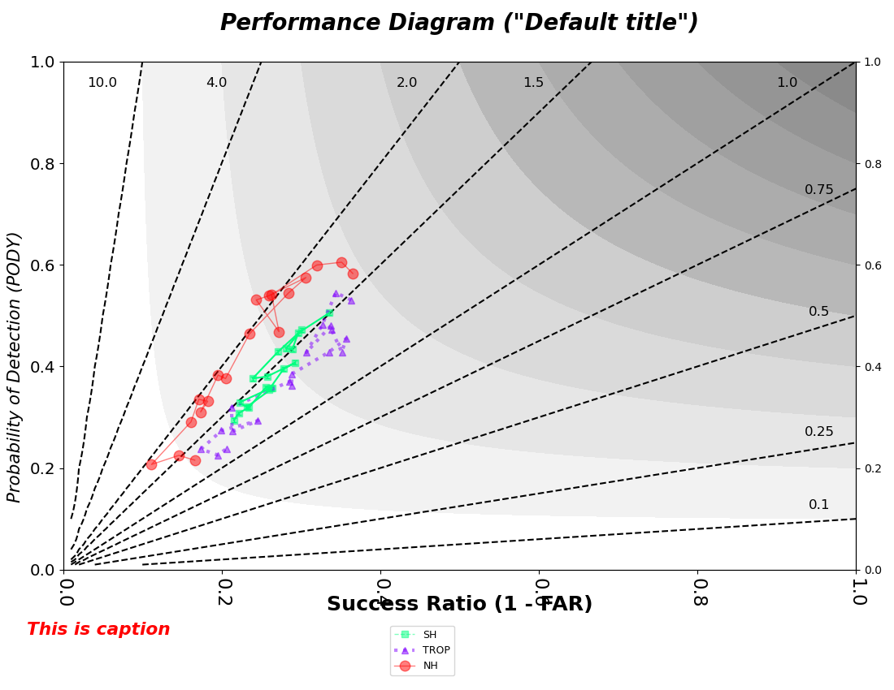
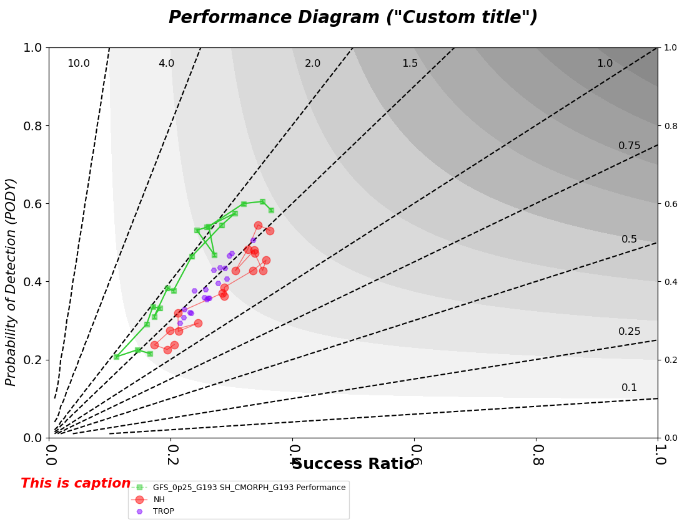

Performance diagram
===========================================

Description
~~~~~~~~~~~

Performance diagrams are used to show the relationship between categorical statistics, with 
axes representing detection and success(1 - false alarm) rates Roebber, 2009).  
The simplest input to the performance diagram is the MET contingency table statistics (CTS) 
output.  This output can be produced by many of the MET tools (Point-Stat, Grid-Stat, etc.).
For more information on Performance diagrams, please refer to the METviewer documentation:

https://metviewer.readthedocs.io/en/latest/Users_Guide/perfdiag.html

There are several reference lines on the performance diagram.  The dashed lines that radiate
from the origin are lines of equal frequency bias.  Labels for the frequency bias amount are
at the end of each line. The diagonal represents a perfect frequency bias score of 1.  Curves
of equal Critical Success Index (CSI) connect the top of the plot to the right side.  CSI 
amounts are listed to the right side of the plot, with better values falling closer to the top.

Example
~~~~~~~

**Sample Data**

The sample data used to create these plots is available in the METplotpy repository, where the 
performance diagram scripts are located:

$METPLOTPY_SOURCE/METplotpy/test/performance_diagram/plot_20200317_151252.data

$METPLOTPY_SOURCE is the directory where the METplotpy code is saved.  The data is text
output from MET in columnar format.

**Configuration Files**

The performance diagram utilizes YAML configuration files to indicate where input data is located and 
to set plot attributes. These plot attributes correspond to values that can be set via the METviewer 
tool. YAML is a recursive acroynym for "YAML Ain't Markup Language" and according to yaml.org, 
it is a "human-readable data-serialization language. It is commonly used for configuration files 
and in applications where data is being stored or transmitted".  Two configuration files are required, 
the first is a default configuration file, performance_diagram_defaults.yaml that is found in the 
$METPLOTPY_SOURCE/METplotpy/metplotpy/plots/config directory. $METPLOTPY_SOURCE indicates the directory
where the METplotpy source code has been saved.  All default
configuration files are located in the $METPLOTPY_SOURCE/METplotpy/metplotpy/plots/config
directory.  **Default configuration files are automatically loaded by the plotting code and do not
need to be explicitly specified when generating a plot**.  The second required YAML configuration file is a
user-supplied "custom" configuration file that can be used to customize/override the default 
settings in the performance_diagram_defaults.yaml file.  The custom configuration file can be an empty 
file if default settings are to be applied.

**Default Configuration File Settings**

METplus Configuration
~~~~~~~~~~~~~~~~~~~~~

**Default Configuration File**

The following is the `mandatory`, performance_diagram_defaults.yaml configuration file,
which serves as a starting point for creating a performance diagram plot,  as it represents
the default values set in METviewer.

**NOTE**: This default configuration file is automatically loaded by performance_diagram.py.

.. literalinclude:: ../../metplotpy/plots/config/performance_diagram_defaults.yaml

**NOTE: These instructions are applicable if you have read and write permissions to the files in the $METPLOTPY_SOURCE
directory and plan on using the minimal_performance_diagram.yaml config file without modifications.**

Modify the `stat_input` setting (input data file) in this default config file to ensure that the data file is accessible.
Open the $METPLOTPY_SOURCE/METplotpy/metplotpy/plots/config/performance_diagram_defaults.yaml file and replace
the relative path in the stat_input entry `stat_input:  ../../test/performance_diagram/plot_20200317_151252.data`
with the path to your $METPLOTPY_SOURCE directory.  For example, if your $METPLOTPY_SOURCE is /username/plotting,
then the `stat_input` setting will look like the following:

`stat_input:  /username/plotting/METplotpy/test/performance_diagram/plot_20200317_151252.data`

**Custom Configuration File**

A second, `mandatory` configuration file is required, which is
used to customize the settings to the performance diagram plot.
The custom_performance_diagram.yaml  file is included with the
source code and looks like the following:

.. literalinclude:: ../../test/performance_diagram/custom_performance_diagram.yaml

Copy this custom config file from the directory where you saved the source code to your working directory:

``cp $METPLOTPY_SOURCE/METplotpy/test/performance_diagram/custom_performance_diagram.yaml $WORKING_DIR/custom_performance_diagram.yaml``

Modify the `stat_input` setting in the
$METPLOTPY_SOURCE/METplotpy/test/performance_diagram/custom_performance_diagram.yaml
file to explicitly point to the $METPLOTPY_SOURCE/METplotpy/test/performance_diagram/performance_diagram directory (where
the custom config files and sample data reside).  Replace the relative path `./plot_20200317_151252.data`
with the full path `$METPLOTPY_SOURCE/METplotpy/test/performance_diagram/plot_20200317_151252.data`.  Modify the `plot_filename`
setting to point to the output path where your plot will be saved, including the name of your plot.

For example:

`stat_input: /username/myworkspace/METplotpy/test/performance_diagram/plot_20200317_151252.data`

`plot_filename: /username/working_dir/output_plots/performance_diagram_custom.png`

where /username/myworkspace/ is $METPLOTPY_SOURCE and /username/working_dir is $WORKING_DIR.  Make sure that the
$WORKING_DIR directory you specify exists and has the appropriate read and write permissions.  You may
change the path listed for `plot_filename` to the output directory of your choice.  If this is not set, then the
`plot_filename` setting specified in the $METPLOTPY_SOURCE/METplotpy/metplotpy/plots/config/performance_diagram_defaults.yaml
configuration file will be used.

If you wish to save the intermediate `.points1` file (used by METviewer and useful for debugging), set the
`dump_points_1` setting to True.  Uncomment or add (if it doesn't exist) the `points_path` setting:

`dump_points_1: 'True'`

`points_path: '/dir_to_save_points1_file'`

Replace the `'/dir_to_save_points1_file'` to the directory where you wish to save the `.points1` file.
If points_path is commented out (indicated by a '#' symbol in front of it), remove the '#' symbol to uncomment
the points_path so that it will be used by the code.  Make sure that this directory exists and has the
appropriate read and write permissions.  **NOTE**: the `points_path` setting
is **optional** and does not need to be defined in your configuration file unless you wish to save the intermediate
.points1 file.

**Using defaults**

If you wish to use the **default** settings defined in the performance_diagram_defaults.yaml
file, specify a minimal custom configuration file (minimal_performance_diagram_defaults.yaml), which consists of only a comment
block, but can be any empty file:

.. literalinclude:: ../../test/performance_diagram/minimal_performance_diagram.yaml

Copy this file to your working directory:

``cp $METPLOTPY_SOURCE/METplotpy/test/performance_diagram/minimal_performance_diagram.yaml $WORKING_DIR/minimal_performance_diagram.yaml``

Add the `stat_input` (input data) and `plot_filename` (output file/plot path) settings to the $WORKING_DIR/minimal_performance_diagram.yaml
file (anywhere below the comment block). The `stat_input` setting explicitly indicates where the
sample data and custom configuration files are located.  Set the `stat_input` to
`$METPLOTPY_SOURCE/METplotpy/test/performance_diagram/plot_20200317_151252.data` and set the
`plot_filename` to  $WORKING_DIR/output_plots/performance_diagram_default.png:

`stat_input: $METPLOTPY_SOURCE/METplotpy/test/performance_diagram/plot_20200317_151252.data`

`plot_filename: $WORKING_DIR/output_plots/performance_diagram_default.png`

Where `$WORKING_DIR` is the working directory where you are saving all your custom
configuration files. **NOTE**: You may specify the `plot_filename` (output directory) to a directory other than the
$WORKING_DIR/output_plots, as long as it is an existing directory where you have read and write permissions.

If you wish to save the intermediate `.points1` file (used by METviewer and useful for debugging), add the following
lines to your minimal_performance_diagram.yaml file (anywhere below the comment block):

`dump_points_1: 'True'`

`points_path: '/dir_to_save_points1_file'`

Replace the `'/dir_to_save_points1_file'` to the directory where you wish to save the `.points1` file.
Make sure that this directory exists and has the appropriate read and write permissions.

Run from the Command Line
~~~~~~~~~~~~~~~~~~~~~~~~~

To generate a default performance diagram (i.e. using settings in the 
performance_diagram_defaults.yaml configuration file), perform the following:

* clone the code from the METplotpy repository at github.com/dtcenter/METplotpy:

``cd $METPLOTPY_SOURCE``

``git clone https://github.com/dtcenter/METplotpy``

* if using a conda environment, verify that you are running in the conda environment that
  has the required Python packages outlined in the Python Requirements
  section:

https://metplotpy.readthedocs.io/en/latest/Users_Guide/installation.html

* Run the following at the command line:

``python $METPLOTPY_SOURCE/METplotpy/metplotpy/plots/performance_diagram/performance_diagram.py $WORKING_DIR/minimal_performance_diagram.yaml``

This will create a PNG file performance_diagram_default.png in the directory that you specified in the `plot_filename`
setting of your performance_diagram_defaults.yaml config file.

To generate a slightly modified, **customized** plot, re-run the above command using the custom_performance_diagram.yaml file:

``python $METPLOTPY_SOURCE/METplotpy/metplotpy/plots/performance_diagram/performance_diagram.py $WORKING_DIR/custom_performance_diagram.yaml``

* a performance_diagram_custom.png output file will be created in the directory you specified in the `plot_filename` config setting in the custom performance_diagram.yaml config file.
