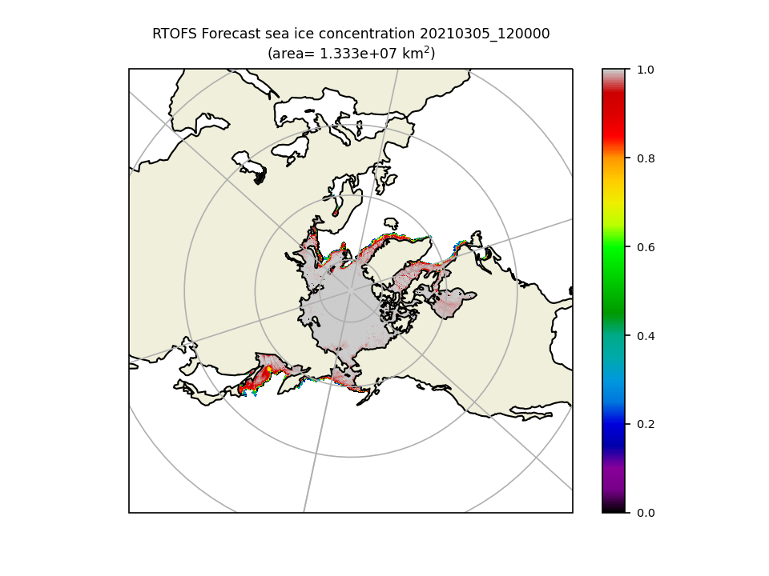
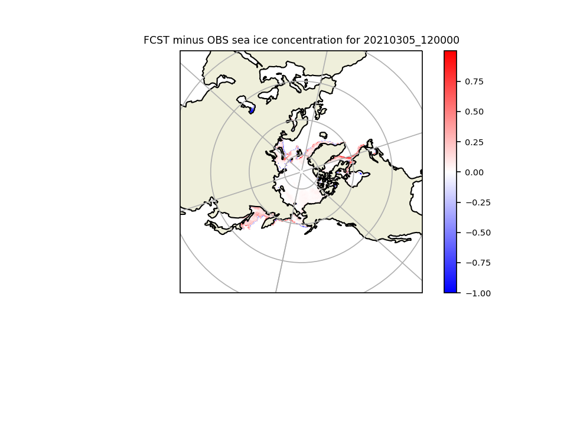
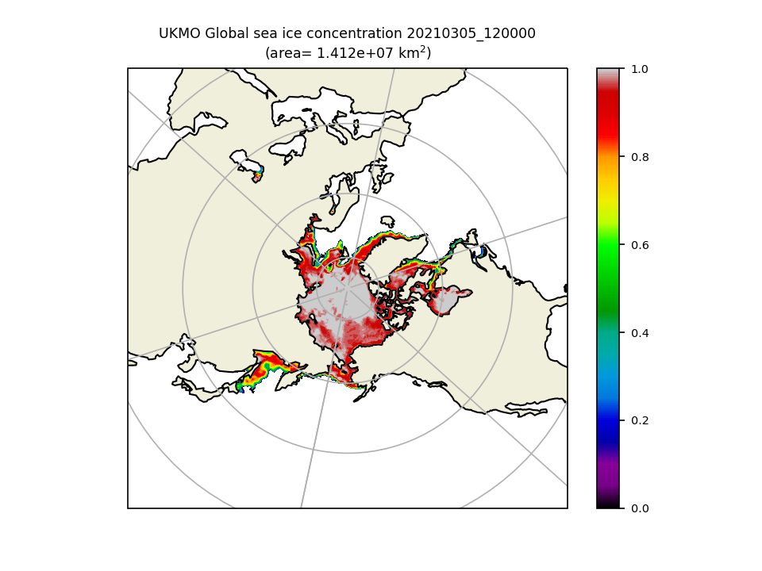

**************
Polar Ice Plot
**************

Description
===========
A Polar Ice plot is a 2D plot using a polar stereographic projection.
There is a specific example found in the polar_ice_plot which plots
sea ice area averages

To generate the polar_ice_plot edit the polar_ice.yaml and have your input
file point to either the example or one of your choosing and then run
python polar_ice_plot.py

Required Packages:
==================

* metplotpy

* netcdf4 1.5.6

* numpy 1.20.2

* pandas 1.2.3

* scipy 1.5.3

* xarray 0.16.0

* cartopy 0.18.0

* matplotlib 3.3.0

* pyproj 2.4.2

* pyresample 2.1.3

* pillow 8.3.1

Example
=======

Sample Data
___________

The sample data used to create an example Polar Ice plot is available in
the `marine_coastal METplus data tar file
<https://dtcenter.ucar.edu/dfiles/code/METplus/METplus_Data/v4.0/sample_data-marine_coastal-4.1.tgz>`_  in the directory
*model_applications/marine_coastal/GridStat_fcstRTOFS_obsOSTIA_iceCover/grid_stat_north_000000L_20210305_120000V_pairs.nc.*

Save this file in a directory where you have read and write permissions, such as
$WORKING_DIR/data/polar_plot, where $WORKING_DIR is the path to your data directory.

Configuration Files
___________________

There is a YAML config file located in
*$METPLOTPY_BASE/metplotpy/plots/polar_plot/polar_ice.yaml*

*$METPLOTPY_BASE* is the directory where the METplotpy code is saved:

e.g.

*/usr/path/to/METplotpy*  if the source code was cloned or forked from the Github repository

or

*/usr/path/to/METplotpy-x.y.z*  if the source code was downloaded as a zip or gzip'd tar file from the Release link of
the Github repository.  The *x.y.z* is the release number.

Copy this configuration file from where you saved the METplotpy source code to your working directory:

.. code-block:: ini

  cp $METPLOTPY_BASE/metplotpy/plots/polar_plot/polar_ice.yaml $WORKING_DIR/polar_ice.yaml

$METPLOTPY_BASE is the directory where you saved the METplotpy code, and $WORKING_DIR is the directory where you
have read and write permissions.

Modify *input_file* setting in the $WORKING_DIR/polar_ice.yaml config file to point to the directory
where you saved your sample data from above:

e.g.

replace *input_file: "~/grid_stat_north_000000L_20210305_120000V_pairs.nc"*
with *input_file: "/path/to/data/grid_stat_north_000000L_20210305_120000V_pairs.nc"*

Where *"/path/to/data"* is the full path to the directory where you saved the grid_stat_north_000000L_20210305_120000V_pairs.nc
sample data.

Run from the Command Line
=========================

To generate the example Polar Ice plot (i.e. using settings in the
**polar_ice.yaml** configuration file) perform the following:

*  If using the conda environment, verify the conda environment
   is running and has has the required Python packages specified in the
   **Required Packages** section above.

* Set the METPLOTPY_BASE environment variable to point to
  *$METPLOTPY_BASE*. where $METPLOTPY_BASE is the directory where you saved the
  METplotpy source code (e.g. /home/someuser).

  For the ksh environment:

  .. code-block:: ini

    export METPLOTPY_BASE=$METPLOTPY_BASE

  For the csh environment:

  .. code-block:: ini

    setenv METPLOTPY_BASE $METPLOTPY_BASE

* Run the following on the command line (from your $WORKING_DIR):

.. code-block:: ini

  cd $WORKING_DIR
  python $METPLOTPY_BASE/metplotpy/plots/polar_plot/polar_ice_plot.py

where $METPLOTPY_BASE is the directory where you are storing the METplotpy source code and $WORKING_DIR is the
directory where you have read and write permissions and where you are storing all your input data and where you
copied the config file.  The polar_ice_plot.py script looks for the polar_ice.yaml file in the current working
directory.

Three plots named **20210305_120000_fcst_ice_north.png**  **20210305_120000_ice_diff_north.png**  **20210305_120000_observation_ice_north.png** will be generated in the sub directory ice_plots from where you ran the above command:

