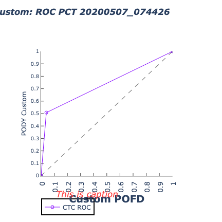

ROC diagram
===========

Description
~~~~~~~~~~~

ROC (Receiver Operating Characteristic) curves are useful in weather forecasting.  ROC
curve plots show the true positive rate (sensitivity) versus the
false positive rate (1 - specificity) for different cut-off points of
a parameter.  In addition to creating ROC diagrams directly from the source code in the METplotpy
repository, ROC diagrams can be generated through METviewer.  For more information on ROC diagrams, please
refer to the METviewer documentation:

https://metviewer.readthedocs.io/en/latest/Users_Guide/rocplot.html

Example
~~~~~~~

**Sample Data**

Sample data used to create an example ROC diagram is
available in the METplotpy repository, where the ROC diagram
code is located:

$METPLOTPY_SOURCE/METplotpy/metplotpy/plots/roc_diagram/plot_20200507_074426.data

**Configuration Files**

The ROC diagram utilizes YAML configuration files to indicate where input data is located and
to set plot attributes. These plot attributes correspond to values that can be set via the METviewer
tool. YAML is a recursive acroynym for "YAML Ain't Markup Language" and according to yaml.org,
it is a "human-readable data-serialization language". It is commonly used for configuration files
and in applications where data is being stored or transmitted".  Two configuration files are required,
the first is a default configuration file, roc_diagram_defaults.yaml that is found in the
$METPLOTPY_SOURCE/METplotpy/metplotpy/plots/config directory.  All default
configuration files are located in the $METPLOTPY_SOURCE/METplotpy/metplotpy/plots/config
directory.  $METPLOTPY_SOURCE is the user-specified directory
where the METplotpy source code has been saved. $WORKING_DIR is the directory where you can copy the necessary
YAML configuration files.  The second, required YAML configuration file is a
user-supplied "custom" configuration file that is used to customize/override the default
settings in the roc_diagram_defaults.yaml file.  The custom configuration file can be an empty
file if all default settings are to be applied.

METplus Configuration
~~~~~~~~~~~~~~~~~~~~~

**Default Configuration File**

The following is the `mandatory`, roc_diagram_defaults.yaml configuration file,
which serves as a good starting point for creating a ROC diagram
plot as it represents the default values set in METviewer

.. literalinclude:: $METPLOTPY_SOURCE/metplotpy/plots/config/roc_diagram_defaults.yaml

**Custom Configuration File**

A second, `mandatory` configuration file is required, which is
used to customize the settings to the ROC diagram plot. The custom_roc_diagram.yaml
file is included with the source code and looks like the following:

.. literalinclude:: $METPLOTPY_SOURCE/metplotpy/plots/roc_diagram/custom_roc_diagram.yaml

copy this custom config file to your working directory:

cp $METPLOTPY_SOURCE/metplotpy/plots/config/custom_roc_diagram.yaml $WORKING_DIR/custom_roc_diagram.yaml

Modify the `stat_input` and `plot_filename` settings in the $METPLOTPY_SOURCE/metplotpy/plots/roc_diagram/roc_diagram_defaults.yaml
file to explicitly point to the $METPLOTPY_SOURCE/metplotpy/plots/roc_diagram directory by replacing
the relative paths (e.g. `./plot_20200507_074426.data`) with the full path (e.g. `/yourdir/METplotpy/metplotpy/plots/roc_diagram/plot_20200507_074426.data).

If you wish to save the intermediate .points1 file (used by METviewer but also useful for debugging), set the following configuration values:

**dump_points_1 setting: 'True'**

**points_path: `/dir_to_save_points1_file`**

except replace the `'/dir_to_save_points1_file'` to the directory where you
wish to save the file

If you wish to use all the **default** settings defined in the roc_diagram_defaults.yaml
file, an "empty" custom configuration file (minimal_roc_diagram_defaults.yaml)
can be specified instead:

.. literalinclude:: $METPLOTPY_SOURCE/metplotpy/plots/roc_diagram/minimal_roc_diagram.yaml

copy this file to your working directory:

cp $METPLOTPY_SOURCE/metplotpy/plots/roc_diagram/minimal_roc_diagram.yaml $WORKING_DIR/metplotpy/plots/roc_diagram/minimal_roc_diagram.yaml

Modify the `stat_input` and `plot_filename` settings in the $METPLOTPY_SOURCE/metplotpy/plots/roc_diagram/roc_diagram_defaults.yaml
file to explicitly point to the $METPLOTPY_SOURCE/metplotpy/plots/roc_diagram directory by replacing
the relative paths (e.g. `./plot_20200507_074426.data`) with the full path (e.g. `/yourdir/METplotpy/metplotpy/plots/roc_diagram/plot_20200507_074426.data`).

python $METPLOTPY_SOURCE/METplotpy/metplotpy/plots/roc_diagram/roc_diagram.py $HOME/your_dir/minimal_roc_diagram.yaml

or

python $METPLOTPY_SOURCE/METplotpy/metplotpy/plots/roc_diagram/roc_diagram.py $HOME/your_dir/minimal_roc_diagram.yaml

If you wish to save the intermediate `.points1` file (used by METviewer and useful for debugging), add the following lines to your minimal_roc_diagram.yaml
file (under the comment block):

**dump_points_1: 'True'**

**points_path: '/dir_to_save_points1_file'**

except replace the `'/dir_to_save_points1_file'` to the directory where you wish to save the
.points1 file.

Modify the `stat_input` and `plot_filename` settings in the $METPLOTPY_SOURCE/metplotpy/plots/config/roc_diagram_defaults.yaml
file to explicitly point to the $METPLOTPY_SOURCE/metplotpy/plots/roc_diagram directory by replacing
the relative paths (e.g. `./plot_20200507_074426.data`) with the full path (e.g. `/yourdir/METplotpy/metplotpy/plots/roc_diagram/plot_20200507_074426.data).

Run from the Command Line
~~~~~~~~~~~~~~~~~~~~~~~~~

The ROC diagram plot that uses only the default values defined in
the roc_diagram_defaults.yaml configuration file looks like the following:

.. image:: roc_diagram_default.png

To generate the above plots, use the roc_diagram_defaults.yaml and
the empty custom configuration file, minimal_roc_diagram.yaml.
Then, perform the following:

* verify that you are running in the conda environment that
  has the required Python packages outlined in the requirements
  section

* cd to the $METPLOTPY_SOURCE/METplotpy/metplotpy/plots/roc_diagram
  directory

* enter the following command:

  ``python $METPLOTPY_SOURCE/METplotpy/metplotpy/plots/roc_diagram/roc_diagram.py $WORKING_DIR/minimal_roc_diagram.yaml``

* a `roc_diagram_default.png` output file will be created in the
  directory you specified in the plot_filename configuration setting in the roc_diagram_defaults.yaml config file.

To generate a **customized** ROC diagram (i.e. some or all default configuration settings are
overridden), use the custom_roc_diagram.yaml config file.

* enter the following command:

``python $METPLOTPY_SOURCE/METplotpy/metplotpy/plots/roc_diagram/roc_diagram.py $WORKING_DIR/custom_roc_diagram.yaml``

In this example, this custom config file changes the title and axis labels.

* This plot is saved in the directory specified in the plot_filename config setting in the custom roc_diagram.yaml config file.

