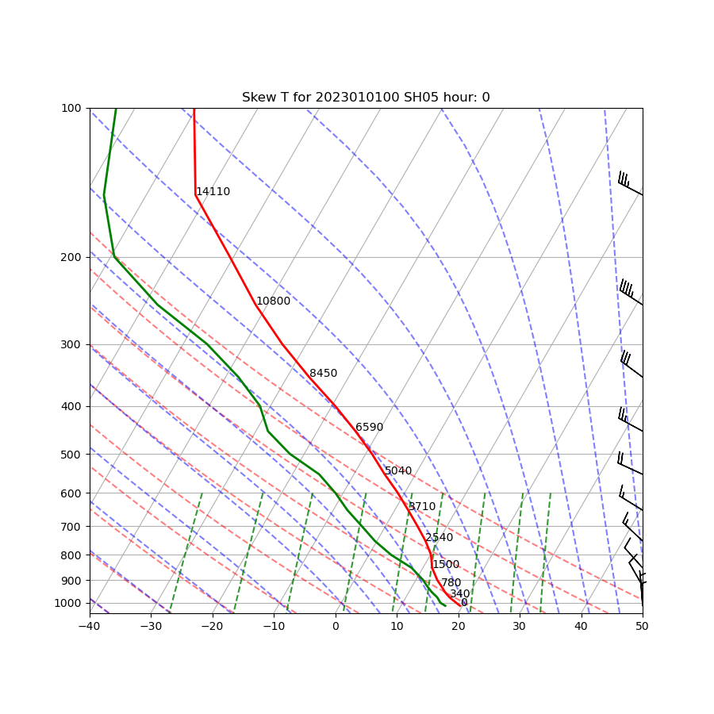

********************
Skew-T Log P Diagram
********************

Description
===========
A skew-T log P diagram is a thermodynamic diagram used for plotting upper air observations.
This skew-T log P diagram was developed for reading in the ASCII format of TC-Diag sounding data collected by
CIRA (Colorado Institute for Research in the Atmosphere).

Example
=======

Sample Data
___________

Sample data is included with the source code and is located in:
*$METPLOTPY_BASE/metplotpy/test/skew_t/data*

*$METPLOTPY_BASE* is the directory where the METplotpy code is saved.
The data is text output from MET in columnar format.

e.g.

*/usr/path/to/METplotpy*  if the source code was cloned or forked from the Github repository

or

*/usr/path/to/METplotpy-x.y.z*  if the source code was downloaded as a zip or gzip'd tar file from the Release link of
the Github repository.  The *x.y.z* is the release number.

Configuration Files
___________________

The skew-T plot utilizes a single YAML configuration file to indicate where input data
is located and to set plot attributes.  YAML is a recursive acronym
for "YAML Ain't Markup Language" and according to
`yaml.org <https://yaml.org>`_, it is a "human-friendly data serialization
language". It is commonly used for configuration files and in applications
where data is being stored or transmitted.

METplus Configuration
=====================

Required Configuration File
___________________________

A *mandatory* configuration file is required, which is
used to customize the settings to the skew-T plot. The **skew_t.yaml**
file is included with the source code.

.. literalinclude:: ../../metplotpy/plots/skew_t/skew_t.yaml

Copy this config file from the directory where the source code was
saved to the working directory:

.. code-block:: ini

  cp $METPLOTPY_BASE/metplotpy/plots/skew_t/skew_t.yaml $WORKING_DIR/skew_t.yaml

Modify the following settings in the configuration file:
   *input_directory*
   Provide the *full* path to the directory where the sample data is located. Do not use
   environment variables.

   *output_directory*
   Provide the *full* path to the directory where you wish to save the plots.  Do not use
   environment variables.

   *log_directory*
   Provide the full path to the directory where you wish to save the log file. Do not use
   environment variables.

   The configuration file is configured to plot the pressure levels adjacent to the temperature line:
   *level_labels_along_y2-axis: False*

   To plot the pressure levels along the y2-axis (right side of the plot), set this value to *True*:
   *level_labels_along_y2-axis: True*

   The density of wind barbs has been reduced to plot every second wind barb by setting
   **decimate_barbs: 2**.  If no decimation/thinning of wind barbs is required, set this value to 1.

   To generate the skew-T plots for all available sounding hours, set *all_sounding_hours:True*

   To generate plots for specific sounding hours, set *all_sounding_hours:False* and
   provide the hours of interest via the sounding_hours_of_interest setting:  *sounding_hours_of_interest: [6,18,30]*.
   Replace these hours in the example with your hours of interest.

Run from the Command Line
=========================

The **skew_t.yaml** configuration file in combination with the
Python script, generates a skew_t plot:

Perform the following:

* If using the conda environment,
  verify the conda environment is running and has has the required
  Python packages outlined in the `requirements section
  <https://metplotpy.readthedocs.io/en/latest/Users_Guide/installation.html#python-requirements>`_.

* Set the METPLOTPY_BASE environment variable to point to
  *$METPLOTPY_BASE*

  For the ksh environment:

  .. code-block:: ini

    export METPLOTPY_BASE=$METPLOTPY_BASE

  For the csh environment:

  .. code-block:: ini

    setenv METPLOTPY_BASE $METPLOTPY_BASE

  Recall that $METPLOTPY_BASE is the directory path indicating where the METplotpy
  source code was saved.

* Enter the following command:

  .. code-block:: ini
		
    python $METPLOTPY_BASE/metplotpy/plots/skew_t/skew_t.py $WORKING_DIR/skew_t.yaml

*  Numerous skew_t output files will be created in the directory that was
   specified in the *output_directory* configuration setting in
   **skew_t.yaml**. NOTE:  The sample data contain some missing
   values for certain sample hours.  Plots are only generated for those hours where there is
   data.  A warning message is logged to the log file indicating which hour has missing data.
   When data are comprised entirely of missing data, then no corresponding plot will be generated.
   A warning message is logged to the log file indicating which file contains no data.

   Output files are named with the same filename as the input file, with the *.png* extension replacing the
   *.dat* extension of the data file. The
   plot title is generated from the name of the input file and the corresponding sounding hour.
