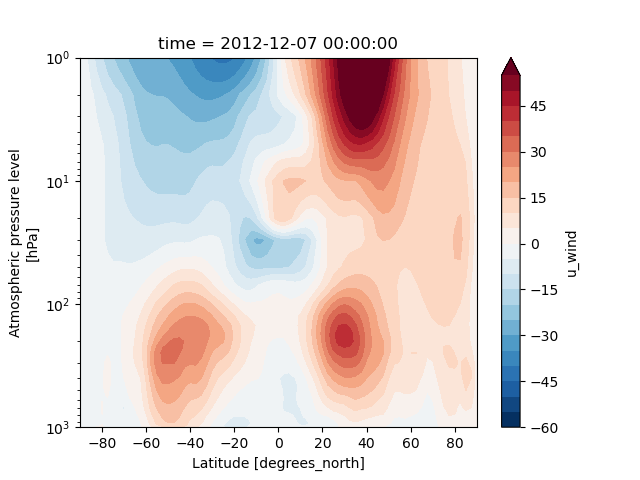
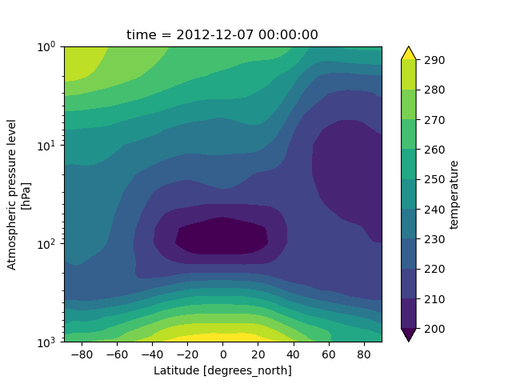

******************************
Stratosphere Diagnostics Plots
******************************

Description
===========

The **stratosphere_diagnostics.py** code (found in the METplotpy repository)
provides a starting point for the creation of four plots: the contour plot of the zonal mean wind,
the contour plot of the zonal mean temperature, a line plot for zonal mean wind, and a line plot
for the meridional mean temperature for the polar cap:

* Contour plot of zonal mean wind:

* Contour plot of zonal mean temperature:

* Line plot zonal mean wind:

* Line plot meridional mean temperature at the pole:

The **directional_means.py** module in the METcalcpy repository
is used to calculate the zonal and meridional means from the input data.  The **stratosphere_diagnostics.py** module
is based on code provided by Zach D. Lawrence (CIRES/CU, NOAA/PSL) and the **directional_means.py** module is based
on the pyzome package (also provided by Zach Lawrence).
A `METplus use case <https://metplus.readthedocs.io/en/develop/generated/model_applications/s2s/UserScript_obsERA_obsOnly_Stratosphere.html#sphx-glr-generated-model-applications-s2s-userscript-obsera-obsonly-stratosphere-py>`_
illustrates how to use the **directional_means** module to calculate zonal and meridional means on sample data.

Required Packages
=================

Packages that are followed by version number require that specific version number (or later).

* Python 3.7

* plotly

* matplotlib 3.5

* nc-time-axis 1.4.0

* netCDF4

* numpy

* PyYAML

* scipy

* xarray

Example
=======

Sample Data
-----------

The sample dataset is a netCDF file:
**SSWC_v1.0_varFull_ERAi_d20130106_s20121107_e20130307_c20160701.nc**

To obtain this data follow these steps, based on the instructions from the `section 2.6 of the METplus installation
section <https://metplus.readthedocs.io/en/develop/Users_Guide/installation.html>`_ :

* Create a directory where you will save the sample data, hereafter referred to as $INPUT_DATA_DIR.

* Go to the `sample input data link <https://dtcenter.ucar.edu/dfiles/code/METplus/METplus_Data/>`_.

* Click on the most recent version number (in the format vX.Y).

* Click on the sample_data_s2s-X.Y.tgz (where X.Y is the version number).

* Copy this compressed tar ball to your $INPUT_DATA_DIR directory.

* Change directory to the $INPUT_DATA_DIR directory.

* Uncompress the tar ball:

   Example:

    `tar -zxvf sample_data_s2s-4.1.tgz`

The file you need is in the $INPUT_DATA_DIR/model_applications/s2s/UserScript_obsERA_obsOnly_Stratosphere
directory, where **$INPUT_DATA_DIR** is the directory you created to store your sample data.

METplus Configuration
=====================

The stratosphere_diagnostics plotting module utilizes a YAML configuration file to indicate where input and output files
are located, and to set plotting attributes. YAML is a recursive
acronym for "YAML Ain't Markup Language" and according to
`yaml.org <https://yaml.org>`_, it is a "human-friendly data serialization
language". It is commonly used for configuration files and in applications
where data is being stored or transmitted.

.. literalinclude:: ../../metplotpy/contributed/stratosphere_diagnostics/stratosphere_diagnostics.yaml

Copy the **stratosphere_diagnostics.yaml** file from your **$SOURCE_DIR** (where $SOURCE_DIR
is the directory where the METplotpy source code was saved) to your **$WORKING_DIR** (the
directory where you have write and execute privileges):

.. code-block:: ini

  cp $METPLOTPY_SOURCE/METplotpy/metplotpy/contributed/stratosphere_diagnostics/stratosphere_diagnostics.yaml $WORKING_DIR/stratosphere_diagnostics.yaml

Modify the *input_data_path* setting in the *$WORKING_DIR/stratosphere_diagnostics.yaml* by
replacing the */path/to/input/directory* entry with the directory where you saved your sample data.
This is the $INPUT_DATA_DIR you used from the **Sample Data** section above.

Replace the *output_plot_path* setting from */path/to/output* to a directory where
you wish to store your output.

Run from the Command Line
=========================

Perform the following:

* To use the conda environment, verify the conda environment
  is running and has has the required
  Python packages specified in the **Required Packages** section above.

* Set the METPLOTPY_BASE environment variable to point to
  *$METPLOTPY_SOURCE/METplotpy*

  For the ksh environment:

  .. code-block:: ini

    export METPLOTPY_BASE=$METPLOTPY_SOURCE/METplotpy

  For the csh environment:

  .. code-block:: ini

    setenv METPLOTPY_BASE $METPLOTPY_SOURCE/METplotpy

  Replacing the $METPLOTPY_SOURCE with the directory where the
  METplotpy source code was saved.

* Enter the following command:

  .. code-block:: ini

    python $METPLOTPY_SOURCE/METplotpy/metplotpy/contributed/stratosphere_diagnostics/stratosphere_diagnostics.py $WORKING_DIR/stratosphere_diagnostics.yaml

* Four .png files will be created in the output directory you specified in
  the **stratosphere_diagnostics.yaml** config file:

    * zonal_mean_temperature_contour.png

    * zonal_mean_wind_contour.png

    * zonal_mean_wind.png

    * polar_cap_meridional_mean_temp.png

These plots correspond to the plots shown above.

