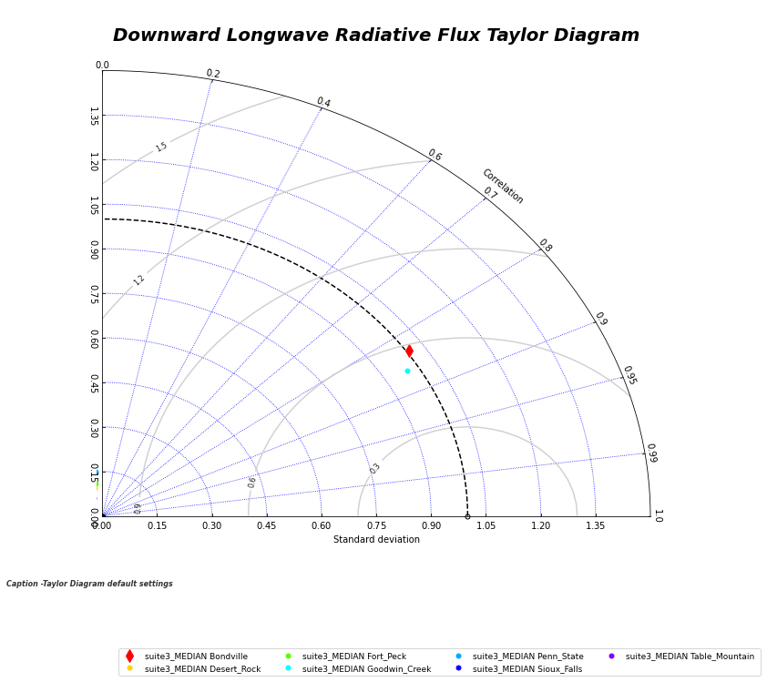
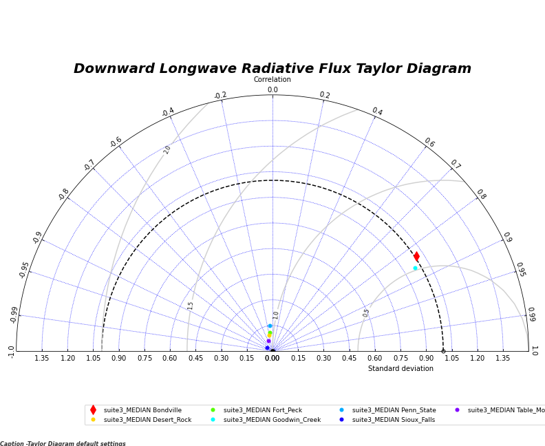
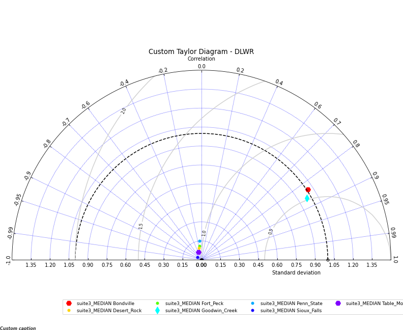

*******************
Taylor Diagram
*******************

Description
===========

The `Taylor diagram <https://metplotpy.readthedocs.io/en/feature_149_taylor_diagram/Users_Guide/references.html>`_  was invented by
Karl E. Taylor in 1994 and is useful in quantifying the correspondence between
models and a "reference" based on the Pearson correlation coefficient, the root-mean-square
error (RMSE), and the standard deviation.  Taylor diagrams have been widely used for climate and other
Earth science models but can be useful in the evaluation of models from other domains.

For more information on Taylor diagrams, please refer to the
`METviewer documentation
<https://metviewer.readthedocs.io/en/latest/Users_Guide/taylordiag.html>`_.

Examples of Taylor diagrams are shown below.

A Taylor diagram of sample Downward Longwave Radiative Flux (DLWR) data displaying only positive correlation
values:

A Taylor diagram of sample Downward Longwave Radiative Flux (DLWR) data displaying negative and
positive correlation values:

Example
=======

Sample Data
___________

The sample data used to create these plots is available in the METplotpy
repository, where the Taylor diagram scripts are located:

*$METPLOTPY_SOURCE/METplotpy/test/taylor_diagram/dlwr_sample.data*

*$METPLOTPY_SOURCE* is the directory where the METplotpy code is saved.
Continuous statistics line type or SL1L2 line type from the MET tool's Point-Stat or Grid-Stat
tools is required for creating a Taylor diagram, where the data is text output in columnar format.

Configuration Files
___________________

The Taylor diagram utilizes YAML configuration files to indicate where
input data is located and to set plot attributes. These plot attributes
correspond to values that can be set via the METviewer tool. YAML is a
recursive acronym for "YAML Ain't Markup Language" and according to
`yaml.org <https://yaml.org>`_,
it is a "human-friendly data serialization language. It is commonly used for
configuration files and in applications where data is being stored or
transmitted. Two configuration files are required. The first is a
default configuration file, **taylor_diagram_defaults.yaml**,
which is found in the
*$METPLOTPY_SOURCE/METplotpy/metplotpy/plots/config* directory.
*$METPLOTPY_SOURCE* indicates the directory where the METplotpy
source code has been saved.  All default
configuration files are located in the
*$METPLOTPY_SOURCE/METplotpy/metplotpy/plots/config* directory.
**Default configuration files are automatically loaded by the
plotting code and do not need to be explicitly specified when
generating a plot**.

The second required configuration file is a user-supplied “custom”
configuration file. This  file is used to customize/override the default
settings in the **taylor_diagram_defaults.yaml** file. The custom
configuration file can be an empty file if all default settings are to
be applied.

METplus Configuration
=====================

Default Configuration File
__________________________

The following is the *mandatory*, **taylor_diagram_defaults.yaml**
configuration file, which serves as a starting point for creating a
Taylor diagram plot,  as it represents the default values set in METviewer.

**NOTE**: This default configuration file is automatically loaded by
**taylor_diagram.py.**

.. literalinclude:: ../../metplotpy/plots/config/taylor_diagram_defaults.yaml

Custom Configuration File
_________________________

A second, *mandatory* configuration file is required, which is
used to customize the settings to the Taylor diagram plot.
The **taylor_diagram_custom.yaml**  file is included with the
source code and looks like the following:

.. literalinclude:: ../../test/taylor_diagram/taylor_diagram_custom.yaml

Copy this custom config file from the directory where the source
code was saved to the working directory:

.. code-block:: ini

  cp $METPLOTPY_SOURCE/METplotpy/test/taylor_diagram/taylor_diagram_custom.yaml $WORKING_DIR/taylor_diagram_custom.yaml

Modify the *stat_input* setting in the
*$METPLOTPY_SOURCE/METplotpy/test/taylor_diagram/taylor_diagram_custom.yaml*
file to explicitly point to the
*$METPLOTPY_SOURCE/METplotpy/test/taylor_diagram/taylor_diagram*
directory (where the custom config files and sample data reside).
Replace the relative path *./dlwr_sample.data*
with the full path
*$METPLOTPY_SOURCE/METplotpy/test/taylor_diagram/dlwr_sample.data*.
Modify the *plot_filename* setting to point to the output path where the
plot will be saved, including the name of the plot.

For example:

*stat_input: /username/myworkspace/METplotpy/test/taylor_diagram/dlwr_sample.data*

*plot_filename: /username/working_dir/output_plots/taylor_diagram_custom.png*

This is where */username/myworkspace/* is $METPLOTPY_SOURCE and
*/username/working_dir* is $WORKING_DIR.  Make sure that the
$WORKING_DIR directory that is specified exists and has the
appropriate read and write permissions. The path listed for
*plot_filename* may be changed to the output directory of one’s choosing.
If this is not set, then the
*plot_filename* setting specified in the
*$METPLOTPY_SOURCE/METplotpy/metplotpy/plots/config/taylor_diagram_defaults.yaml*
configuration file will be used.

No intermediate files (i.e. *.points1* file) are generated by the Taylor diagram.
The *dump_points_1* setting is expected by METviewer and is set to False in the configuration file.

Using defaults
______________

To use the *default* settings defined in the
**taylor_diagram_defaults.yaml**
file, specify a minimal custom configuration file
(**minimal_taylor_diagram_defaults.yaml**), which consists of only
a comment block, but it can be any empty file (write permissions for the
output filename path corresponding to the *plot_filename* setting in
the default configuration file will be needed. Otherwise, specify
a *plot_filename* in the **minimal_taylor_diagram.yaml** file):

.. literalinclude:: ../../test/taylor_diagram/minimal_taylor_diagram.yaml

Copy this file to the working directory:

.. code-block:: ini
		
  cp $METPLOTPY_SOURCE/METplotpy/test/taylor_diagram/minimal_taylor_diagram.yaml $WORKING_DIR/minimal_taylor_diagram.yaml

If the *stat_input* and *plot_filename* settings (output file/plot path) are missing, add
these settings to the *$WORKING_DIR/minimal_taylor_diagram.yaml*
file (anywhere below the comment block).  The *stat_input* setting
explicitly indicates where the sample data and custom configuration
files are located.  Set the *stat_input* to
*$METPLOTPY_SOURCE/METplotpy/test/taylor_diagram/dlwr_sample.data* and set the
*plot_filename* to
*$WORKING_DIR/output_plots/taylor_diagram_default.png*:

*stat_input: $METPLOTPY_SOURCE/METplotpy/test/taylor_diagram/dlwr_sample.data*

*plot_filename: $WORKING_DIR/output_plots/taylor_diagram_default.png*

*$WORKING_DIR* is the working directory where all of
the custom configuration files are being saved.
**NOTE**: The *plot_filename* (output directory) may be specified
to a directory other than the *$WORKING_DIR/output_plots*, as long as
it is an existing directory where the author has read and write permissions.

Run from the Command Line
=========================

To generate a default Taylor diagram (i.e. using settings in the
**taylor_diagram_defaults.yaml** configuration file),
perform the following:

*  If using the conda environment, verify the conda environment
   is running and has has the required Python packages outlined in the
   `requirements section.
   <https://metplotpy.readthedocs.io/en/feature_149_taylor_diagram/Users_Guide/installation.html>`_

* Set the METPLOTPY_BASE environment variable to point to
  *$METPLOTPY_SOURCE/METplotpy/metplotpy*.

  For the ksh environment:

  .. code-block:: ini
		
    export METPLOTPY_BASE=$METPLOTPY_SOURCE/METplotpy/metplotpy

  For the csh environment:

  .. code-block:: ini
		
    setenv METPLOTPY_BASE $METPLOTPY_SOURCE/METplotpy/metplotpy

  Replacing the $METPLOTPY_SOURCE with the directory where the
  METplotpy source code was saved.

* Run the following on the command line:

  .. code-block:: ini  

    python $METPLOTPY_SOURCE/METplotpy/metplotpy/plots/taylor_diagram/taylor_diagram.py $WORKING_DIR/minimal_taylor_diagram.yaml

  This will create a PNG file, **taylor_diagram_default.png**,
  in the directory that was specified in the *plot_filename*
  setting of the **minimal_taylor_diagram.yaml** config file:

  .. image:: taylor_diagram_default.png

  To generate a slightly modified, **customized** plot, run the
  command (below) using the **taylor_diagram_custom.yaml** file:

  .. code-block:: ini
		
    python $METPLOTPY_SOURCE/METplotpy/metplotpy/plots/taylor_diagram/taylor_diagram.py $WORKING_DIR/taylor_diagram_custom.yaml

* A **taylor_diagram_custom.png** output file will be created in
  the directory that was  specified in the *plot_filename* config setting
  in the **taylor_diagram_custom.yaml** config file.  This customized plot has a different
  output filename, title text, title size, title font style, caption text, and different symbols than the default
  plot, as shown below:

