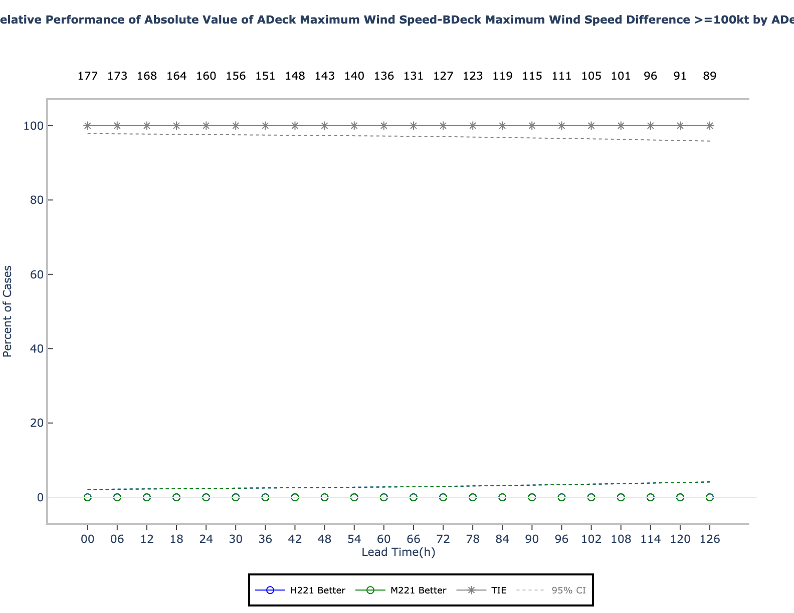
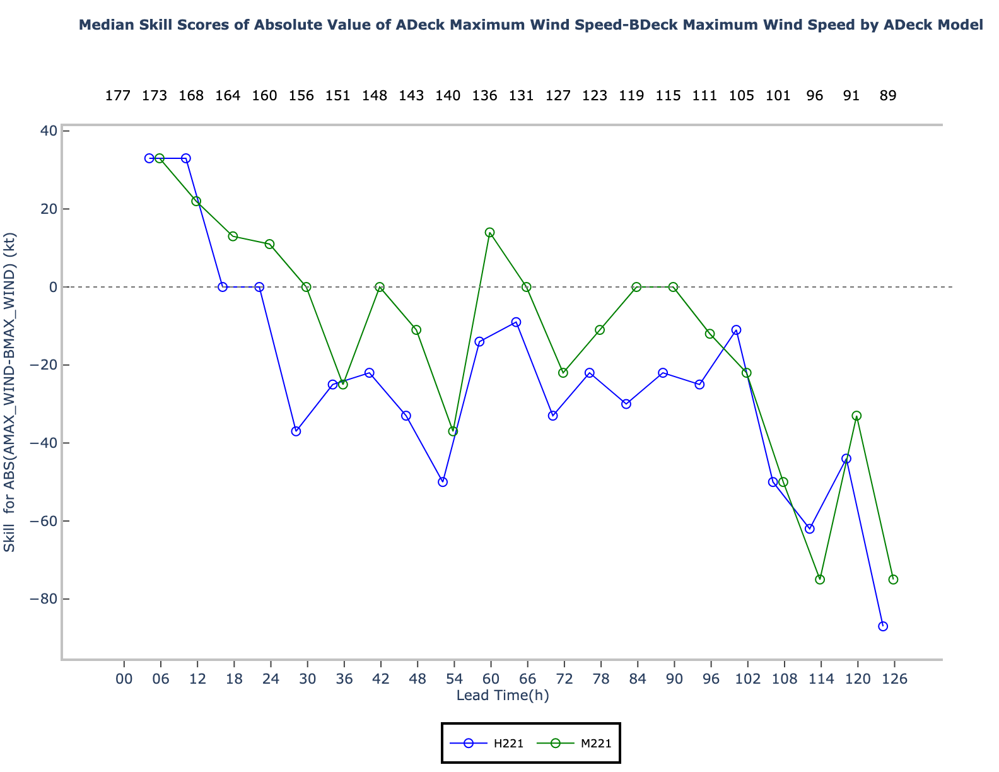
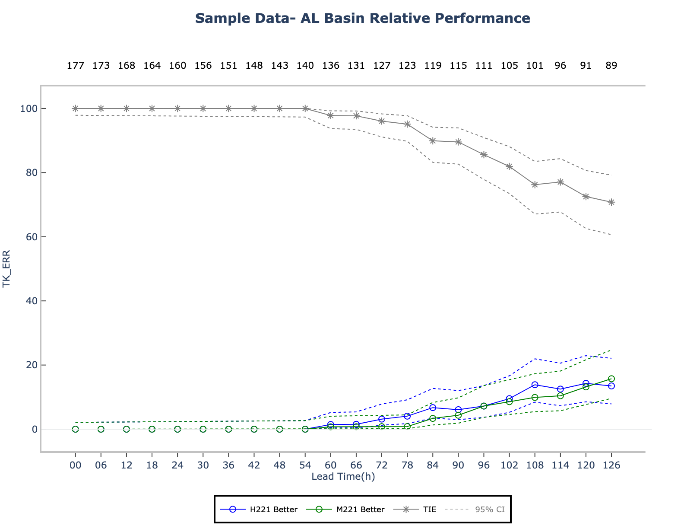

***********
TCMPR Plots
***********

Description
===========

The TCMPR plots were originally available under the MET repository: https://github.com/dtcenter/MET
and written in R script.  The code has been rewritten in Python and is now located in the METplotpy repository:
https://github.com/dtcenter/METplotpy/metplotpy/plots/tcmpr_plots

The TCMPR plots require TCMPR line type data produced by the MET TC-pairs tool. The data
must have all header names consistent with those in the MET User's Guide, section 24.2.

In addition, the METcalcpy
source code will be needed to perform event equalization and other necessary calculations.

The METcalcpy repository is located:
https://github.com/dtcenter/METcalcpy

Use the same release versions for METplotpy and METcalcpy (i.e. if using a vx.y.z of METplotpy, use the
same version for METcalcpy).

There are numerous TCMPR plots that can be generated within **one** YAML configuration files:

  * mean line plot
  * median line plot
  * boxplot
  * relative performance plot
  * rank plot
  * mean skill line plot
  * median skill line plot

Using a single configuration file to generate multiple plot types is advantageous. This reduces the number of
times the TCMPR plotter code is invoked from the command line.

When more specific titles and plot customizations are desired for particular plot types,
each plot type can be defined with a corresponding configuration file
(e.g. a box plot will have a config file specifying settings specific to the
boxplot, a reliability plot will have a corresponding config file with settings relevant to a reliability plot, etc.).
However, the TCMPR plotter code will now need to be invoked for each of these special plot type/config file
combinations.

Example
=======

Sample Data
-----------

The data is columnar text output from the MET TC-Pairs tool for the TCMPR line type (saved as .tcst files).
The sample data used to create various TCMPR plots is available in the
`METplotpy <https://github.com/dtcenter/METplotpy>`_ repository, where the TCMPR plot tests are located:

*$METPLOTPY_BASE/test/tcmpr_plots/Data*

*$METPLOTPY_BASE* is the directory where the METplotpy code is saved:

e.g.

*/usr/path/to/METplotpy*  if the source code was cloned or forked from the Github repository

or

*/usr/path/to/METplotpy-x.y.z*  if the source code was downloaded as a zip or gzip'd tar file from the Release link of
the Github repository.  The *x.y.z* is the release number.

Configuration Files
-------------------

The TCMPR plots utilize *two* YAML configuration files to indicate where input
data is located and to set plot attributes.

YAML is a recursive acronym for "YAML Ain't Markup Language" and according to
`yaml.org <https://yaml.org>`_, it is a
"human-friendly data serialization language".
It is commonly used for configuration files and in applications where
data is being stored or transmitted.

A **mandatory default configuration** file specifies line/series colors, symbol shapes, symbol sizes,
margins, log levels, x- and y-axis settings that can be generically applied to numerous plot types. These default
values can be overridden by the custom configuration file. The default configuration file is automatically
loaded by the TCMPR plotting code.

A **mandatory custom configuration file is also required**. Multiple plot types can be requested
in **one** configuration file (resulting in a single call to tcmpr.py to generate all the specified plots).
In this case, the TCMPR plotting scripts will automatically create the title, output file prefix, and y-axis
label based on the plot type and requested statistics specified in the config file.

If particular plot types require specific/custom titles and/or
x- and y-axis labels, then each plot type can have a corresponding configuration file with values specific to this plot
type, statistics of interest (e.g. ABS(AMSLP-BMSLP), TK_ERR, etc.), fixed variables
(e.g. BASIN:AL, LEVEL:[SS, HU, TS]), and series (e.g. AMODEL:[H221, M221]).

.. note::

  The YAML configuration files **do not support expanding environment variables**.
  If you see an environment variable referenced in this documentation for a YAML configuration item,
  please be aware the **full value of that environment variable must be used**.

METplus Configuration
=====================

Default Configuration File
--------------------------

A default configuration file, tcmpr_defaults.yaml has some default settings for three lines/series such as plot
size, margins, etc. This config file **does not require any modification**.
There are some example colors and line and symbol styles and sizes for *three* lines/series.
The default logging level is set to ERROR, the least verbose. By default, logging
is directed to stdout.  Any of these settings can be overridden by setting new values in the custom
configuration file(s).

.. literalinclude:: ../../metplotpy/plots/config/tcmpr_defaults.yaml

**NOTE**: This default configuration file is automatically loaded by
**tcmpr.py** and **does not require any modifications**.

The default configuration file also specifies the name (including path) of the HFIP baseline data file, the
column information file, and the HFIP baseline comparison:

.. code-block:: ini

   baseline_file: ./hfip_baseline.dat
   column_info_file: ./plot_tcmpr_hdr.dat
   hfip_bsln: 'no'

The HFIP baseline is turned off.

Custom Configuration File
-------------------------

A second, *mandatory* configuration file is required, which is
used to customize the settings to the specified TCMPR plot type(s). The settings in this custom configuration
file override those in the default config file. The **tcmpr_multi_plots.yaml**
file is included with the source code and is located in the $METPLOTPY_BASE/test/tcmpr_plots directory.

Copy this custom config file from the directory where the source code was
saved to the working directory:

.. code-block:: ini
		
  cp $METPLOTPY_BASE/test/tcmpr_plots/tcmpr_multi_plots.yaml $WORKING_DIR/tcmpr_multi_plots.yaml

Set up the custom configuration file:
-------------------------------------

For this example, the only settings requiring changes are: **tcst_dir**, **plot_dir**, **log_filename**,
**baseline_file**, and **column_info_file**.

**Specify the input data in one of two ways**:

* Specify by directory (use all files under this directory):

.. code-block:: ini

    tcst_dir: '/path/to/tcmpr_sample_data'

Replace the */path/to* with the full path to the sample data, $METPLOTPY_BASE/test/tcmpr_plots/Data/
**except replace $METPLOTPY_BASE with the full path to the METplotpy source code**.

This will read in all the .tcst files under the specified directory.

* Specify by list of .tcst files:

.. code-block:: ini

   tcst_files: ['/path/to/a.tcst', '/path/to/b.tcst', '/path/to/w.tcst', '/path/to/z.tcst' ]

Replace the a.tcst, b.tcst, etc. with files of interest (include full file path).

**Specify the output directory where the plot files will be saved**:

.. code-block:: ini

   plot_dir: '/path/to/output_dir'

Replace */path/to/output_dir* to an existing directory that has the appropriate read and write privileges.

**Specify the log level and log file** (optional):

.. code-block:: ini

   log_level: INFO

.. code-block:: ini

   log_filename: /path/to/output/tcmpr_log.out

Replace */path/to/output* to an existing directory with the appropriate read and write permissions.
By default, the log level is set to ERROR (the least verbose) and logging is directed to STDOUT.  The following
log levels are available (from most verbose to least): INFO, DEBUG, WARNING, ERROR.

*Specify the baseline_file and column_info_file**:

.. code-block:: ini

baseline_file: '$METPLOTPY_BASE/metplotpy/plots/tcmpr_plots/hfip_baseline.dat'
column_info_file: '$METPLOTPY_BASE/metplotpy/plots/tcmpr_plots/plot_tcmpr_hdr.dat'

Replace $METPLOTPY_BASE with the full path to where the METplotpy source code was saved
(i.e. /home/username/METplotpy).

The following settings do not need to be modified to run this example.
^^^^^^^^^^^^^^^^^^^^^^^^^^^^^^^^^^^^^^^^^^^^^^^^^^^^^^^^^^^^^^^^^^^^^^

**Specify the series/line values of interest**:

.. code-block:: ini

  series_val_1:
    AMODEL:
      - H221
      - M221

Specify a key (AMODEL) and a list of one or more values of interest (e.g. the H221 and M221 models)
The above example will produce a plot with **two** lines/series, one for each AMODEL.  The number of series/lines
dictates the number of required plot settings. In this case,  **two** values are needed for plot settings such as
colors, symbols, series order, plot display (on/off), line widths, line styles, symbol appearance
(style and size), and series confidence intervals (plot or hide). **NOTE**: If the sufficient number of settings
is not met (that is there are fewer settings than there are series/lines requested), an error message will be
produced.

The following settings are necessary for generating the plot types for this data set.
The settings will override the defaults in the tcmpr_defaults.yaml

**Specify the independent (i.e. x-axis) variable, series, values and labels**:

.. code-block:: ini

    indy_var: 'LEAD'

.. code-block:: ini

   series_val_1:
    AMODEL:
      - H221
      - M221

.. code-block:: ini

    indy_vals:
     - 0
     - 6
     - 12
     - 18
     - 24
     - 30
     - 36
     - 42
     - 48
     - 54
     - 60
     - 66
     - 72
     - 78
     - 84
     - 90
     - 96
     - 102
     - 108
     - 114
     - 120
     - 126

.. code-block:: ini

    indy_labels:
      - '00'
      - '06'
      - '12'
      - '18'
      - '24'
      - '30'
      - '36'
      - '42'
      - '48'
      - '54'
      - '60'
      - '66'
      - '72'
      - '78'
      - '84'
      - '90'
      - '96'
      - '102'
      - '108'
      - '114'
      - '120'
      - '126'

The example above is requesting the forecast lead times (the 'LEAD' column in the example data set provided) for
0, 6, 12, ..., 126 hours with the corresponding labels (surrounded by either single or double quotes).
The indy_var is set to 'LEAD' in the tcmpr_defaults.yaml config file.  Override this to the name of the
forecast lead column if this name differs from that in the input data.

**Specify the criteria for subsetting/limiting the input data** (optional):

.. code-block:: ini

   fixed_vars_vals_input:
     BASIN:
      - AL
     LEVEL:
      - SS
      - SD
      - TS
      - TD
      - HU

In the example above, the data of interest/focus corresponds to the Atlantic Basin and the
five specified levels.

**Specify whether to perform event equalization**:

.. code-block:: ini

   event_equal: 'True'

Event equalization must be set to True for generating the rank plots.

**Specify the plot types to generate**:

.. code-block:: ini

   plot_type_list:
     - 'boxplot'
     - 'skill_mn'
     - 'skill_md'
     - 'relperf'
     - 'mean'
     - 'median'
     - 'rank'

The seven supported plot types are requested.

**Specify the relative performance threshold** (for relative performance plots):

.. code-block:: ini

    rp_diff:
      - '>=100'

Enclose threshold values with single or double quotes.

**Specify the model to use for the skill reference line** (for mean/median skill line plots):

.. code-block:: ini

    skill_ref:
       - HFSA

**Specify the columns of interest**:

.. code-block:: ini

   list_stat_1:
     - "ABS(AMAX_WIND-BMAX_WIND)"
     - "TK_ERR"

The absolute difference between the AMAX_WIND and BMAX_WIND columns and the TK_ERR columns are selected. In
addition to the absolute difference (ABS), the difference (DIFF) between columns is also supported.

**Allow the code to generate the y-axis label, title, and output filenames** (leave these settings
to empty string):

.. code-block:: ini

   yaxis_1: ''

.. code-block:: ini

   title: ''

.. code-block:: ini

   prefix: ''

When the prefix is set to something other than an empty string, that value will be prepended to the
auto-generated name of the plot. If the auto-generated plot name is *ABS(AMAX_WIND-BMAX_WIND)_median.png*,
and the *prefix* is set to 'Example_Data', then the plot file name becomes
*Example_Data_ABS(AMAX_WIND-BMAX_WIND)_median.png*.

**Use the xaxis setting in the default config file**:

.. code-block:: ini

   xaxis: 'Lead Time(h)'

The *xaxis* setting is absent in the custom config file, tcmpr_multi_plots.yaml.  When a setting is absent in
the custom config file. the default value is used.
If a different setting is desired,  add the xaxis setting in the custom config file (anywhere in the file),
tcmpr_multi_plots.yaml and set it to the desired text (surrounded by single or double quotes).

The above settings define the creation of a boxplot, mean line plot, median line plot, rank plot, median skill
plot, and mean skill plot for ABS(AMAX_WIND-BMAX_WIND) and TK_ERR.  Each plot contains the lines/boxes for
the AMODEL M221 and H221, resulting in a total of fourteen plots. The plot titles, y-axis label,and  output
filenames are generated by the code.

Generate seven plot types using one configuration file:
-------------------------------------------------------

The **tcmpr_multi_plots.yaml** configuration file, in combination with the
**tcmpr_defaults.yaml** configuration file, generates the following plots:

.. image:: figure/TK_ERR_relperf.png

Generate plots with separate, specific configuration files:
-----------------------------------------------------------

This is an example of generating single plot types with titles axis labels specific to
that plot type.  Two plot types will be generated, a boxplot and a relative performance plot.
The line colors, series, independent values and labels, etc. are the same as those used in the
tcmpr_multi_plots.yaml custom config file.

Copy the config files to the working directory:

.. code-block:: ini

  cp $METPLOTPY_BASE/test/tcmpr_plots/tcmpr_multi_plots.yaml $WORKING_DIR/boxplot.yaml

  cp $METPLOTPY_BASE/test/tcmpr_plots/tcmpr_multi_plots.yaml $WORKING_DIR/relperf.yaml

**Boxplot**

Generate a boxplot for the TK_ERR.  In the boxplot.yaml file, delete all other plot types from
the plot_type_list, leaving only the boxplot:

.. code-block:: ini

   plot_type_list:
     - 'boxplot'

Specify the title, y-axis label, and prefix for the boxplot:

.. code-block:: ini

   title: 'Sample Data- TK_ERR for AL basin'

.. code-block:: ini

   yaxis_1: 'TK_ERR'

.. code-block:: ini

   prefix: 'BOXPLOT_SAMPLE_DATA'

Specify only the TK_ERR:

.. code-block:: ini

   list_stat_1:
     - "TK_ERR"

**Relative performance plot**

In the relperf.yaml file, delete all the other plot types from the plot_type_list, leaving only the relperf:

.. code-block:: ini

   plot_type_list:
     - 'relperf'

Specify the title, y-axis label, and prefix for the relative performance plot:

.. code-block:: ini

   title: 'Sample Data- AL Basin Relative Performance'

.. code-block:: ini

   yaxis_1: 'TK_ERR'

.. code-block:: ini

   prefix: 'RELPERF_SAMPLE_DATA'

Specify only the TK_ERR:

.. code-block:: ini

   list_stat_1:
     - "TK_ERR"

Run from the Command Line
=========================

**Pre-requisites**

* If using the conda environment, verify the conda environment
  is running and has the required
  `Python packages
  <https://metplotpy.readthedocs.io/en/latest/Users_Guide/installation.html#python-requirements>`_
  outlined in the requirements section.

* Set the METPLOTPY_BASE environment variable to point to where the METplotpy source code resides

  For the ksh environment:

  .. code-block:: ini

     export METPLOTPY_BASE=/path/to/METplotpy_source_cod

  For the csh environment:

  .. code-block:: ini

     setenv METPLOTPY_BASE /path/to/METplotpy_source_cod

Replace /path/to/METplotpy_source_code to the directory path where the METplotpy source code is saved.

* Set the METCALCPY_BASE environment variable to point to where the METcalcpy source code resides, for example:

  .. code-block:: ini

     export METPLOTPY_BASE=/home/username/METplotpy

  .. code-block:: ini

     setenv METPLOTPY_BASE=/home/username/METplotpy

For the ksh environment:

  .. code-block:: ini

    export METCALCPY_BASE=/path/to/METcalcpy_source_code

For the csh environment:

  .. code-block:: ini

    setenv METCALCPY_BASE /path/to/METcalcpy_source_code

Replace /path/to/METcalcpy_source_code to the directory path where the METcalcpy source code is saved, for
example:

    .. code-block:: ini

       export METCALCPY_BASE=/home/username/METcalcpy

    .. code-block:: ini

       setenv METCALCPY_BASE /home/username/METcalcpy

* Set the PYTHONPATH

  For the ksh environment:

 .. code-block:: ini

    export PYTHONPATH=$METCALCPY_BASE:$METCALCPY_BASE/metcalcpy:$METPLOTPY_BASE:$METPLOTPY_BASE/metplotpy:$METPLOTPY_BASE/metplotpy/plots

   For the csh environment:

  .. code-block:: ini

     setenv PYTHONPATH $METCALCPY_BASE:$METCALCPY_BASE/metcalcpy:$METPLOTPY_BASE:$METPLOTPY_BASE/metplotpy:$METPLOTPY_BASE/metplotpy/plots

Multiple plot types using one config file:
------------------------------------------

To generate the seven plot types using the **tcmpr_defaults.yaml** and
**tcmpr_multi_plots.yaml** config files, perform the following:

* Enter the following command:

  .. code-block:: ini

     python $METPLOTPY_BASE/metplotpy/plots/tcmpr_plots/tcmpr.py $WORKING_DIR/tcmpr_multi_plots.yaml

* Fourteen different output files will be created in the directory specified in
  the *plot_dir* configuration setting in the **tcmpr_multi_plots.yaml** config file (see above for the
  plots):

  * ABS(AMAX_WIND-BMAX_WIND)_boxplot.png

  * ABS(AMAX_WIND-BMAX_WIND)_mean.png

  * ABS(AMAX_WIND-BMAX_WIND)_median.png

  * ABS(AMAX_WIND-BMAX_WIND)_rank.png

  * ABS(AMAX_WIND-BMAX_WIND)_relperf.png

  * ABS(AMAX_WIND-BMAX_WIND)_skill_md.png

  * ABS(AMAX_WIND-BMAX_WIND)_skill_mn.png

  * TK_ERR_boxplot.png

  * TK_ERR_mean.png

  * TK_ERR_median.png

  * TK_ERR_rank.png

  * TK_ERR_relperf.png

  * TK_ERR_skill_md.png

  * TK_ERR_skill_mn.png

NOTE: Some of the titles are cut-off in some of the plots.  The default title_size can be overridden by adding the
title_size setting to the tcmpr_multi_plots.yaml file (anywhere in the file) and reducing it from the
default value of 1.4:

  .. code-block:: ini

     title_size: 1.0

The above setting of 1.0 significantly reduces the font size of the title to accommodate long titles.
Experiment with other values to achieve the desired result.

Plots with separate, corresponding config files:
------------------------------------------------

Two plot types, boxplot and relative performance will be generated using the same settings as
the tcmpr_multi_plots.yaml file with some changes to the title, y-axis, and plot filename. All the
other settings (i.e. color, symbol settings, series, variables) will be the same.

**Boxplot**

The **boxplot.yaml** configuration file, in combination with the
**tcmpr_defaults.yaml** configuration file, generates the following files in the directory specified by the
*plot_dir* setting:

.. image:: figure/BOXPLOT_SAMPLE_DATA_TK_ERR_boxplot.png

**To generate the boxplot for the TK_ERR, enter the following command**:
  
  .. code-block:: ini

     python $METPLOTPY_BASE/metplotpy/plots/tcmpr_plots/tcmpr.py $WORKING_DIR/boxplot.yaml

This generates the boxplot for the  TK_ERR columns for the M221 and H221 AMODELs:

    * BOXPLOT_SAMPLE_DATA_TK_ERR_boxplot.png

**Relative performance**

The **relperf.yaml** configuration file, in combination with the
**tcmpr_defaults.yaml** configuration file, generates the following files in the directory specified by the
*plot_dir* setting:

**To generate the relative performance plot for TK_ERR, enter the following command**:

.. code-block:: ini

   python $METPLOTPY_BASE/metplotpy/plots/tcmpr_plots/tcmpr.py $WORKING_DIR/relperf.yaml

This generates the relative performance plots for the ABS(AMAX_WIND-BMAX_WIND) and TK_ERR columns for the M221 and H221
AMODELs:

 * RELPERF_SAMPLE_DATA_TK_ERR_relperf.png

