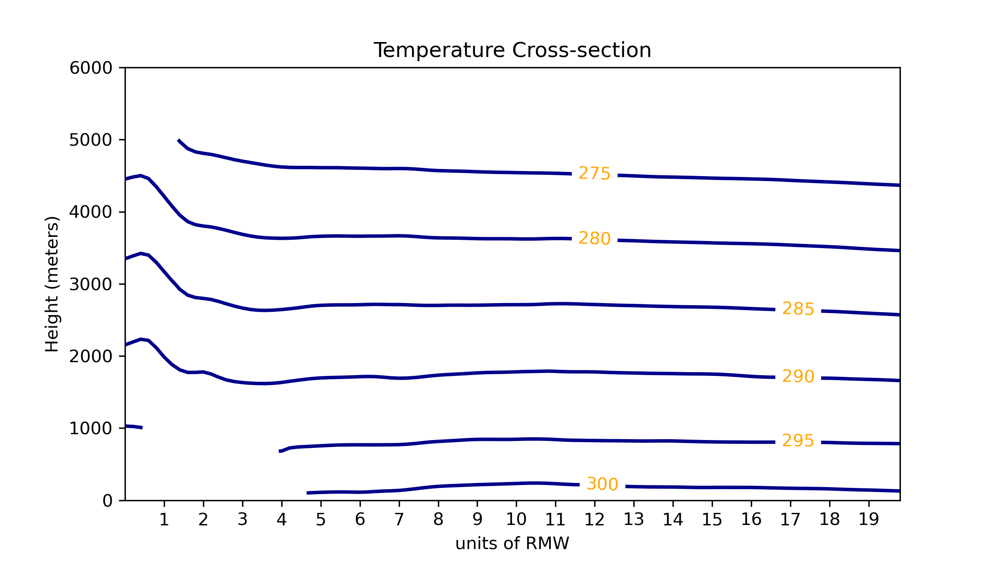

*************************
TC-RMW Cross-section Plot
*************************

Description
===========

Generate cross-section plots for TC-RMW data based on *height levels* using output
from the METcalcpy vertical interpolation module, *vertical_interpolation.py*:

https://metcalcpy.readthedocs.io/en/develop/Users_Guide/vertical_interpolation.html

Example
=======

Sample Data
-----------

Create the sample data by performing the conversion from pressure levels to height levels by following the instructions:

https://metcalcpy.readthedocs.io/en/develop/Users_Guide/vertical_interpolation.html

The output directory you specified in the *height_from_pressure_tcrmw.sh* shell script (in the METcalcpy
source code) is where your *tc_rmw_example_vertical_interp.nc* file will be located.  The
*tc_rmw_example_vertical_interp.nc* is the input file to the cross section plot,
*plot_cross_section.py*.

Configuration Files
-------------------

An example configuration file (YAML, with .yaml extension) is available as a starting point
for customizing the cross-plot of the height level data:

$METPLOTPY_BASE/metplotpy/contributed/tc_rmw/plot_cross_section.yaml
where $METPLOTPY_BASE is the location where you saved the METplotpy source code.

.. literalinclude:: ../../metplotpy/contributed/tc_rmw/plot_cross_section.yaml

In this example, the plot_cross_section.yaml configuration file is set up to generate the
cross-section plot for the temperature field:

field:
   'TMP'

You can modify the *plot_filename* to give your output plot a different name.  Two different file
types are generated, a *.png* file and a *.pdf* file. In the *plot_cross_section.yaml* configuration
file, the plot that will be created will be named example.png and example.pdf.

There are configuration settings to set the labels to the x-axis and y-axis, the plot size, plot
resolution, contour colors, etc.

To generate a cross-section plot for a different field, replace the 'TMP' with the any other
available field name from the input file (*tc_rmw_example_vertical_interp.nc*).

Run from the Command Line
=========================

You can generate a cross-section plot using the *test_plot_cross_section.sh* Bourne shell script:

.. literalinclude:: ../../metplotpy/contributed/tc_rmw/test_plot_cross_section.sh

Open the *test_plot_cross_section.sh* script in an editor of your choice.

Modify the *datadir*, *plotdir*, *filename*, and *configfile* values in the *test_plot_cross_section.sh* script to
point to the appropriate locations:

* *datadir* is the location of the input netCDF file (the directory where you saved the output from the METcalcpy vertical interpolation)

* *plotdir* is the location of the output plot

* *filename* is the name of the input netCDF file (*tc_rmw_example_vertical_interp.nc* that was created from running the METcalcpy vertical interpolation)

* *configfile* is the YAML config file that is used to set plot customizations (line colors, labels, etc.)

Save and close the *test_plot_cross_section.sh* script.

To generate the plot, perform the following:

* Make sure you have the following Python packages installed:
   * **Python 3.7** or above

   * METcalcpy (use the same version number as this METplotpy)

   * matplotlib 3.4.3

   * metpy 1.1.0

   * netcdf4 1.5.7 or above

   * numpy

   * pandas

   * pint 0.17

   * xarray

   * yaml

*Specific version numbers are specified when necessary.  If versions are not specified, use a
compatible version number for your operating system and existing packages.*

* If you are running in a conda environment, verify that you are running the conda environment that has the above Python packages installed.

* cd to the $METPLOTPY_BASE/metplotpy/contributed/tc_rmw directory

``cd $METPLOTPY_BASE/metplotpy/contributed/tc_rmw``

replacing the $METPLOTPY_BASE with the directory where you saved the METplotpy
source code.

* run the test_plot_cross_section.sh script:

``sh test_plot_cross_section.sh``

Two files will be created, *example.png* and *example.pdf* (if you used the *plot_filename* value
of 'example' in the *plot_cross_section.yaml* configuration file).  They will be located in
the output directory you specified in the *test_plot_cross_section.sh* Bourne shell script.
The plot will look like the following:

