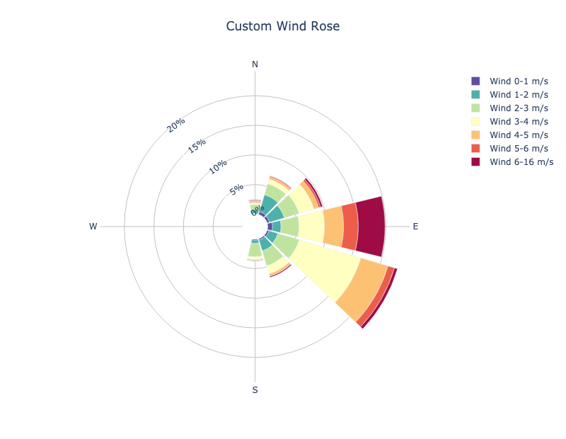

******************
Wind Rose Diagram
******************

Description
===========

A wind rose diagram graphically displays the wind speed and wind direction at a particular location over a period of
time.  The diagram consists of radiating spokes that represent the wind direction in terms of the cardinal wind
directions of North, East, South, and West.  Each spoke indicates how often the wind blows from each direction and
the color bands on each spoke represents the wind speed range (bins).  The wind rose diagram is based on
a polar coordinate system, with data plotted at a distance away from the origin at an angle that is
relative to North.

Example
=======

Sample Data
___________

The data used to create a wind rose plot is columnar text output from MET for the MPR (matched pair)
line type.
The sample data used to create these plots is available in the METplotpy
repository, where the wind rose diagram test scripts are located:

*$METPLOTPY_BASE/test/wind rose_diagram/point_stat_mpr.txt*

*$METPLOTPY_BASE* is the directory where the METplotpy code is saved:

*$METPLOTPY_BASE* is the directory where the METplotpy code is saved:

e.g.

*/usr/path/to/METplotpy*  if the source code was cloned or forked from the Github repository

or

*/usr/path/to/METplotpy-x.y.z*  if the source code was downloaded as a zip or gzip'd tar file from the Release link of
the Github repository.  The *x.y.z* is the release number.

Configuration Files
___________________

The wind rose diagram utilizes YAML configuration files to indicate where
input data is located and to set plot attributes. These plot attributes
correspond to values that can be set via the METviewer tool. YAML is a
recursive acronym for "YAML Ain't Markup Language" and according to
`yaml.org <https://yaml.org>`_,
it is a "human-friendly data serialization language. It is commonly used for
configuration files and in applications where data is being stored or
transmitted. Two configuration files are required. The first is a
default configuration file, **wind_rose_diagram_defaults.yaml**,
which is found in the
*$METPLOTPY_BASE/metplotpy/plots/config* directory.
*$METPLOTPY_BASE* indicates the directory where the METplotpy
source code has been saved.  All default
configuration files are located in the
*$METPLOTPY_BASE/metplotpy/plots/config* directory.
**Default configuration files are automatically loaded by the
plotting code and do not need to be explicitly specified when
generating a plot**.

The second required configuration file is a user-supplied “custom”
configuration file. This second configuration file is used to customize/override the default
settings in the **wind_rose_defaults.yaml** file. The custom
configuration file can be an empty file if all default settings are to
be applied.

METplus Configuration
=====================

Default Configuration File
__________________________

The following is the *mandatory*, **wind_rose_defaults.yaml**
configuration file, which serves as a starting point for creating a
wind rose diagram plot.

**NOTE**: This default configuration file is automatically loaded by
**wind_rose_diagram.py.**

.. literalinclude:: ../../metplotpy/plots/config/wind_rose_defaults.yaml

Custom Configuration File
_________________________

As previously mentioned, a second *mandatory* configuration file is required, which is
used to customize the settings to the wind rose diagram plot.
The **wind_rose_custom.yaml**  file is included with the
source code and looks like the following:

.. literalinclude:: ../../test/wind_rose/wind_rose_custom.yaml

Copy this custom config file from the directory where the source
code was saved to the working directory:

.. code-block:: ini

  cp $METPLOTPY_BASE/test/wind_rose/wind_rose_custom.yaml $WORKING_DIR/wind_rose_custom.yaml

Notice that this has many of the same settings found in the the wind_rose_default.yaml file. We will simply change
the title of the custom plot to customize the plot.  **NOTE**: You do not need to include all the configuration
settings in your custom configuration file. You only need to include the settings you wish to override.

Modify the *stat_input* setting in the
*$METPLOTPY_BASE/test/wind_rose/wind_rose_custom.yaml*
file to explicitly point to the
*$METPLOTPY_BASE/test/wind_rose/wind_rose*
directory (where the custom config files and sample data reside).
Replace the relative path *./point_stat_mpr.txt*
with the full path
*$METPLOTPY_BASE/test/wind_rose/point_stat_mpr.txt*
(including replacing *$METPLOTPY_BASE* with the full path to the METplotpy
installation on the system).
Modify the *plot_filename* setting to point to the output path where the
plot will be saved, including the name of the plot.
Modify the title from: *title: Wind Rose* to *title: Custom Wind Rose*
Uncomment the entry (indicated by a '#' symbol in front of it; remove the '#' symbol to uncomment)
for the **stat_input** setting to indicate where the input data is located and indicate the full path
and name of the input data file.

For example:

*stat_input: /username/myworkspace/METplotpy/test/wind_rose/point_stat_mpr.txt*

*plot_filename: /username/working_dir/output_plots/wind_rose_custom.png*

*title: Custom Wind Rose*

This is where */username/myworkspace/METplotpy* is $METPLOTPY_BASE and
*/username/working_dir* is $WORKING_DIR.  Make sure that the
$WORKING_DIR directory that is specified exists and has the
appropriate read and write permissions. The path listed for
*plot_filename* may be changed to the output directory of one’s choosing.
If this is not set, then the
*plot_filename* setting specified in the
*$METPLOTPY_BASE/metplotpy/plots/config/wind_rose_defaults.yaml*
configuration file will be used.

To save the intermediate **.points1** file (used by METviewer and useful
for debugging), set the *dump_points_1* setting to True.
Uncomment or add (if it doesn't exist) the *points_path* setting:

*dump_points_1: 'True'*

*points_path: '/dir_to_save_points1_file'*

Replace the */dir_to_save_points1_file* to the same directory where the
**.points1** file is saved.
If *points_path* is commented out (indicated by a '#' symbol in front of it),
remove the '#' symbol to uncomment
the *points_path* so that it will be used by the code.  Make sure that
this directory exists and has the
appropriate read and write permissions.  **NOTE**: the *points_path* setting
is **optional** and does not need to be defined in the configuration
file unless saving the intermediate **.points1** file is desired.

Using defaults
______________

To use the *default* settings defined in the
**wind_rose_defaults.yaml**
file, specify a minimal custom configuration file
(**minimal_wind_rose_defaults.yaml**), which consists of only
a comment block, but it can be any empty file (write permissions for the
output filename path corresponding to the *plot_filename* setting in
the default configuration file will be needed. Otherwise, specify
a *plot_filename* in the **minimal_wind_rose.yaml** file):

.. literalinclude:: ../../test/wind_rose/minimal_wind_rose.yaml

Copy this file to the working directory:

.. code-block:: ini
		
  cp $METPLOTPY_BASE/test/wind_rose/minimal_wind_rose.yaml $WORKING_DIR/minimal_wind_rose.yaml

Add the *stat_input* (input data) and *plot_filename*
(output file/plot path) settings to the
*$WORKING_DIR/minimal_wind_rose.yaml*
file (anywhere below the comment block). The *stat_input* setting
explicitly indicates where the sample data and custom configuration
files are located.  Set the *stat_input* to
*$METPLOTPY_BASE/test/wind_rose/point_stat_mpr.txt* and set the
*plot_filename* to
*$WORKING_DIR/output_plots/wind_rose_default.png*:

*stat_input: $METPLOTPY_BASE/test/wind_rose/point_stat_mpr.txt*

*plot_filename: $WORKING_DIR/output_plots/wind_rose_default.png*

*$WORKING_DIR* is the working directory where all of
the custom configuration files are being saved.
**NOTE**: The *plot_filename* (output directory) may be specified
to a directory other than the *$WORKING_DIR/output_plots*, as long as
it is an existing directory where the author has read and write permissions.

To save the intermediate **.points1** file (used by METviewer and useful
for debugging), add the following lines to the
**minimal_wind_rose.yaml** file (anywhere below the comment block):

*dump_points_1: 'True'*

*points_path: '/dir_to_save_points1_file'*

Replace the */dir_to_save_points1_file* to the same directory where
the **.points** file is saved. Make sure that this directory exists
and has the appropriate read and write permissions.

Run from the Command Line
=========================

To generate a default performance diagram (i.e. using settings in the 
**wind_rose_defaults.yaml** configuration file),
perform the following:

*  If using the conda environment, verify the conda environment
   is running and has has the required Python packages outlined in the
   `requirements section.
   <https://metplotpy.readthedocs.io/en/latest/Users_Guide/installation-requirements.html>`_

* Set the METPLOTPY_BASE environment variable to point to
  *$METPLOTPY_BASE*.

  For the ksh environment:

  .. code-block:: ini
		
    export METPLOTPY_BASE=$METPLOTPY_BASE

  For the csh environment:

  .. code-block:: ini
		
    setenv METPLOTPY_BASE $METPLOTPY_BASE

  Replacing the $METPLOTPY_BASE with the directory where the
  METplotpy source code was saved.

* Run the following on the command line:

  .. code-block:: ini  

    python $METPLOTPY_BASE/metplotpy/plots/wind_rose/wind_rose.py $WORKING_DIR/minimal_wind_rose.yaml

  This will create a PNG file, **wind_rose_default.png**,
  in the directory that was specified in the *plot_filename*
  setting of the **minimal_wind_rose.yaml** config file:

  .. image:: figure/wind_rose_default.png

  To generate the slightly modified, **customized** plot, re-run the above
  command using the **wind_rose_custom.yaml** file:

  .. code-block:: ini
		
    python $METPLOTPY_BASE/metplotpy/plots/wind_rose/wind_rose.py $WORKING_DIR/wind_rose_custom.yaml

  .. image:: figure/wind_rose_custom.png

* A **wind_rose_custom.png** output file will be created in
  the directory that was specified in the *plot_filename* config setting
  in the **custom_performance_diagram.yaml** config file.  The title will match what you set in the
  *title* setting of your custom_performance_diagram.yaml file.
